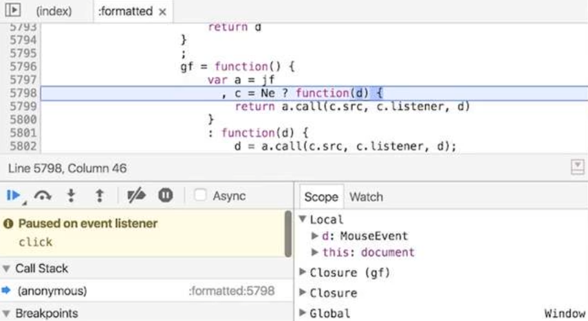
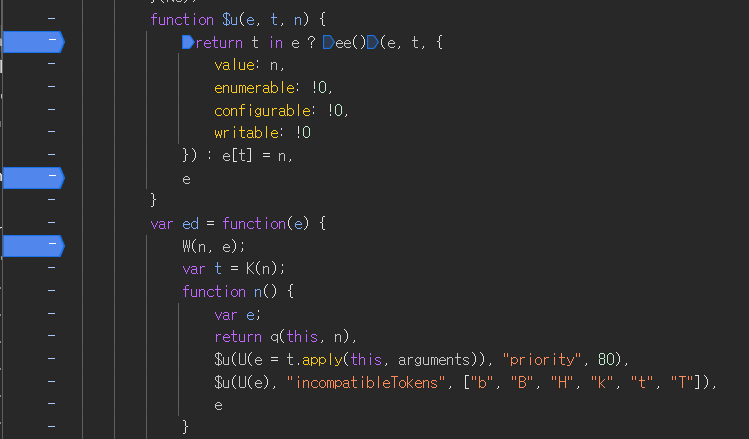

# 2024.09.13 / week 10 / part.01

<br>

## Browser Debugging

1. 코드 내에 console.log를 사용해 확인하는 방법
   

<br>

2. 개발자 도구에서 breaking point를 지정해서 확인하는 방법
   


## 1. 컴파일러 언어

기계가 이해하기 위한 기계어로 변환

-  pre-processing : 코드 > 기계어로 변환
-  processing : 컴퓨터에서 기계어를 실행

## 2. 인터프리터 언어

-  컴파일 과정을 거치지 않고 바로 실행
-  실행되는 과정에서 변환을 동시 진행

-  컴파일 단계가 없음
-  컴파일러 언어에 비해 실행 속도가 느린 특징

<br>


## JavaScript언어의 특징

### 1. 동적 타입 언어

- 변수에 들어가는 값에 따라 런타임에 타입이 추론

예시 1.
```
let 변수 = 1;
typeof 변수; //number
```

예시 2.
```
let 변수 1;
변수 = 'abc';
typeof 변수 //string
```


### 2. 일급 객체

- 변수에 할당할 수 있다.
- 함수의 인자로 전달할 수 있다.
- 함수의 반환값으로 사용할 수 있다.

예시 코드
```
const 함수1 = function (요소) {
    return 요소();  // 전달받은 함수를 실행
};

const 함수2 = function () {
    return 함수3;  // 함수3을 반환
};

const 함수3 = function () {
    return 'apple';  // 문자열 반환
};

함수1(함수2());  // 'apple'
```

## 변수

컴퓨터는 데이터를 기억하기 위해 메모리를 활용

>메모리 = 컴퓨터의 기억장치

- 메모리에 데이터를 담아 기억
- 메모리 각각의 위치 주소값 존재
- 메모리 주소값으로 위치를 탐색

#### 메모리의 주소값을 대신할 식별자 = 변수


### 변수 생성

1. 선언
2. 초기화
3. 할당


#### var 키워드 - 단점
1. 키워드의 생략 가능성
2. 중복 선언으로 인한 혼선 가능성
3. 실행 순서와 무관하게 변수 참조가 가능해서 결과 예측에 불필요한 혼선
    - 의도하지 않은 변수의 값을 변경하는 상황 발생 가능성

#### const / let 변수

코드 평가 시점에는 `선언`만 진행. 변수의 할당문이 실행되지 전에는 참조 불가능.
- 블록 레벨 스코프 : 코드 블록 내에서만 접근 가능한 스코프

✅ 변수에 접근이 한정적이므로 예측 가능한 범위 내에서 변수 값 변경이 일어남

#### const
- 재 할당이 불가능한 `상수`를 선언할 때 사용
- 무조건 값을 할당해야 실행이 됨

#### let
- 재 할당이 가능한 변수 타입
- 값을 할당하지 않아도 생성


