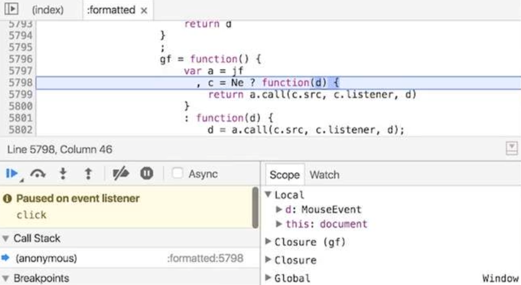
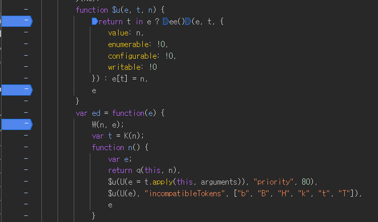
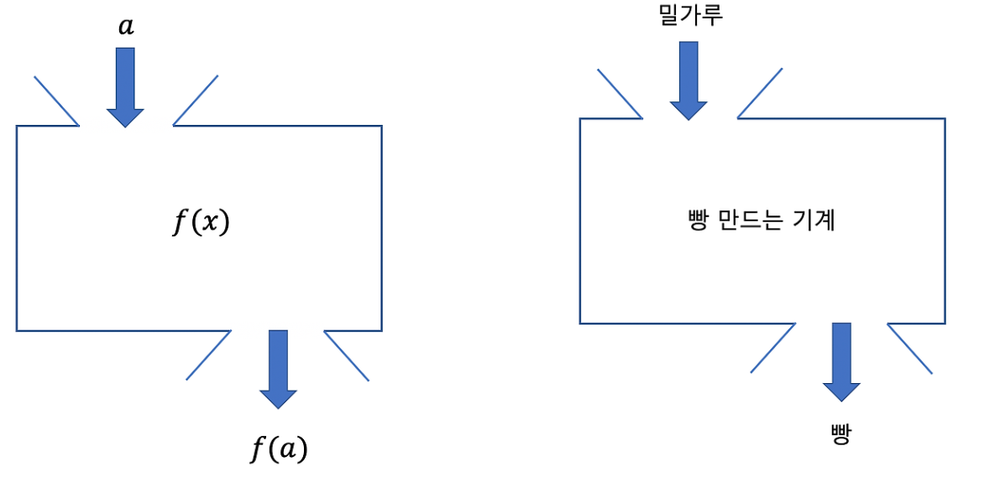

# 2024.10.21 / week 10 / part.01

<br>

## Browser Debugging

1. 코드 내에 console.log를 사용해 확인하는 방법
   

<br>

2. 개발자 도구에서 breaking point를 지정해서 확인하는 방법
   


## 1. 컴파일러 언어

기계가 이해하기 위한 기계어로 변환

-  pre-processing : 코드 > 기계어로 변환
-  processing : 컴퓨터에서 기계어를 실행

## 2. 인터프리터 언어

-  컴파일 과정을 거치지 않고 바로 실행
-  실행되는 과정에서 변환을 동시 진행

-  컴파일 단계가 없음
-  컴파일러 언어에 비해 실행 속도가 느린 특징

<br>


## JavaScript언어의 특징

### 1. 동적 타입 언어

- 변수에 들어가는 값에 따라 런타임에 타입이 추론

예시 1.
```
let 변수 = 1;
typeof 변수; //number
```

예시 2.
```
let 변수 1;
변수 = 'abc';
typeof 변수 //string
```


### 2. 일급 객체

- 변수에 할당할 수 있다.
- 함수의 인자로 전달할 수 있다.
- 함수의 반환값으로 사용할 수 있다.

예시 코드
```
const 함수1 = function (요소) {
    return 요소();  // 전달받은 함수를 실행
};

const 함수2 = function () {
    return 함수3;  // 함수3을 반환
};

const 함수3 = function () {
    return 'apple';  // 문자열 반환
};

함수1(함수2());  // 'apple'
```

## 변수

컴퓨터는 데이터를 기억하기 위해 메모리를 활용

>메모리 = 컴퓨터의 기억장치

- 메모리에 데이터를 담아 기억
- 메모리 각각의 위치 주소값 존재
- 메모리 주소값으로 위치를 탐색

#### 메모리의 주소값을 대신할 식별자 = 변수


### 변수 생성

1. 선언
2. 초기화
3. 할당


#### var 키워드 - 단점
1. 키워드의 생략 가능성
2. 중복 선언으로 인한 혼선 가능성
3. 실행 순서와 무관하게 변수 참조가 가능해서 결과 예측에 불필요한 혼선
    - 의도하지 않은 변수의 값을 변경하는 상황 발생 가능성

#### const / let 변수

코드 평가 시점에는 `선언`만 진행. 변수의 할당문이 실행되지 전에는 참조 불가능.
- 블록 레벨 스코프 : 코드 블록 내에서만 접근 가능한 스코프

✅ 변수에 접근이 한정적이므로 예측 가능한 범위 내에서 변수 값 변경이 일어남

#### const
- 재 할당이 불가능한 `상수`를 선언할 때 사용
- 무조건 값을 할당해야 실행이 됨

#### let
- 재 할당이 가능한 변수 타입
- 값을 할당하지 않아도 생성


자바스크립트 객체 타입

1. 원시 타입

    1. String
    2. Number
    3. BigInt
    4. Undefined
    5. Null
    6. Boolean
    7. Symbol

    특징

        1. 변경 불가능한 값 (immutable value)
        2. 참조 형태가 아닌 `값`으로 전달

2. 객체 타입

    - 원시 타입의 값을 제외한 모든 것은 객체
    - 속성의 값을 변경할 수 있는 mutable한 값
    - 참조 방식 전달 => 객체의 메모리 주소 전달
    
        참조 방식을 전달할 경우, 데이터가 의도치 않게 변경될 수 있음
        -  전달할 때, 복사본을 전달 해야 함.

            복사 방식

                1. deep copy
                2. shallow copy
    

## 원시 타입

### Number

자바 스크립트의 숫자 표현 : ***배정밀도 64비트 부동소수점***

- 실수를 연살할 때, 근사값으로 처리 : 0.1 + 0.2는 0.3이 아님
- 최소 값 = -(2^53-1) / Number.MIN_SAFE_INTEGER
- 최대 값 = 2^53-1 / Number.MAX_SAFE_INTEGER

#### Type

- infinity : 무한대를 나타내는 숫자
- NaN : Not a number의 줄임말 = 숫자가 아님
- BigInt : Number의 최대 값을 넘는 정수도 안전하게 저장 및 연산
    - 다른 타입과 혼합하여 연산 불가능


### String

- 텍스트 데이터를 표현할 때 사용
- UTF 코드 단위의 시퀀스로 표현
    - 16bit 정수 값의 요소로 구성된 집합
    - 각 요소가 string의 한 자리
    - 0번째 index부터 시작
- 따옴표('), 쌍따옴표("), 백틱(`)으로 감싸서 작성

#### 템플릿 리터럴 표기법 (``)
- ES6부터 백틱 사용 가능
- 표현식 사용 가능, 줄바꿈 허용
    
    - 예시
        - \`My name is ${표현식}\`  


### Boolean

- 논리적 데이터 유형
- `true` or `false`


### undefined

- 변수 선언 시, 값을 할당하지 않은 경우 할당 되는 값

### null

- 값이 없다는 것을 의도적으로 표현할 때 사용
- 의도적으로 더 이상 참조하지 않겠다는 뜻으로도 사용

- null type은 object라는 자바스크립트 스펙 내의 버그
    - ❌ typeof null;
    - ✅ foo === null;

### symbol

- 중복되지 않는 유니크한 값
    - 객체의 key로 사용
    - 내부에서만 접근할 수 있도록 ***전용 객체 속성의 키***로 사용
- Symbol함수를 호출하여 생성

```
const func = {
    [Symbol.for('chicken')] : 'food'
};

console.log(Symbol.for('chicken')); //food
```


## Reference type

#### 객체 타입

객체 타입은 Object type, Reference type이라고도 명칭

- 객체 타입
    
    다양한 타입의 값을 하나의 단위로 구성한 복합적인 자료구조
- 객체

    데이터(속성), 데이터에 관련한 동작을(method) 포함하는 개념적 존재

- 원시 타입의 값을 제외한 자바스크립트에서의 모든 것은 객체

변경 가능한 값
- 객체의 속성을 변경, 추가, 삭제 가능 = mutable <> immutable (원시값)
- 동적 변화 가능하므로, 힙 메모리에 저장
- 참조 타입이므로 참조 값으로 처리 (Pass-by-reference)


## 동적 타입 언어

- 자바스크립트는 동적 타입언어
- 의도적인 타입 변환 및 의도와 상관없는 타입 변경
    - 명시적 타입 변환
    - 암묵적 타입 변환

### 명시적 타입 변환
- 원시 래퍼 객체를 활용하여 의도적으로 타입을 변경
    | | |
    |-------|-------|
    |값.toString|문자열 타입으로 변환|
    |Number(값)|숫자 타입으로 변환|
    |Boolean(값)|불리언 타입으로 변환|
    


### 암묵적 타입 변환

- 아래 형식으로 사용시 타입이 변환
    | | |
    |-------|-------|
    |값 + ""|문자열 타입으로 변환|
    |값 * 1|숫자 타입으로 변환|
    |!!값 |불리언 타입으로 변환|

- 불 필요한 디버깅 시간 소요 가능성

해결 방안
- typeof or 일치연산자(===)를 사용하여 타입 guard 구현
- 자바스크립트의 superSet인 typeScript사용


## 연산자

하나 이상의 표현식을 대상으로 연산을 수행하여 하나의 값을 생성

- 연산자의 종류

| | | | | | | | |
|-|-|-|-|-|-|-|-|
|단항|산술|관계|이진 논리|삼항|할당|옵셔널|쉼표|

### 단항 연산자

하나의 피연산자만 사용하는 연산

- `void` : 표현식을 평가할 때 값을 반환하지 않도록 지정한다.
- `typeof` : 평가 전의 피연산자 타입을 나타내는 문자열을 반환한다.
- `delete` : 객체의 속성을 삭제한다.

### 산술 연산자 

#### 단항 산술 연산자

1개의 피 연산자를 산술 연산하여 숫자 값을 반환

- ++
    
    숫자 1을 증가시키고, 증가시킨 값을 암묵적으로 할당한다.

- ++
    
    숫자 1을 감소시키고, 감소시킨 값을 암묵적으로 할당한다.

- 양수의 표현. 아무런 효과가 없음

    (피연산자가 숫자인 케이스만 해당)

- 양수를 음수로, 음수를 양수로 반전시킨 값을 반환
    
    (문자열인 경우 암묵적 타입변환 처리)


#### 이항 산술 연산자

2개의 피 연산자를 산술 연산하여 숫자값을 반환

- \+ 덧셈
- \- 뺄셈
- \* 곱셈
- / 나눗셈
- % 나머지


### 관계 연산자


피연산자를 비교하고, 결과가 참인지에 따라 boolean 값을 반환

- in
    
    객체 내에 속성이 존재할 경우 true 반환
- instanceof

    특정 객체 타입에 속하면 true를 반환


### 비교 연산자


피연산자를 비교하고, 결과가 참인지에 따라 boolean 값을 반환
피연산자에는 숫자, 문자열, 논리형, 객체타입이 사용

- `== 동등 연산자` : 서로 같으면 true

- `=== 일치 연산자` : 서로 같고, 타입도 같으면 true

- `!= 부등 연산자` : 서로 다르면 true

- `!== 불일치 연산자` : 서로 다르고, 타입도 다르면 true


### 논리 연산자

- 두개의 피연산자 중 하나를 반환
- 반환되는 값이 무조건 Boolean값이 아님


>AND 연산자

 A && B


- A가 true로 평가되면 B를 반환
- A가 false로 평가되면 A를 반환

```
console.log(true && 'Hello');  // 'Hello' 반환 (A가 true로 평가됨)
console.log(false && 'Hello'); // false 반환 (A가 false로 평가됨)
console.log(0 && 42);          // 0 반환 (A가 falsy)
console.log('Hi' && 'There');  // 'There' 반환 (A가 truthy)
```

>OR 연산자

A | | B


- A가 true로 평가되면 A를 반환
- A가 false로 평가되면 B를 반환

```
console.log(true || 'Hello');  // true 반환 (A가 truthy)
console.log(false || 'Hello'); // 'Hello' 반환 (A가 falsy)
console.log(0 || 42);          // 42 반환 (A가 falsy)
console.log('Hi' || 'There');  // 'Hi' 반환 (A가 truthy)
```

단축평가 논리 : 첫번째 식을 평가한 결과에 따라서, 두번째 식 평가를 실행


### 삼항 연산자

조건식 ? 참일 때 값 : 거짓일 때 값

```
let age = 18;
let message = (age >= 18) ? '성인입니다.' : '미성년자입니다.';
console.log(message); // '성인입니다.'
```


### 옵셔널 연산자

체의 속성에 접근할 때, 해당 속성이 존재하지 않으면 **undefined**를 반환하며 에러를 방지

```
let user = { name: 'Alice', address: { city: 'Seoul' } };

// 존재하지 않는 속성에 접근할 때
console.log(user.address?.city); // 'Seoul'
console.log(user.contact?.phone); // undefined (에러 없이 처리)
```


## 함수

자바 스크립트에서 함수는 객체처럼 `속성`과 `메서드`를 가질 수 있다.

#### 객체와의 차이점

- 함수는 외부에서 호출이 `가능`
- 객체는 외부에서 호출이 `불가능`

함수의 형태
- 로직 처리를 위해 주입받는데이터 : input
- 로직 처리 후 반환되는 결과 데이터 output
- 본문 : 명령문의 시퀀스로 구성



#### 자바 스크립트의 함수 특징

- 일급 객체의 특징을 가지고 있음

입급객체란? 

- 다른 객체들에 일반적으로 적용 가능한 연산을 모두 지원하는 객체

해당 정의에 해당되면 일급객체다.

- 1. 자바스크립트 함수는 함수의 실제 매개변수가 될 수 있다.

```
function foo(input) {
  input();  // 전달된 함수 실행
}

function bar() {
  console.log("매개변수로 전달됨");
}

foo(bar);  // 출력: 매개변수로 전달됨
```

- 2. 자바스크립트 함수는 함수의 반환값이 될 수 있다.

```
function foo() {
  return function bar() {
    console.log("반환된 함수");
  };
}

const fn = foo();
fn();  // 출력: 반환된 함수
```

- 3. 자바스크립트 함수는 할당명령문의 대상이 될 수 있다.

```
const foo = function() {
  console.log("함수 할당됨");
};

foo();  // 출력: 함수 할당됨
```

- 4. 자바스크립트 함수는 동일비교의 대상이 될 수 있다.(값으로 표현 가능)

```
const foo = function() {};
const bar = foo;

console.log(foo === bar);  // 출력: true
```
즉,
자바스크립트에서는 함수도 하나의 값처럼 취급할 수 있고
다른 변수나 데이터처럼 다룰 수 있다.


### 함수의 형태

- 함수 이름
- 매개 변수
- 함수 몸체

#### 매개 변수

- 기본 값 매개 변수
    - 매개 변수 값이 없는 경우
    - undefined가 전달될 경우 대체되는 초기 값
        ```
        function foo(arg=1){
            return arr;
        }
        ```
- 나머지 매개 변수

    함수에 전달되는 매개변수의 개수를 정확히 모를 때 사용
    - 가변항 함수
    - spread 연산자

    ```
    function foo(arg, ...rest) {
        console.log(rest);
        return arg;
    }
    foo('a', 'b', 'c');
    ```
    
    코드 실행 결과

    1. rest에는 'b', 'c'가 배열 형태로 저장
    2. console.log(rest)는 [ 'b', 'c' ]를 출력
    3. return arg는 첫 번째 인자인 'a'를 반환

- arguments 객체

    arguments 객체는 자바스크립트의 함수 내부에서 전달된 인자들을 유사 배열 형태로 담고 있는 객체

    ```
    function bar(arg, ...rest) {
        console.log(arguments);  // 전달된 모든 인자를 출력
        return arg;
    }
    bar(1, 2, 3);
    ```
    출력 결과
    ```
    Arguments(3) [1, 2, 3, callee: (...), Symbol(Symbol.iterator): ƒ]
    ```
    - 이 함수에서는 전달된 인자들 1, 2, 3이 arguments 객체에 저장됩
    - arguments는 인덱스로 접근 가능
    - callee 속성을 통해 호출된 함수에 대한 정보를 포함


#### 매개 변수와 인자의 차이

- 매개 변수(parameter)
    
    함수를 정의할 때 사용하는 변수

- 인자(argument)

    함수가 호출될 때 넘기는 값


#### 함수 생성 방법

- 함수 선언문
- 함수 표현식
- function 생성자 함수
- 화살표 함수

#### 함수 생성 패턴

- IIFE(즉시 실행 함수)

    - 함수를 정의하자마자 바로 실행되는 함수
    
    - 주로 전역 스코프 오염을 피하기 위해 사용
    
    - 함수 내부에 독립적인 스코프를 생성
    ```
    (function() {
        console.log("즉시 실행됩니다!");
    })();
    ```
- 재귀함수
    재귀 함수는 자기 자신을 반복해서 호출하는 함수
    
    주로 반복적인 문제를 분할하거나 트리 구조 탐색과 같은 알고리즘에서 자주 사용
    ```
    function factorial(n) {
        if (n === 1) return 1;
        return n * factorial(n - 1);
    }
    console.log(factorial(5));  // 출력: 120
    ```
- 중첩함수

    - 중첩 함수는 함수 내부에 또 다른 함수를 정의한 것
    
    - 중첩된 함수는 부모 함수의 스코프에 접근할 수 있음. 이는 클로저(Closure)의 기초
    ```
    function outer(a) {
        function inner(b) {
            return a + b;
        }
        return inner;
    }

    const add5 = outer(5);
    console.log(add5(3));  // 출력: 8
    ```

- 콜백함수
    - 콜백 함수는 다른 함수의 매개변수로 전달되는 함수
    - 특정 작업이 끝난 후 실행되는 비동기 작업에 자주 사용
    ```
    function greet(name) {
        console.log(`안녕하세요, ${name}님!`);
    }
    setTimeout(() => greet("철수"), 1000);  // 1초 후에 콜백 실행
    ```