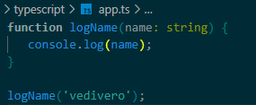
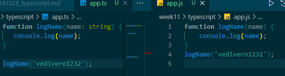
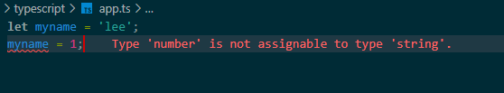
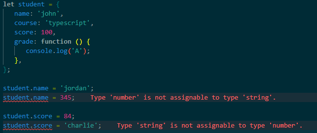
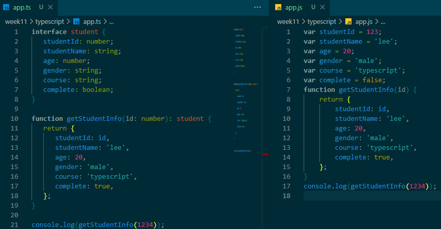
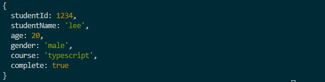
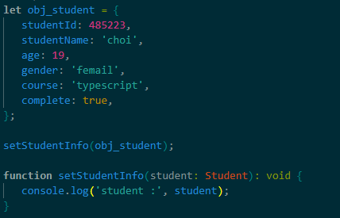
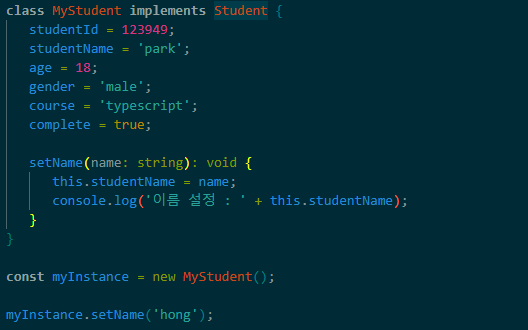

# 타입스크립트란?

## 1. 타입스크립트의 필요성

- 자바스크립트는 동적 타입 언어로, 코드가 복잡해질수록 오류를 찾기 어렵고 유지보수가 힘듦.
- 이 문제를 해결하기 위해 **타입스크립트(TypeScript)**가 등장.

>### 타입스크립트가 필요한 이유
>- 지저분한 코드 : 자바스크립트는 유연한 만큼 코드가 난잡해지기 쉬움.
>- 대규모 프로젝트 : 프로젝트가 커지면 자바스크립트 코드 관리가 복잡.

## 2. 타입스크립트의 장점

타입스크립트를 사용하면 다음과 같은 이점이 있음:

1. 버그 감소 : 타입 검사로 코드 작성 시 버그를 미리 방지할 수 있음.
2. 유지보수 용이 : 정적 타입 시스템 덕분에 코드의 가독성과 유지보수가 쉬움.
3. 고품질 코드 생산 : 코드의 일관성을 유지하고, 예상치 못한 오류를 줄일 수 있음.

## 3. 타입스크립트의 정의
타입스크립트는 자바스크립트에 타입 검사 기능이 추가된 언어.

- 타입스크립트 = 자바스크립트 + 타입 체크
- 자바스크립트는 타입스크립트 환경에서 정상 작동하지만, 타입스크립트 코드는 자바스크립트 환경에서 직접 실행되지 않음.

## 4. 타입스크립트와 자바스크립트의 차이 예시

- 자바스크립트 코드 예시:
    ```
    function plus(a, b) {
    return a + b;
    }
    console.log(plus('3', '5'));  // '35' (문자열 연결)
    ```

- 타입스크립트 코드 예시:
    ```
    function plus(a: number, b: number): number {
    return a + b;
    }
    console.log(plus('3', '5'));  // 컴파일 오류 발생
    ```

비교:

- 자바스크립트에서는 '3'과 '5'가 문자열로 처리되어 예상치 못한 결과가 나옴.
- 타입스크립트는 컴파일 타임에 오류를 감지하여 문제를 미리 해결할 수 있음.

## 5. 타입스크립트의 컴파일 과정
타입스크립트는 브라우저에서 직접 실행되지 않음. 컴파일러가 타입스크립트 코드를 자바스크립트로 변환해야 함.

### 컴파일 과정:
1. 타입스크립트 코드를 작성.
2. 컴파일러가 코드를 자바스크립트로 변환.
3. 변환된 자바스크립트 코드는 브라우저에서 실행됨.

## 6. 데이터 타입 명시의 장점
- 컴파일 타임 오류 체크: 코드 작성 시점에 오류를 발견할 수 있음.
- 안정성 향상: 잘못된 데이터 타입 사용을 방지함.


<br>
<br>

# 환경설정

`npm i typescript`


<br>
<br>

# 첫 번째 프로젝트



#### 명령어
- `tsc app.js` : type script compile

- `node app.js` : 타입스크립트 파일 실행

- `tsc --init` : 타입스크립트 설정 값 자동 설정

- `tsc -w app.js` : watch의 약자(코드가 수정되는지를 계속해서 확인)

    
    실시간으로 바로 반영


<br>
<br>

# 데이터 타입과 추론

-  초기 할당된 타입에 맞지 않는 값을 재할당하는 경우

    

- myname이라는 변수가 선언되고 초기 값으로 문자열 'lee'가 할당 됨.
- 타입스크립트는 선언 당시에 문자열 변수라고 추론하기 때문에 숫자형 1이 대입하면 오류 발생

<br>

- 초기화 된 값의 데이터 타입과 일치하지 않는 데이터를 할당하면 오류 발생.

    


## 1. 왜 데이터 타입이 중요한가?

- 자바스크립트에서는 변수에 어떤 데이터 타입의 값이든 할당할 수 있음
- 이는 유연하지만 때로는 예상치 못한 오류를 유발할 수 있음

- 예제
    ```
    let myname = 'lee';  // 문자열 할당
    myname = 1;  // 숫자로 변경 (실수로 잘못된 값이 할당될 수 있음)
    ```

    - 자바스크립트는 이런 문제를 사전에 막지 못함.
    - 타입이 혼동되면 예상치 못한 오류나 버그가 발생할 수 있음.

## 2. 타입스크립트의 타입 추론(Type Inference) 기능

- 타입스크립트는 타입 추론을 통해 변수의 타입을 자동으로 판단
- 초기값을 기준으로 컴파일러가 변수의 타입을 추론

- 예제

```
let age = 30;  // 숫자 30을 할당하면, age의 타입을 number로 추론
```
- age 변수는 자동으로 number 타입으로 추론됨.

## 3. 타입 추론의 장점과 주의점
- 코드 간결화: 타입을 명시적으로 지정하지 않아도 되어 코드가 간결해짐.
- 명확한 타입 지정 권장: 복잡한 로직에서는 타입을 명확하게 명시하는 것이 좋음.

```
let age: number = 30;  // 명시적 타입 지정
```
- 타입스크립트는 타입을 추론하지만, 모호한 경우에는 직접 지정하는 것이 코드의 가독성과 안정성에 도움을 줌.


<br>
<br>

# 타입 명시

## 타입 명시란?

- 타입스크립트에서는 변수를 선언할 때 해당 변수에 어떤 데이터 타입을 가질지 명시합니다.
- 이를 통해 명확한 데이터 타입을 지정하여 예기치 않은 오류를 사전에 방지할 수 있습니다.

### 변수에 데이터 타입을 지정하는 방법

1. 타입 명시와 선언 예제:
```
let myname: string = 'lee';  // myname 변수는 문자열 타입
```

- 타입 오류 예시:

```
myname = 1;  // 오류 발생: string 타입 변수에 number 타입 할당 불가
myname 변수를 문자열로 선언했기 때문에 숫자를 할당할 경우 타입스크립트가 오류를 발생시킴.
````

- 타입스크립트의 장점
    - 명확한 타입 지정: 각 변수의 데이터 타입이 명확하므로 코드 가독성 증가.
    - 컴파일 타임 오류 감지: 잘못된 타입의 데이터가 할당될 경우 컴파일 시점에 오류를 알림.
    - 안정성 향상: 타입 혼동으로 인한 예기치 않은 런타임 오류를 방지.

- Syntax 예제
    - 변수에 명시적으로 타입을 지정하는 구문은 다음과 같습니다:

    ```
    let x: string = '나는 문자열이다.';
    ```


<br>
<br>

# 인터페이스

## 데이터 타입 : 객체






- `student`로 선언된 interface를 데이터 타입으로 호출하는 getStudentInfo 함수
- 해당 객체를 데이터 타입으로 사용하려면 모든 프로퍼티를 할당해야 사용 가능.

    ```
    interface student {
    studentId: number;
    studentName: string;
    age: number;
    gender: string;
    course: string;
    complete: boolean;
    }
    ```

    ```
    function getStudentInfo(id: number): student {
    return {
        studentId: id,
        studentName: 'lee',
        age: 20,
        gender: 'male',
        course: 'typescript',
        complete: true,
    };
    }
    ```

- 사용하지 않는 프로퍼티 처리 방법

    ```
    function getStudentInfo(id: number): student {
    return {
        studentId: id,
        studentName?: 'lee',
        age?: 20,
        gender: 'male',
        course: 'typescript',
        complete: true,
    };
    }
    ```

- age와 studentName과 같이 `옵셔널 체이닝` 연산자를 사용


## 함수의 인자

    
    function Plus(a:number, b?:number) : void {
        a+b;
    }
    

- 함수에 전달되는 인자의 데이터 타입을 선언하는 경우에도 옵셔널 프로퍼티를 사용


## Set





- `Student` 객체 타입의 `student` 변수를 인자로 함수 선언
- `obj_student` 객체의 값을 호출하여 출력


## 메소드를 인터페이스안에 선언하는 방법




<br>
<br>

# 열거형

- 열거형(Enum)을 사용하면 특정 속성에 허용된 값의 집합을 미리 정의

## 1. Enum을 이용한 성별 정의

```
enum Gender {
  Male = "male",
  Female = "female",
  Other = "other",
}

interface Student {
  studentId: number;
  studentName: string;
  age: number;
  gender: Gender;
  course: string;
  complete: boolean;
}

let obj_student: Student = {
  studentId: 485223,
  studentName: 'choi',
  age: 19,
  gender: Gender.Female,  // Enum 값 사용
  course: 'typescript',
  complete: true,
};

console.log(obj_student);
```

## 2. 설명

### Gender 열거형:

    - Male, Female, Other 값만 성별로 허용
    - gender 속성에 다른 값이 들어가면 컴파일 오류가 발생

### 코드 가독성 향상:

- 문자열 "female" 대신 Gender.Female을 사용함으로써 의미를 명확하게 표현


## 3. 잘못된 값 할당 시 오류 발생

- 아래와 같이 정의된 열거형에 없는 값을 할당하면 컴파일 오류가 발생

    ```
    obj_student.gender = "femail";  // 오류: 'Gender' 열거형에 없는 값
    ```

- 오류 메시지:

    ```
    Type '"femail"' is not assignable to type 'Gender'.
    ```

## 4. 열거형을 사용하지 않은 경우의 문제점

```
let obj_student = {
  studentId: 485223,
  studentName: 'choi',
  age: 19,
  gender: 'femail',  // 오타가 있어도 오류를 잡아내지 못함
  course: 'typescript',
  complete: true,
};
```
- 위 코드에서는 'femail'이라는 오타가 발생했지만, 자바스크립트에서는 오류가 발생하지 않음

- 이런 문제를 해결하기 위해 **타입스크립트와 열거형(Enum)**을 사용하면 좋다.


>열거형(Enum)을 사용하면 예상치 못한 오타나 값의 혼동을 방지

>속성의 집합을 미리 정의함으로써 코드의 안정성과 가독성을 높일 수 있음