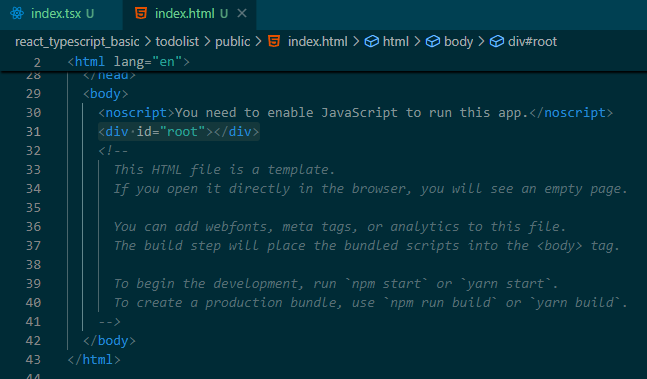

# React

## 1. React란 무엇인가?

- React.js는 자바스크립트 라이브러리 중 하나로, Facebook(메타)에서 사용자 인터페이스 개발을 위해 제작됨.
- 싱글 페이지 어플리케이션(SPA) 및 모바일 앱 개발에 적합.
- 2011년 Facebook 뉴스피드에 처음 도입, 2012년 인스타그램에 적용.
- 2013년 공개 및 오픈 소스화.

## 2. React 동작 원리
- 초기 렌더링: 초기 화면을 그리는 과정.
- 가상 DOM 변경: 변경된 사항을 실제 DOM 대신 가상 DOM에서 먼저 적용.
- 재조정(reconciliation): 가상 DOM과 실제 DOM의 차이를 비교.
- 실제 DOM 업데이트: 최소한의 변경만 실제 DOM에 반영하여 성능 최적화.


<br>
<br>

# 프로젝트 생성 및 코드 분석

## 프로젝트 생성

`npx create-react-app todolist --template typescript`

- 프로젝트 실행

    - `npm start`

    


- 개발자 도구로 열어본 프로젝트 소스 코드

    ```
    <!DOCTYPE html>
    <head>
        <meta charset="utf-8" />
        <link rel="icon" href="/favicon.ico" />
        <meta name="viewport" content="width=device-width, initial-scale=1" />
        <meta name="theme-color" content="#000000" />
        <meta
        name="description"
        content="Web site created using create-react-app"
        />
        <link rel="apple-touch-icon" href="/logo192.png" />
        <!--
        manifest.json provides metadata used when your web app is installed on a
        user's mobile device or desktop. See https://developers.google.com/web/fundamentals/web-app-manifest/
        -->
        <link rel="manifest" href="/manifest.json" />
        <!--
        Notice the use of  in the tags above.
        It will be replaced with the URL of the `public` folder during the build.
        Only files inside the `public` folder can be referenced from the HTML.

        Unlike "/favicon.ico" or "favicon.ico", "/favicon.ico" will
        work correctly both with client-side routing and a non-root public URL.
        Learn how to configure a non-root public URL by running `npm run build`.
        -->
        <title>React App</title>
    <script defer src="/static/js/bundle.js"></script></head>
    <body>
        <noscript>You need to enable JavaScript to run this app.</noscript>
        <div id="root"></div>
        <!--
        This HTML file is a template.
        If you open it directly in the browser, you will see an empty page.

        You can add webfonts, meta tags, or analytics to this file.
        The build step will place the bundled scripts into the <body> tag.

        To begin the development, run `npm start` or `yarn start`.
        To create a production bundle, use `npm run build` or `yarn build`.
        -->
    </body>
    </html>
    ```

    - `root`를 누가 access 하는가?

    - id값이 root인 영역에
    

    - App 컴포넌트를 랜더링 하는 원리
    

    - App.jsx

        


