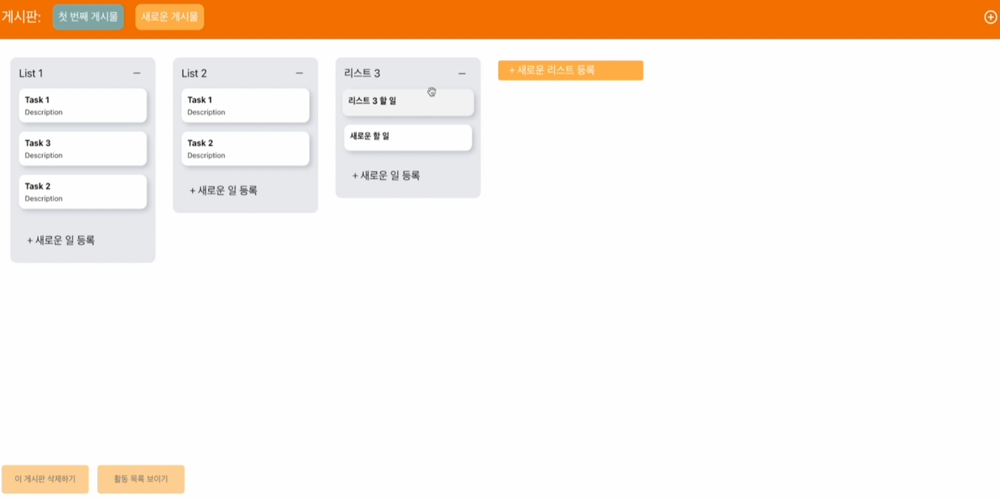
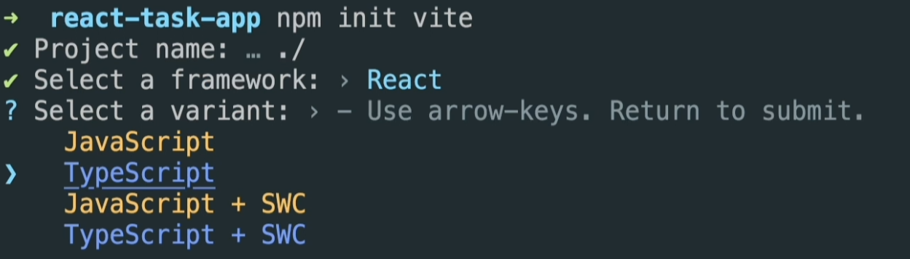
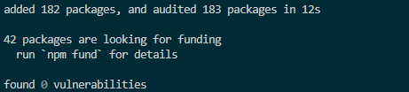
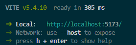
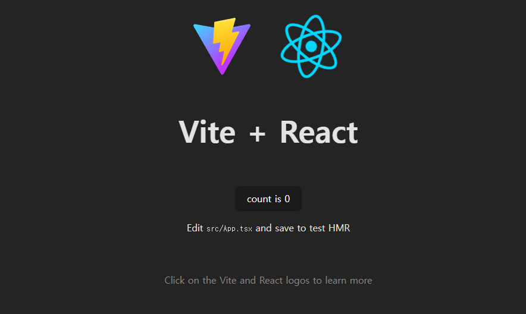
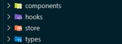
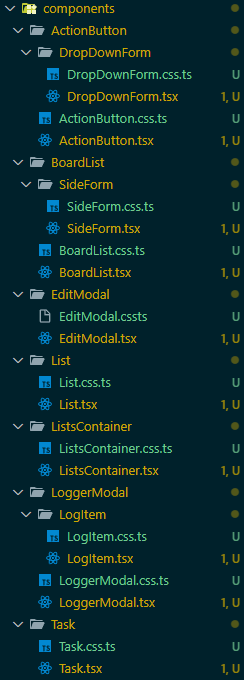
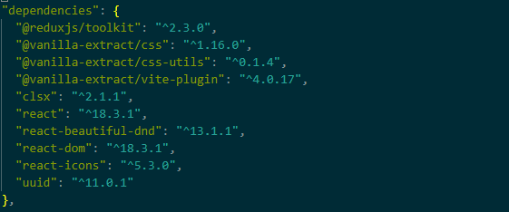

# 1. 만들고자 하는 앱 살펴보기




- 할 일 CURD
- 등록자 활동 기록

## vite로 프로젝트 생성


### `npm init vite`



---

### `npm install`



---

### `npm run dev`






<br>
<br>

# 구조 생성하기



- components
    - 컴포넌트들을 모아 관리하는 폴더

- hooks
    - 커스텀 훅을 만들어 사용하는 폴더

- store
    - 상태 관리 관련 로직을 포함한 폴더

- types
    - 타입 정의를 모아둔 폴더 (주로 TypeScript에서 사용)

- 대표적인 상태 관리 라이브러리
    - Redux 
    - Mobx 
    - Zustand 
    - Recoil 
    - React 
    - Context


<br>


# 모든 컴포넌트 생성하기





<br>


# 필요한 패키지들 설치하기


## @reduxjs/toolkit

- Redux의 공식 툴킷으로, 상태 관리를 간편하게 하기 위한 유틸리티들을 제공
- createSlice, configureStore와 같은 API로 더 쉬운 상태 관리가 가능

<br>


## clsx

- 조건부로 클래스를 조합할 때 유용한 작은 유틸리티
- 여러 조건에 따라 동적으로 클래스 이름을 할당할 때 사용합
- 예: clsx({ 'active': isActive })

<br>


## @vanilla-extract/css 
## @vanilla-extract/css-utils
## @vanilla-extract/vite-plugin

- CSS-in-JS 라이브러리
- CSS를 코드 내에서 타입 안정성을 유지하며 관리하도록 제공
- Vite 플러그인을 통해 빌드 환경에서 쉽게 사용할 수 있도록 제공

<br>


## react-icons

- 여러 오픈소스 아이콘을 React 컴포넌트로 제공
- 예: Font Awesome, Material Icons 등의 아이콘을 쉽게 사용할 수 있음

<br>


## uuid

- 고유한 식별자(UUID)를 생성하는 라이브러리
- 주로 유니크한 키나 ID가 필요할 때 사용

<br>


## react-beautiful-dnd

- 드래그 앤 드롭 기능을 쉽게 구현할 수 있도록 도와주는 React 라이브러리
- 예: 카드 리스트나 요소들을 쉽게 드래그하여 순서를 바꿀 수 있음


## 설치 실행
`npm i @reduxjs/toolkit clsx @vanilla-extract/css @vanilla-extract/css-utils @vanilla-extract/vite-plugin react-icons uuid react-beautiful-dnd`


## 설치 결과
### packgea.json




<br>
<br>

# 리덕스 사용을 위한 준비하기

## Redux의 동작 순서와 원리

### 1. Redux 기본 흐름 이해

#### 1. Action 객체 생성

- 사용자가 어떤 행동(이벤트)을 수행했을 때, 해당 동작에 대한 정보를 담은 Action 객체를 생성
- 예: { type: 'INCREMENT', payload: 1 }

#### 2. dispatch 함수 호출

- 생성된 Action 객체를 dispatch() 함수를 통해 Redux에 전달
- 예: dispatch({ type: 'INCREMENT', payload: 1 })

#### 3. Reducer 함수 처리

- dispatch()된 Action을 Reducer 함수가 받아 현재 상태(state)와 액션을 바탕으로 새로운 상태를 반환

- 예:
    ```
    function counterReducer(state = 0, action) {
        switch (action.type) {
            case 'INCREMENT':
                return state + action.payload;
            default:
                return state;
        }
    }
    ```
#### 4. Redux Store에 상태 업데이트

- Reducer 함수가 반환한 새로운 상태는 Redux Store에 저장

#### 5. React Component의 Rerendering

- 상태가 변경되면 Redux Store가 변경 사항을 감지하고, 관련된 React 컴포넌트를 다시 렌더링
- 예: useSelector() 훅을 통해 컴포넌트가 필요한 상태를 가져오고, 상태가 변경될 때 컴포넌트가 자동으로 업데이트


### Redux 동작 순서 요약
- Action 객체 생성 →
- dispatch로 액션 전달 →
- Reducer에서 새로운 상태 계산 →
- Redux Store에 상태 저장 →
- React Component가 상태 변경에 따라 다시 렌더링


## Reducer 설명

- Reducer란?
    - Reducer는 현재 상태(state)와 Action(행동)을 입력받아 새로운 상태를 반환하는 순수 함수
    - 기존 상태를 직접 변경하지 않고, 새로운 상태 객체를 반환

    ### 샘플 소스 코드
    ```
    import { createSlice } from '@reduxjs/toolkit';
    import { ITask } from '../../types';

    type TModalState = {
    boardId: string;
    listId: string;
    task: ITask;
    };

    const initialState = {
    boardId: 'board-0',
    listId: 0,
    task: {
        taskId: 'task-0',
        taskName: 'task 0',
        taskDescription: 'task description',
        taskOwner: 'vedviero',
    },
    };

    const modalSlice = createSlice({
    name: 'modal', //이름
    initialState, //초기 state
    reducers:{ //액션을 생성하는 함수들
        
    });

    export const modalReducer = modalSlice.reducer;
    ```

    #### 1. 초기 상태 설정 (initialState)
    - initialState는 모달의 기본 상태를 정의
    - 이 상태는 Redux Store에 저장
    - 모달이 처음 렌더될 때 사용
    
    ```
    const initialState = {
        boardId: 'board-0',
        listId: 0,
        task: {
            taskId: 'task-0',
            taskName: 'task 0',
            taskDescription: 'task description',
            taskOwner: 'vedviero',
        },
    };
    ```


    #### 2. Reducer와 Slice 정의
    - createSlice()는 Reducer와 액션을 함께 생성하는 Redux Toolkit의 함수
    - Reducer는 상태가 어떻게 변해야 하는지 정의하는 함수
    - 아직 reducers 안에 상태를 변경하는 액션 함수가 정의되지 않은 기본 형태
    

        ```
        const modalSlice = createSlice({
        name: 'modal', // Slice의 이름
        initialState, // 초기 상태 설정
        reducers: {}, // Reducer 함수가 들어갈 자리
        });

        export const modalReducer = modalSlice.reducer;
        ```


    #### 3. 기본 원리 요약
    - 초기 상태 설정: initialState를 사용해 모달의 상태를 정의
    - Reducer 정의: createSlice()를 통해 Reducer와 액션을 함께 생성
    - Store에 Reducer 등록: modalReducer를 Redux Store에 연결해 상태를 관리

    #### 4. 결론
    - Reducer는 상태를 관리하는 순수 함수
    - 이 코드는 Redux Toolkit의 기본 구조를 보여줌
    - 액션 함수가 추가되면 dispatch를 통해 상태를 변경
    - 현재는 초기 상태 정의와 Reducer 생성 준비만 된 상태

<br>

    
## Redux Toolkit과 React가 함께 작동하는 흐름

- Slice (슬라이스)

    - 상태와 액션이 함께 정의된 조각.
    - 예: 모달 상태를 관리하는 modalSlice.
- Reducer (리듀서)

    - 상태를 변경하는 규칙을 정의하는 함수.
    - 액션에 따라 상태를 변경함.
- Store (스토어)

    - 앱 전체의 상태를 한곳에 저장.
    - 모든 슬라이스 상태가 이곳에 모임.
- Provider (제공자)

    - 스토어를 React 컴포넌트에 공급하는 역할.
    - 없으면 컴포넌트가 Redux 상태를 사용할 수 없음.
- React Component (컴포넌트)

    - 화면을 구성하는 블록.
    - Redux에서 상태를 가져와 보여주고, 이벤트 발생 시 상태를 변경함.
- Wrapper (래퍼)

    - Provider가 컴포넌트를 감싸 스토어와 연결시킴.
 

## 동작 순서

- Provider가 Redux 스토어를 모든 컴포넌트에 전달.
- 컴포넌트는 스토어에서 상태를 가져와 화면에 보여줌.`
- 버튼 클릭 등 이벤트가 발생하면 액션이 디스패치됨.
- 리듀서가 호출돼 상태 변경.
- 상태가 바뀌면 컴포넌트가 다시 렌더링됨.


## 비유로 이해하기:
- Store
    - 공장 (데이터를 다루는 큰 창고)
- Reducer
    - 작업 규칙 (공장에서 물건을 어떻게 바꿀지 정하는 규칙)
- Slice
    - 공장 안의 작은 부서들 (각 부서가 다른 물건을 담당)
- Provider
    - 도로 (공장과 가게(컴포넌트)를 연결해주는 역할)
- React Component
    - 가게 (사용자에게 결과를 보여주는 역할)
- Wrapper
    - 쇼핑백 (컴포넌트에 필요한 데이터를 담아서 전달)

<br>


## export default vs export const의 차이점

### 1. export default
- 모듈에서 하나의 기본 내보내기를 정의
- 가장 대표적인 값을 내보낼 때 사용
- 이름 없이 내보내기 때문에, import할 때 이름을 임의로 변경 가능

    ```
    const reducer = {
    logger: loggerReducer,
    boards: boardsReducer,
    modal: modalReducer,
    };

    export default reducer;
    ```

    ```
    사용 예시:

    // 임의의 이름으로 import 가능
    import rootReducer from './reducer';  
    // 또는
    import whateverName from './reducer';
    ```

- 위 예시에서 reducer 객체가 default export로 내보내짐
- import할 때는 이름에 구애받지 않고 임의로 지정 가능

### 2. export const
- 여러 값을 개별적으로 내보냄
- 이름을 명시적으로 내보냄
- import할 때 해당 이름 그대로 사용

    ```
    import { createSlice } from '@reduxjs/toolkit';

    const boardsSlice = createSlice({
    name: 'boards',
    initialState: [],
    reducers: {},
    });

    export const boardsReducer = boardsSlice.reducer;  // 명시적 내보내기
    ```

    ```
    사용 예시:

    // 같은 이름으로만 import 가능
    import { boardsReducer } from './slices/boardsSlice';
    boardsReducer를 **export const**로 내보내면, 해당 이름 그대로 사용
    ```

<br>
<br>
<br>
<br>
<br>
<br>
<br>
<br>
<br>
<br>
<br>