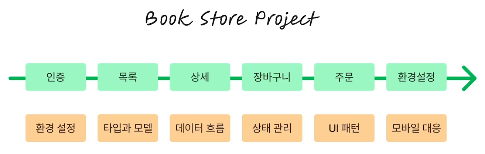
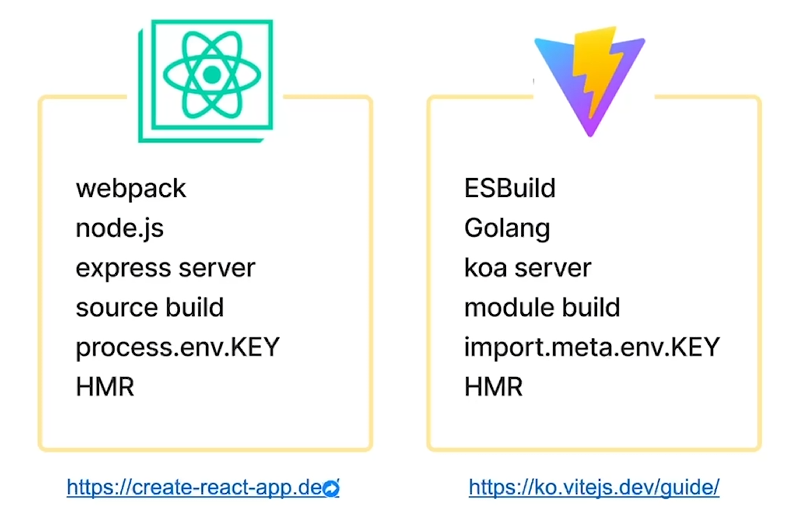

## 프로젝트 플랜

 

## CRA vs VITE

| 항목               | Create React App (CRA)                                             | Vite                                                       |
|--------------------|----------------------------------------------------------------------|------------------------------------------------------------|
| **개요**           | 초기 설정과 구성을 자동화하여 리액트 앱을 빠르게 생성할 수 있도록 지원 | 빠른 속도와 효율성을 강조하며 최신 개발 환경을 제공         |
| **개발 언어**      | Node.js                                                              | Golang                                                     |
| **번들러**         | Webpack과 Babel을 사용하여 코드 컴파일 및 압축 처리                    | ESBuild와 Rollup을 사용하여 모듈 빌드, 빠른 속도            |
| **개발 서버**      | Express 서버                                                        | Koa 서버                                                   |
| **빌드 방식**      | 전체 소스를 빌드하여 결과물을 생성                                    | 모듈 단위 빌드로 필요한 모듈만 빠르게 빌드                  |
| **환경 변수 사용** | `process.env.KEY` 형식으로 환경 변수 관리                             | `import.meta.env.KEY` 형식으로 환경 변수 관리                |
| **HMR (Hot Module Replacement)** | HMR을 지원하여 코드 변경 사항을 즉시 반영             | 더욱 빠른 HMR을 지원, 변경 사항을 모듈 단위로 즉시 반영       |
| **타입스크립트 지원** | Babel을 통해 TypeScript 코드를 브라우저에서 동작하도록 컴파일     | ESBuild를 통해 빠르게 TypeScript를 지원                     |
| **기타 특징**      | CRA는 전통적인 Webpack 기반으로 모든 코드를 한 번에 빌드하고 압축함   | Vite는 ESM 기반으로 필요한 모듈만 빠르게 로드하여 성능이 우수 |

---

 
 

# 폴더 구조

## 프로젝트 폴더 구조

프로젝트 폴더(디렉토리) 구조

1. pages - 라우트에 대응하는 페이지 컴포넌트(컨테이너)
2. components - 공통 컴포넌트, 각 페이지에서 사용되는 컴포넌트
3. utils - 유틸리티
4. hooks - 리액트 훅
5. model - 모델(타입)
6. api - api 연동을 위한 fetcher 등

# 컴포넌트 생성

## 기본적인 컴포넌트 생성 예시

- `book store`라는 텍스트가 적힌 컴포넌트를 `Home`이라는 네임으로 생성
- 외부 모듈에서 `Home`이라는 네임으로 호출할 수 있도록 내보내기 설정

 

- `Home` 컴포넌트가 위치한 물리적 경로를 명시
- 페이지 호출 시 `Home` 컴포넌트를 응답

    

 

- 테스트

    

 

- 화면 확인

    

---

## ✅ React 컴포넌트에서 하나의 Element만 return

>대표 Element가 없다면 `<> </> (Fragment)`로 감싸줄 수 있다.

- 예시

---

## 1. pages

### 📌 라우트에 대응하는 페이지 컴포넌트(컨테이너)

#### 각 라우트(URL 경로)에 대응하는 페이지 컴포넌트가 위치하는 폴더

예시: 
- /home, /about, /login 등의 경로에 맞는 HomePage, AboutPage, LoginPage 등의 컴포넌트가 이 폴더에 위치

---

## 2. components

### 📌 공통 컴포넌트, 각 페이지에서 사용되는 컴포넌트

#### 여러 페이지에서 재사용되는 공통 UI 컴포넌트들이 위치하는 폴더
#### 버튼, 입력 필드, 모달 같은 UI 요소는 이 폴더에 두어 재사용성을 높임

#### 각 라우트(URL 경로)에 대응하는 페이지 컴포넌트가 위치하는 폴더

---

## 3. utils

### 📌 유틸리티 함수 및 도구 모음

#### 페이지나 컴포넌트에서 공통적으로 사용될 수 있는 순수 함수 및 도구 함수들을 모아둔 폴더

예시:
- `날짜 형식 변환 함수`: formatDate(date: Date): string
- `숫자 포맷팅 함수`: formatNumber(number: number): string
- `로컬 스토리지 관리 함수`: getFromLocalStorage(key: string): any

---

## 4. hooks

### 📌 사용자 정의 훅

#### 리액트에서 반복적인 로직이나 상태 관리를 캡슐화하여 재사용 가능한 형태로 만든 사용자 정의 훅들이 위치하는 폴더

--- 사용자 정의 리액트 훅(Custom Hooks)

## 5. model

### 📌 데이터 구조와 타입 정의

#### 프로젝트에서 사용하는 데이터 구조와 타입을 정의한 파일이 위치하는 폴더

예시:
- `User 타입 정의`: interface User { id: number; name: string; email: string }
- `Product 타입 정의`: interface Product { id: number; name: string; price: number }

---

## 6. api

### 📌 비즈리스 로직

#### 외부 API와의 연동을 담당하는 Fetcher 함수 및 관련 설정이 위치하는 폴더

#### axios 설정이나, 특정 API를 호출하는 함수가 정의되어 여러 컴포넌트에서 쉽게 사용

---
