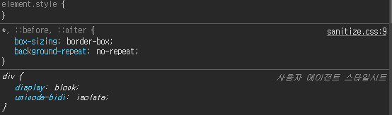
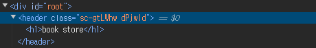

# 레이아웃 구성

## 1. 레이아웃의 필요성:

- 프로젝트의 기본 화면 구조를 정의
- 반복적으로 나타나는 `헤더`와 `푸터`를 각 페이지에 제공
- 상황에 맞게 레이아웃을 변경

## 2. 레이아웃 구성:

- Home Page: Header, Footer, 홈 콘텐츠 컴포넌트 배치
- Detail Page: Header, Sidebar, Footer, 상세 콘텐츠 컴포넌트 배치

    
    - `Layout.tsx`
    ```
    import Header from '../common/Header';
    import Footer from '../common/Footer';

    interface LayoutProps {
    children: React.ReactNode;
    }

    const Layout = ({ children }: LayoutProps) => {
        return (
            <>
                <Header />
                <main>{children}</main>
                <Footer />
            </>
        );
    };

    export default Layout;
    ```

    - `Home.tsx`
    ```
    const Home = () => {
        return (
            <>
                <div>Home body</div>
            </>
        );
    };

    export default Home;
    ```


## 3. children의 타입 지정:

- React Node 타입은 children으로 React 컴포넌트들이 배치될 수 있도록 선언
- 협업 시 타입 오류를 방지하기 위해 React Element 타입으로 작성된 파일이 children에 올바르게 배치되었는지 점검
- children을 props로 사용하거나 태그로 사용 가능


    - props로 사용 예시
        ```
        function App() {
        return <Layout children={<Home />} />;
        }
        ```

    - 태그로 사용 예시
        ```
        function App() {
        // return <Layout children={<Home />} />;
        return (
            <Layout>
                <Home />
            </Layout>
        );
        }
        ```


## CSS 

https://picocss.com/docs

> 이 내용들을 바탕으로 리액트 레이아웃 구조와 컴포넌트 타입 관리를 보다 효율적으로 할 수 있다.


<br>
<br>

# Global Style, Styped Component

## https://csstools.github.io/sanitize.css/

### 프로젝트에 `sanitize.css` 적용하기


`npm install sanitize.css` 설치
    



## Styped Component Install

- 설치

    `npm install styled-components`

- 적용 예시1 - header

    ```
    import { styled } from 'styled-components';

    const Header = () => {
        return (
            <HeaderStyle>
                <h1>book store</h1>
            </HeaderStyle>
        );
    };

    const HeaderStyle = styled.header`
        background-color: #333;
        h1 {
            color: white;
        }
    `;

    export default Header;
    ```

    - 난수화된 클래스가 적용
    
        

    - 난수화된 클래스를 사용하는 이유

        - 스타일을 캡슐화해서 제한하기 위함


- 적용 예시2 - global

    `global.ts`
    ```
    import 'sanitize.css';
    import { createGlobalStyle } from 'styled-components';

    export const GlobalStyle = createGlobalStyle``;
    ```

    `index.tsx`
    ```
    import React from 'react';
    import ReactDOM from 'react-dom/client';
    import App from './App';
    import { GlobalStyle } from './style/global';

    const root = ReactDOM.createRoot(document.getElementById('root') as HTMLElement);
    root.render(
    <React.StrictMode>
            <GlobalStyle />
            <App />
        </React.StrictMode>,
    );
    ```


<br>
<br>

# 테마 만들기


- UI/UX의 일관성 유지

    - 모든 페이지에서 일관된 디자인을 유지하여 사용자 경험을 개선

- 유지보수가 용이

    - 색상, 폰트 등의 디자인 요소를 한 곳에서 관리할 수 있어 변경이 필요한 경우 쉽게 수정

- 확장성

    - 새로운 페이지나 컴포넌트 추가 시 기존 테마를 활용하여 쉽게 확장

- 재사용성

    - 동일한 스타일을 여러 컴포넌트에서 반복적으로 사용할 수 있어 코드 중복을 줄이고 효율성을 높임

- 사용자 정의

    - 사용자 환경에 맞게 테마를 조정하거나 다크 모드, 라이트 모드 등 다양한 테마 옵션을 제공

> 테마를 활용하면 디자인의 일관성과 유지보수의 효율성을 높일 수 있음


## 


- 테마는 확장성으로 인해 자주 수정
- 타입을 지정하지 않으면 정해진 규칙을 위반할 가능성
- 개발자마다 다르게 해석될 여지를 사전 방지

    ```
    export type ThemeName = 'light' | 'dark';
    type ColorKey = 'primary' | 'background' | 'secondary' | 'third';

    interface Theme {
        name: ThemeName;
        color: Record<ColorKey, string>;
    }

    export const light: Theme = {
    name: 'light',
        color: {
            primary: 'brown',
            background: 'lightgray',
            secondary: 'blue',
            third: 'green',
        },
    };

    export const dark: Theme = {
        name: 'dark',
        color: {
            primary: 'coral',
            background: 'midnightblue',
            secondary: 'blue',
            third: 'green',
        },
    };
    ```


<br>
<br>

# Theme Swicher with Context API

1. 사용자는 토글 U를 통해 웹사이트의 색상 테마 변경
2. 색상 테마는 전역상태로 존재
3. 사용자가 선택한 테마는 론컬스토리진에 저장


# Theme toggle switcch

---

### App.tsx에서 테마 상태를 관리
- App 컴포넌트에서 themeName이라는 상태를 useState로 정의
- 이 상태는 현재 적용 중인 테마 정보를 저장(light 또는 dark)
- 테마 정보를 `ThemeProvider`와 `ThemeSwitcher` 컴포넌트로 전달

`App.tsx`
```
function App() {
   const [themeName, setThemeName] = useState<ThemeName>('light');

   return (
      <ThemeProvider theme={getTheme(themeName)}>
         <GlobalStyle themeName={themeName} />
         <ThemeSwitcher themeName={themeName} setThemeName={setThemeName} />
         <Layout>
            <Home />
         </Layout>
      </ThemeProvider>
   );
}
```


---

### 테마 토글 기능 구현

- ThemeSwitcher 컴포넌트는 전달받은 themeName을 기준으로 테마 변경

`ThemeSwitcher.tsx`
```
import { ThemeName } from '../../style/theme';

interface Props {
   themeName: ThemeName;
   setThemeName: (themeName: ThemeName) => void;
}

const ThemeSwitcher = ({ themeName, setThemeName }: Props) => {
   const toggleTheme = () => {
      setThemeName(themeName === 'light' ? 'dark' : 'light');
   };

   return <button onClick={toggleTheme}>{themeName}</button>;
};

export default ThemeSwitcher;
```

- toggleTheme 함수가 버튼 이벤트로 호출이 되면, themeName 값을 변경


---


`theme.ts`
```
export type ThemeName = 'light' | 'dark';
type ColorKey = 'primary' | 'background' | 'secondary' | 'third';

interface Theme {
   name: ThemeName;
   color: Record<ColorKey, string>;
}

export const light: Theme = {
   name: 'light',
   color: {
      primary: 'brown',
      background: 'lightgray',
      secondary: 'blue',
      third: 'green',
   },
};

export const dark: Theme = {
   name: 'dark',
   color: {
      primary: 'coral',
      background: 'midnightblue',
      secondary: 'blue',
      third: 'green',
   },
};

export const getTheme = (themeName: ThemeName): Theme => {
   switch (themeName) {
      case 'light':
         return light;
      case 'dark':
         return dark;
   }
};
```

---

### 로직

- `초기 상태` 
themeName이 'light'로 설정

- `테마 설정`
ThemeProvider가 themeName에 따라 테마 적용

- `테마 변경 준비`
ThemeSwitcher가 themeName과 setThemeName을 통해 테마 토글 준비

- `버튼 클릭`
버튼 클릭 시 toggleTheme 함수가 실행되어 themeName 변경

- `리렌더링`
themeName이 변경되어 App이 리렌더링되고 새로운 테마가 적용

---

<br>

# Context API

React와 TypeScript로, 어플리케이션의 테마를 전환하는 로직
<br>

## 1. themeContext.tsx
### 어플리케이션에서 테마를 변경하고 유지

<br>


`소스 코드`
```
import { createContext, ReactNode, useEffect, useState } from 'react';
import { ThemeName, getTheme } from '../style/theme';
import { ThemeProvider } from 'styled-components';
import { GlobalStyle } from '../style/global';

const DEFAULT_THEME_NAME = 'light';
const THEME_LOCAL_STORAGE_KEY = 'book_store_theme';

interface State {
   themeName: ThemeName;
   toggleTheme: () => void;
}

export const state = {
   themeName: DEFAULT_THEME_NAME as ThemeName,
   toggleTheme: () => {},
};

export const ThemeContext = createContext<State>(state);

export const BookStoreThemeProvider = ({ children }: { children: ReactNode }) => {
   const [themeName, setThemeName] = useState<ThemeName>('dark');

   const toggleTheme = () => {
      setThemeName(themeName === 'light' ? 'dark' : 'light');
      localStorage.setItem(THEME_LOCAL_STORAGE_KEY, themeName === 'light' ? 'dark' : 'light');
   };

   useEffect(() => {
      const savedThemeName = localStorage.getItem(THEME_LOCAL_STORAGE_KEY) as ThemeName;
      setThemeName(savedThemeName || DEFAULT_THEME_NAME);
   }, []);

   return (
      <ThemeContext.Provider value={{ themeName, toggleTheme }}>
         <ThemeProvider theme={getTheme(themeName)}>
            <GlobalStyle themeName={themeName} />
            {children}
         </ThemeProvider>
      </ThemeContext.Provider>
   );
};
```

<br>

#### 1. 기본값과 상수 설정

```
const DEFAULT_THEME_NAME = 'light';
const THEME_LOCAL_STORAGE_KEY = 'book_store_theme';
```
- `DEFAULT_THEME_NAME`
	기본 테마 이름을 'light'로 설정
    
- `THEME_LOCAL_STORAGE_KEY`
	테마 정보를 브라우저에 저장할 때 사용할 키(key)
    
- 브라우저가 데이터를 기억하는 로컬 스토리지로 저장된 테마 정보를 사용

<br>

#### 2. 상태 인터페이스 정의

```
interface State {
   themeName: ThemeName;
   toggleTheme: () => void;
}
```
- `State`
	어플리케이션의 테마 상태가 어떤 구조로 되어야 하는지 설명
- `themeName`
	현재 테마 이름 저장 ('light' 또는 'dark') 
- `toggleTheme`
	테마 변경 함수

>interface State는 테마에 대한를 명확하게 정의해주는 역할
코드에서 themeName과 toggleTheme이 어떤 타입이어야 하는지를 지정

<br>

#### 3. 초기 상태 값 설정

```
export const state = {
   themeName: DEFAULT_THEME_NAME as ThemeName,
   toggleTheme: () => {},
};
```
- `state`
	기본 테마 상태
- `themeName`
	DEFAULT_THEME_NAME으로 설정
- `toggleTheme`
	비어 있는 함수로 초기화합니다.

<br>

#### 4. 컨텍스트 생성

```
export const ThemeContext = createContext<State>(state);
```
- `ThemeContext`
	React에서 제공하는 컨텍스트(Context) 기능
    - ***`createContext`는 React에서 상태를 공유할 수 있는 Context 객체를 생성하는 함수***
    - ***컴포넌트 간에 특정한 값을 손쉽게 공유할 수 있게 하는 Context 객체***
- 테마 상태를 컴포넌트 트리 전체에 전달하는 역할

- `createContext<State>(state)`
	state 객체를 초기값으로 사용하여 ThemeContext라는 컨텍스트 
    
- 컴포넌트들 사이에서 테마 상태를 공유하는데 사용

<br>
  

#### 5. 테마 제공자 컴포넌트

```
export const BookStoreThemeProvider = ({ children }: { children: ReactNode }) => {
   const [themeName, setThemeName] = useState<ThemeName>('dark');
```
- `BookStoreThemeProvider`
  어플리케이션의 최상위에서 테마 정보를 관리하고 제공하는 컴포넌트
  
- `children`
  React 컴포넌트에서 children은 이 컴포넌트 안에 위치한 다른 모든 컴포넌트를 의미
  
- `themeName`, `setThemeName`
  useState를 통해 정의, 테마 이름을 변경할 수 있는 상태

  >children이라는 인자를 통해 감싸고 있는 하위 컴포넌트들을 받아서 렌더링
children에는 BookStoreThemeProvider로 감싸진 모든 자식 컴포넌트들이 들어감
  
```
  function App() {
     return (
        <BookStoreThemeProvider>
           <ThemeSwitcher />
           <Layout>
              <Home />
           </Layout>
        </BookStoreThemeProvider>
     );
  }
```

<br>

#### 6. 토글 함수 (테마 변경 함수)

```
const toggleTheme = () => {
   setThemeName(themeName === 'light' ? 'dark' : 'light');
   localStorage.setItem(THEME_LOCAL_STORAGE_KEY, themeName === 'light' ? 'dark' : 'light');
};
```
- toggleTheme는 테마를 변경하는 함수
- 현재 테마가 'light'면 'dark'로, 'dark'면 'light'로 변경
- 변경된 테마 이름은 localStorage에 저장
- 페이지를 새로고침해도 사용자가 마지막으로 선택한 테마 유지

<br>

#### 7. 페이지 로드시 로컬 스토리지에서 테마 불러오기

```
useEffect(() => {
   const savedThemeName = localStorage.getItem(THEME_LOCAL_STORAGE_KEY) as ThemeName;
   setThemeName(savedThemeName || DEFAULT_THEME_NAME);
}, []);
```
- useEffect는 컴포넌트가 처음 나타날 때 로컬 스토리지에서 테마 정보를 불러옴
- 저장된 테마가 있으면 그 테마를 사용
- 없으면 DEFAULT_THEME_NAME을 사용

<br>

#### 8. 컨텍스트와 테마 제공

```
return (
   <ThemeContext.Provider value={{ themeName, toggleTheme }}>
      <ThemeProvider theme={getTheme(themeName)}>
         <GlobalStyle themeName={themeName} />
         {children}
      </ThemeProvider>
   </ThemeContext.Provider>
);
```
- `ThemeContext.Provider`
  하위 컴포넌트들이 themeName과 toggleTheme를 사용할 수 있게 함
  
- `ThemeProvider`, `GlobalStyle`
  현재 테마의 스타일을 어플리케이션에 적용
  
- `getTheme(themeName)`
  themeName에 맞는 색상과 스타일을 적용

