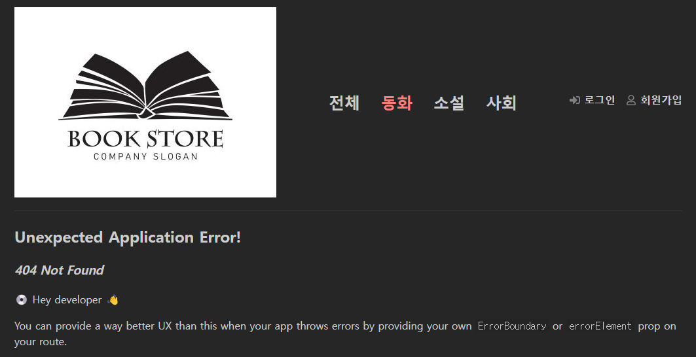
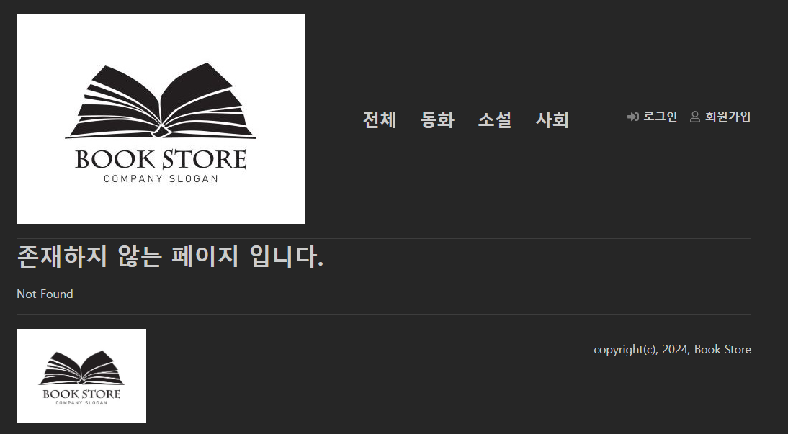
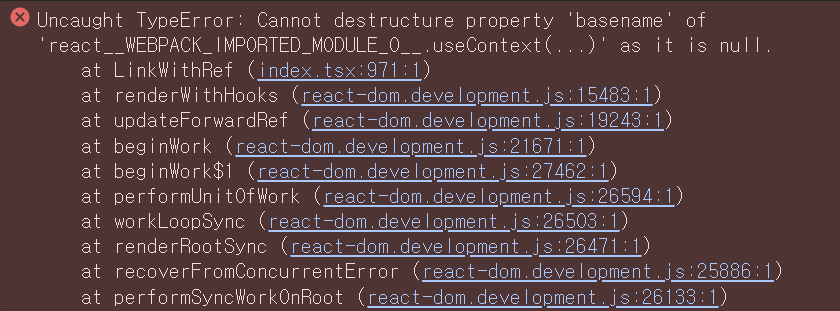
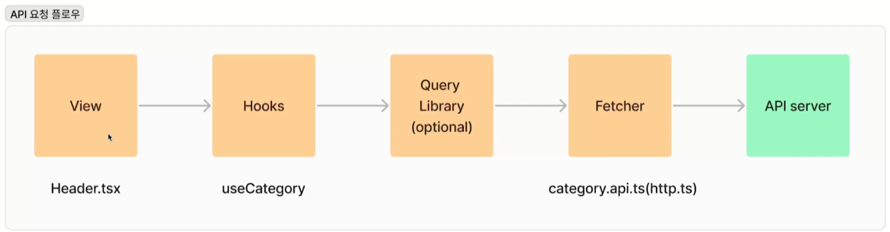
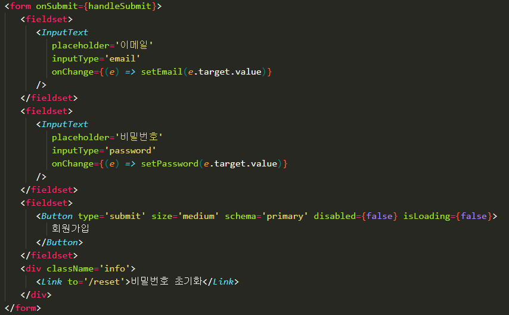
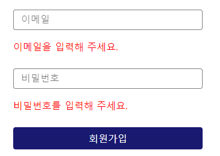

# 라우트 작성

## react-router-dom

- 1. React Router를 사용

- 2. npm install react-router-dom @types/react-router-dom -- save

---

<br>
<br>

## 라우터 목록

1. 로그인 /login
2. 회원가입 /signup
3. 비밀번호 초기화 /reset
4. 도서 목록 /books
5. 도서 상세 /books/{id}
6. 장바구니 /cart
7. 주문서 작성 /order.
8. 주문 목록 /orderlist


---

<br>
<br>


## 라우터 사용 방법

- createBrowserRouter 호출
    - `import {createBrowserRouter} from 'react-router-dom`

- `createBrowserRouter`
     - 라우터 생성

- 배열 형태로 세부 경로를 지정

    - 
    ```
    const router = createBrowserRouter([
        {
            path: '/',
            element: <Home />,
        },
        {
            path: '/books',
            element: <div>도서 목록</div>,
        },
    ]);
    ```

- 레이아웃에 랜더
    - RouterProvider 사용
        ```
        <BookStoreThemeProvider>
            <ThemeSwitcher />
            <Layout>
                <RouterProvider router={router} />
            </Layout>
        </BookStoreThemeProvider>
        ```

- /books 요청
    - routre에서 정의한 element를 return
    - 


- 존재하지 않는 페이지 요청
    - react-router-dom에서 생성
    - 


- 존재하지 않는 페이지 요청에 대한 처리
    - 요청한 페이지에 대한 에러 발생시 처리하는 원리
        - errorElement 속성 추가
            ```
            const router = createBrowserRouter([
                {
                    path: '/',
                    element: <Home />,
                    errorElement: <div>존재하지 않는 페이지 입니다.</div>,
                },
                {
                    path: '/books',
                    element: <div>도서 목록</div>,
                },
            ]);
            ```
        - 
    - 에러 페이지 생성
        - react-router-dom의 useRouteError 사용
            ```
            import { useRouteError } from 'react-router-dom';

                interface RouteError {
                statusText?: string;
                message?: string;
                }

                function Error() {
                const error = useRouteError() as RouteError;
                return (
                    <div>
                        <h1>존재하지 않는 페이지 입니다.</h1>
                        <p>{error.statusText}</p>
                        <p>{error.message}</p>
                    </div>
                );
            }
            ```
        - 생성한 페이지 적용
            ```
            const router = createBrowserRouter([
                {
                    path: '/',
                    element: <Home />,
                    errorElement: <Error />,
                },
                {
                    path: '/books',
                    element: <div>도서 목록</div>,
                },
            ]);
            ```
            - `<p>{error.statusText}</p>`영역에 구체적인 문구 `Not Found`라고 출력된다.
            


    - 페이지 이동 시, 화면이 깜빡이는 것은 router가 제대로 동작되지 않는 것
        - 원인 : a 태그
        ```
        <nav className='category'>
            <ul>
               {CATEGORY.map((item) => (
                  <li key={item.id}>
                     <a href={item.id === null ? `/books` : `/book?category_id=${item.id}`}>{item.name}</a>
                  </li>
               ))}
            </ul>
         </nav>
        ```
        - 해결 : react-router-dom에서 제공하는 Link사용
        ```
        <nav className='category'>
            <ul>
               {CATEGORY.map((item) => (
                  <li key={item.id}>
                     <Link to={item.id === null ? `/books` : `/book?category_id=${item.id}`}>{item.name}</Link>
                  </li>
               ))}
            </ul>
         </nav>
        ```
    - 에러 발생
     
    - 에러 발생 이유
        - route에서 관리하는 주체는 layout의 하위에 존재 (layout의 chilren)
        - 링크가 존재하는 `Header`파일은 layout하위에 존재하지 않음
            - RouterProvider 외부에 존재
        - ※ layout이 RouterProvider 내부에 존재해야 함

    - 소스 코드 수정
        - Layout으로 감싸기
        ```
        const router = createBrowserRouter([
            {
                path: '/',
                element: (
                    <Layout>
                        <Home />
                    </Layout>
                ),
                errorElement: <Error />,
            },
            {
                path: '/books',
                element: (
                    <Layout>
                        <div>도서 목록</div>
                    </Layout>
                ),
            },
        ]);
        ```
        - route에서 layout을 포함한 컴포넌트를 관리하게 됨
---

<br>
<br>

# API 통신과 데이터 레이어


## API 요청 데이터 흐름



### View (컴포넌트)

- API 요청이 시작되는 지점
- 예: Header.tsx에서 카테고리를 불러오는 작업을 수행.

### Hooks

- 커스텀 훅에서 API 호출 로직을 처리
- 예: useCategory 훅을 통해 데이터를 가져오고 상태를 관리.

### Query Library (선택 사항)

- react-query 같은 라이브러리를 사용할 경우, 데이터 캐싱 및 상태 관리 로직이 포함
- 선택적으로 추가 가능.

### Fetcher

- 실제 API 호출을 처리하는 함수
- 예: category.api.ts 또는 http.ts 파일에서 API 호출 로직이 정의

### API Server

- API 요청이 최종적으로 도달하는 서버
- 데이터를 가져와 응답을 반환.

### 요약
- 컴포넌트(View) → Hooks → Query Library(Optional) → Fetcher → API Server
- 이 구조는 모듈화와 재사용성을 높이고, 데이터 요청의 흐름을 명확히 관리할 수 있도록 설계


---


## 적용

### axios 사용

- axios 라이브러리 설치 `npm i axios`

    ```
    import axios, { AxiosRequestConfig } from 'axios';

    //모든 요청에 base로 들어가는 URL
    const BASE_URL = 'http://localhost:9999';
    const DEFAULT_TIMEOUT = 30000;

    export const createClient = (config?: AxiosRequestConfig) => {
        const axiosInstance = axios.create({
            baseURL: BASE_URL,
            timeout: DEFAULT_TIMEOUT,
            headers: {
                'content-type': 'application/json',
            },
            withCredentials: true,
            ...config,
    });

    //Error handle
    axiosInstance.interceptors.response.use(
        (response) => {
            return response;
        },
        (error) => {
            return Promise.reject(error);
        },
        );

        return axiosInstance;
    };

    export const httpClient = createClient();
    ```

    설명
    > - axios를 사용하여 HTTP 요청을 보내기 위한 클라이언트를 생성하는 유틸리티 함수
    > - API 요청에 필요한 공통 설정(예: baseURL, timeout, headers)을 일관성 있게 관리


### hook 생성


```
import { useEffect, useState } from 'react';
import { fetchCategory } from '../api/category.api';
import { Category } from '../models/category.model';

export const useCategory = () => {
   const [category, setCategory] = useState<Category[]>([]);

   useEffect(() => {
      fetchCategory().then((category) => {
         setCategory(category);
      });
   }, []);

   return { category };
};
```


### useCategory 훅의 역할 및 동작 원리

1. 훅의 역할
    - useCategory 훅은 React 컴포넌트에서 카테고리 데이터를 관리하고 API 요청을 통해 데이터를 가져오는 기능을 캡슐화한 커스텀 훅(Custom Hook)

2. 훅 사용

    - fetchCategory API 호출 로직을 반복 작성하지 않아도 됨
    - 상태 관리(useState)와 데이터 요청(useEffect)을 하나의 재사용 가능한 함수로 묶어서 사용
    - React 컴포넌트는 간단히 category 상태만 사용하여 데이터를 렌더링


### 코드 작성


`category.api.ts`

#### 역할

- 서버로부터 카테고리 데이터를 요청하고 반환하는 함수 fetchCategory를 호출하는 API 파일.

#### 주요 내용

- useEffect와 useState를 사용해 React 컴포넌트의 상태 관리를 수행.

- 카테고리 목록에 "전체" 항목을 추가하여 사용자가 모든 카테고리를 선택할 수 있는 옵션 제공.

#### 상세 코드 설명:

```
import { useEffect, useState } from 'react';
import { fetchCategory } from '../api/category.api';
import { Category } from '../models/category.model';

export const useCategory = () => {
   const [category, setCategory] = useState<Category[]>([]); // 카테고리 상태 초기화

   useEffect(() => {
      fetchCategory().then((category) => { // API 호출
         if (!category) return; // 데이터가 없으면 종료

         const categoryWithAll = [
            {
               id: null,
               name: '전체', // "전체" 카테고리를 추가
            },
            ...category,
         ];

         setCategory(categoryWithAll); // 상태 업데이트
      });
   }, []); // 컴포넌트 마운트 시 한 번 실행

   return { category }; // 카테고리 상태 반환
};
```

`useCategory.ts`

#### 역할

- React의 Custom Hook으로, 카테고리 데이터를 컴포넌트 내에서 쉽게 사용할 수 있도록 상태와 데이터를 제공.

#### 주요 내용

- useEffect를 통해 API 호출을 트리거.

- 상태로 관리되는 category 배열을 컴포넌트로 반환하여 사용.

#### 상세 코드 설명


---

<br>
<br>


# React Hook Form

- input태그에 속성이 많아지면 복잡하고, 수정하기 어려워 짐.
    ```
    import { useEffect, useState } from 'react';
    import { fetchCategory } from '../api/category.api';
    import { Category } from '../models/category.model';

    export const useCategory = () => {
    const [category, setCategory] = useState<Category[]>([]); // 빈 카테고리 배열 초기화

    useEffect(() => {
        fetchCategory().then((category) => { // 비동기적으로 데이터 가져오기
            if (!category) return; // 데이터가 없을 경우 early return

            const categoryWithAll = [
                {
                id: null,
                name: '전체', // 기본 옵션 추가
                },
                ...category, // 기존 카테고리 데이터 추가
            ];

            setCategory(categoryWithAll); // 업데이트된 데이터로 상태 갱신
        });
    }, []); // 의존성 배열: 마운트 시 한 번 실행

    return { category }; // 최종적으로 카테고리 데이터 반환
    };
    ```


    
---

### 리액트 폼 상태관리와 유효성 검증에 특화된 라이브러리
- 설치
    - `npm i react-hook-form`
- 호출
    - `import { useForm } from 'react-hook-form';`

- 코드

    - 인터페이스 필요
    ```
    interface SignupProrps {
        email: string;
        pasword: string;
    }

    const {
      register,
      handleSubmit,
      formState: { error },
    };
    useForm<SignupProrps>();
    ```

    - 기존 방식
    ```
    <form onSubmit={handleSubmit}>

     <InputText
        placeholder='이메일'
        inputType='email'
        onChange={(e) => setEmail(e.target.value)}
    />
    ```

    - hookForm 방식
    ```
    const onSubmit = (data: SignupProrps) => {
       console.log(data);
    };

    <form onSubmit={handleSubmit(onSubmit)}>

    <InputText
        placeholder='이메일'
        inputType='email'
        {...register('email', { required: true })}
    />
    ```


    - 유효성 검증 코드
    ```
    <fieldset>
        <InputText
            placeholder='이메일'
            inputType='email'
            {...register('email', { required: true })}
        />
        {errors.email && <p className='error-text'>이메일을 입력해 주세요.</p>}
    </fieldset>
    <fieldset>
        <InputText
            placeholder='비밀번호'
            inputType='password'
            {...register('password', { required: true })}
        />
        {errors.password && <p className='error-text'>비밀번호를 입력해 주세요.</p>}
    </fieldset>
    ```
    - 유효성 검증 메세지가 출력되는 이미지

        


---

<br>
<br>
