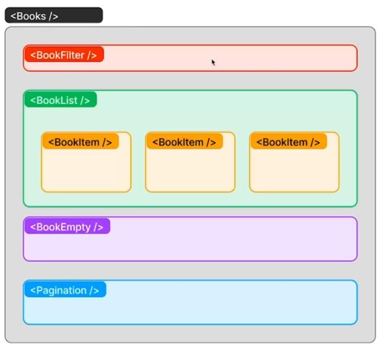
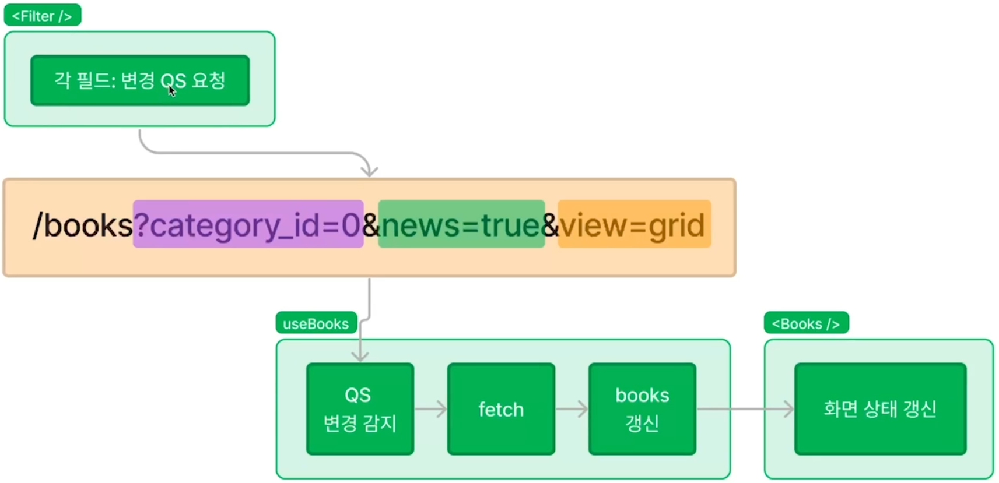

# 도서 목록 페이지


### 도서 목록 화면 요구 사항

1. 도서(book)의 목록을 fetch 하여 화면에 렌더
2. 페이지네이셨을 구현
3. 검색 결과가 없는 경우, 결과 없음 화면 노출
4. 카테고리 및 신간 필터 기능을 제공
5. 목록의 view는 `그리드 형태`, `목록 형태`로 변경 가능

---

- UI 구조

    


---

<br>
<br>

### BooksItem.jsx

#### 1. 컴포넌트의 구조와 흐름

- BookItem은 책 한 권의 데이터를 받아 화면에 렌더링하는 React 컴포넌트
- 책의 이미지, 제목, 요약, 저자, 가격, 좋아요 수를 화면에 표시

    #### 코드의 흐름

    - Props 정의:

        - BookItem 컴포넌트는 Props로 book 데이터를 받는다.
        - book은 Book 인터페이스를 기반으로 타입이 정의

    - 데이터 렌더링:

        - book 객체의 각 속성을 활용하여 데이터를 화면에 표시.
---

<br>
<br>

### BooksEmpty.jsx

- 검색 결과가 없을 때 사용자에게 보여줄 React 컴포넌트인 BooksEmpty를 구현

#### 구현 내용

- react-icons 사용

#### 스타일링

- BooksEmptyStyle을 styled-components로 작성하여 레이아웃을 정리.

- 중앙 정렬을 위해 flexbox를 활용:
    ```
    display: flex;
    flex-direction: column;
    justify-content: center;
    align-items: center;
    ```

---

<br>
<br>

### BooksFilter.jsx

- 쿼리스트링
    

    - useBooks에서 변경된 쿼리스트링 감지
        - 도서 검색에 대한 목록 결과를 반환하는 Hook

    - 반환된 검색 결과를 fetch해서 새로운 데이터로 갱신
    - Books라는 상태로 갱신

    - `<Books/>` 화면에 랜더링


### BooksFilter 컴포넌트의 역할

- BooksFilter는 사용자가 카테고리 버튼이나 신간 버튼을 클릭하여 필터를 설정
- 필터 정보를 URL에 쿼리스트링(query string)으로 반영하는 역할

    - 카테고리 필터
        - 카테고리별로 버튼을 생성하고, 클릭하면 해당 카테고리를 활성화
    - 신간 필터
        - "신간" 버튼을 클릭하여 news=true를 토글


### 코드의 흐름

#### 1. useCategory 훅 호출

`const { category } = useCategory();`

    useCategory는 카테고리 데이터를 가져옴
    URL의 쿼리스트링(category_id)에 따라 각 카테고리의 활성 상태(isActive)를 업데이트

- 반환된 category 배열의 구조
    ```
    [
        { id: null, name: '전체', isActive: true },
        { id: 1, name: '소설', isActive: false },
        { id: 2, name: '경제', isActive: false },
        ...
    ];
    ```

#### 2. 버튼 생성

```
{category.map((item) => (
   <Button
      size="medium"
      schema={item.isActive ? "primary" : "normal"}
      disabled={false}
      isLoading={false}
      onClick={() => {
         handleCategory(item.id); // 클릭 시 필터 처리
      }}
      key={item.id}
   >
      {item.name}
   </Button>
))}
```

- 카테고리 배열을 map 함수로 순회하여 버튼을 동적으로 생성
- 버튼 색상(schema)은 item.isActive에 따라 설정
    - 활성화된 카테고리는 primary, 비활성화된 카테고리는 normal
- 클릭 시, handleCategory 함수가 실행되어 URL의 쿼리스트링을 업데이트

#### 3. handleCategory 함수 실행

```
const handleCategory = (id: number | null) => {
   const newSearchParams = new URLSearchParams(searchParams);

   if (id === null) {
      newSearchParams.delete(QUERYSTRING.CATEGORY_ID); // 'category_id' 제거
   } else {
      newSearchParams.set(QUERYSTRING.CATEGORY_ID, id.toString()); // 'category_id' 설정
   }

   setSearchParams(newSearchParams); // URL 쿼리스트링 업데이트
};
```
- 클릭된 카테고리의 ID를 쿼리스트링에 반영
- id === null: category_id를 제거 (전체 카테고리로 설정).
- id !== null: category_id를 해당 ID로 설정.

#### 4. 신간 필터 처리

```
const handleNews = () => {
   const newSearchParams = new URLSearchParams(searchParams);

   if (newSearchParams.get(QUERYSTRING.NEWS)) {
      newSearchParams.delete(QUERYSTRING.NEWS); // 'news' 제거
   } else {
      newSearchParams.set(QUERYSTRING.NEWS, "true"); // 'news' 추가
   }

   setSearchParams(newSearchParams); // URL 업데이트
};
```
- "신간" 버튼을 클릭하면, news=true 값을 URL 쿼리스트링에 추가하거나 제거
- 이미 news=true가 있다면 제거
- 없다면 news=true를 추가


### useCategory 훅의 역할

- useCategory는 카테고리 데이터를 가져옴
- URL 쿼리스트링의 변화에 따라 각 카테고리의 활성 상태를 관리

#### 코드의 흐름
1. 초기 카테고리 데이터 로드

```
const [category, setCategory] = useState<Category[]>([]);

useEffect(() => {
   fetchCategory().then((category) => {
      if (!category) return;

      const categoryWithAll = [
         { id: null, name: "전체" },
         ...category,
      ];

      setCategory(categoryWithAll); // 카테고리 상태 업데이트
      setActive(); // 활성 상태 업데이트
   });
}, []);
```
#### fetchCategory 함수로 카테고리 데이터를 가져옴

    - API에서 가져온 카테고리에 기본 카테고리 "전체"를 추가
    - category구조
        ```
        [
            { id: null, name: "전체" },
            { id: 1, name: "소설" },
            { id: 2, name: "경제" },
            ...
        ]
        ```

    - setActive 함수를 호출하여 URL의 쿼리스트링에 따라 카테고리 활성 상태를 업데이트

### 2. URL 쿼리스트링 변화 감지

```
useEffect(() => {
   setActive(); // location.search 변경 시 활성 상태 업데이트
}, [location.search]);
```
- useLocation을 사용하여 URL 쿼리스트링(location.search) 변화를 감지
- 쿼리스트링이 변경될 때마다 setActive를 호출하여 카테고리의 활성 상태를 업데이트


---

<br>
<br>

# BooksList.tsx

## 도서 정보를 화면에 렌더링하는 전체 로직

- 사용자가 도서를 검색하거나 필터링할 때, 도서 데이터를 API로부터 가져와서 화면에 표시하는 흐름
- 도서 목록을 표시하고, 필터나 페이지네이션, 결과가 없을 경우에 대한 처리를 모두 포함

### 1. Books 컴포넌트: 페이지의 메인 구조

- 도서 검색 결과 페이지의 메인 컴포넌트
    - 검색 결과 데이터를 받아서 목록을 표시하거나, 결과가 없을 경우 적절한 메시지를 표시
    - 데이터는 useBooks 훅을 통해 가져옴
    ```
    const Books = () => {
        const { books, pagination, isEmpty } = useBooks(); // 데이터 가져오기

        return (
            <>
                <Title size='large'>도서 검색 결과</Title> {/* 제목 */}
                <BooksStyle>
                    <BooksFilter /> {/* 필터링 UI */}
                    <BooksViewSwitcher /> {/* 뷰 전환 (그리드/리스트 등) */}
                    {!isEmpty && <BooksList books={books} />} {/* 도서 목록 */}
                    {isEmpty && <BooksEmpty />} {/* 결과가 없을 때 */}
                    {!isEmpty && <Pagination />} {/* 페이지네이션 */}
                </BooksStyle>
            </>
        );
    };
    ```

#### 데이터 흐름

1. useBooks로 도서 데이터 가져오기

    - `useBooks`
        - 훅을 통해 API에서 가져온 books, pagination, isEmpty 값을 가져옴
    - `books`
        - 도서 목록 데이터 배열.
    - `pagination`
        - 현재 페이지와 총 도서 개수를 나타내는 데이터.
    - `isEmpty`
        - 검색 결과가 없을 때 true.

2. 조건부 렌더링:

- 검색 결과가 있는 경우:
    - BooksList를 렌더링하여 도서 목록을 표시합니다.
    - Pagination 컴포넌트를 렌더링하여 페이지 이동 UI를 제공합니다.
- 검색 결과가 없는 경우:
    - BooksEmpty 컴포넌트를 렌더링하여 "결과 없음" 메시지를 표시합니다


### 2. useBooks 훅: 도서 데이터 가져오기

- API 호출을 통해 도서 데이터를 가져오고 상태를 관리
- URL의 쿼리스트링을 감지하여 요청 데이터를 업데이트

    ```
    export const useBooks = () => {
    const location = useLocation(); // URL 쿼리스트링 가져오기

    const [books, setBooks] = useState<Book[]>([]); // 도서 목록 상태
    const [pagination, setPagination] = useState<Pagination>({
        totalCount: 0,
        currentPage: 1,
    }); // 페이지네이션 상태

    const [isEmpty, setIsEmpty] = useState(true); // 결과 없음 상태

    useEffect(() => {
        const params = new URLSearchParams(location.search); // URL의 쿼리스트링 읽기
        fetchBooks({
            category_id: params.get(QUERYSTRING.CATEGORY_ID)
                ? Number(params.get(QUERYSTRING.CATEGORY_ID))
                : undefined,
            news: params.get(QUERYSTRING.NEWS) ? true : undefined,
            currentPage: params.get(QUERYSTRING.PAGE) ? Number(params.get(QUERYSTRING.PAGE)) : 1,
            limit: LIMIT, // 한 페이지당 보여줄 도서 개수
        }).then(({ books, pagination }) => {
            setBooks(books); // 도서 목록 상태 업데이트
            setPagination(pagination); // 페이지네이션 상태 업데이트
            setIsEmpty(books.length === 0); // 결과가 없으면 true
        });
    }, [location.search]); // URL 변경 시마다 실행

        return { books, pagination, isEmpty }; // 상태 반환
    };
    ```

#### 데이터 흐름:

1. URL의 쿼리스트링 감지

    - location.search를 통해 사용자가 선택한 카테고리, 신간 여부, 페이지 번호를 읽음

2. API 호출 (fetchBooks)

    - 쿼리스트링 데이터를 fetchBooks 함수에 전달하여 서버에서 도서 데이터를 가져옴
    - 결과로 가져온 데이터를 books와 pagination 상태에 저장

3. 결과가 없는 경우 처리

    - books 배열의 길이가 0일 경우 isEmpty를 true로 설정

4. 데이터 반환

    - books: 현재 페이지의 도서 목록 배열.
    - pagination: 총 도서 개수와 현재 페이지.
    - isEmpty: 결과가 없을 때 true.


### 3. BooksList 컴포넌트: 도서 목록 표시

- books 데이터를 받아와 도서를 목록 형태로 렌더링
- 각 도서는 BookItem 컴포넌트를 통해 렌더링

    ```
    const BooksList = ({ books }: Props) => {
        return (
            <BooksListStyle>
                {books?.map((item) => (
                    <BookItem key={item.id} book={item} /> // 각 도서를 BookItem으로 렌더링
                ))}
            </BooksListStyle>
        );
    };
    ```

#### 데이터 흐름:

1. books 데이터 받기

    - Books 컴포넌트에서 BooksList에 books 데이터를 전달.
    - books는 각 도서의 정보를 담은 객체 배열.

2. BookItem으로 렌더링:

    - books.map을 사용해 각 도서를 BookItem 컴포넌트로 렌더링
    - key={item.id}를 사용하여 고유 식별자를 부여


### 4. BookItem 컴포넌트: 개별 도서 렌더링

단일 도서 데이터를 받아 렌더링

```
const BookItem = ({ book }: Props) => {
   return (
      <BookItemStyle>
         <div className="img">
            
         </div>
         <div className="content">
            <h3>{book.title}</h3>
            <p>{book.author}</p>
            <p>{book.price}원</p>
         </div>
      </BookItemStyle>
   );
};
```

#### 데이터 흐름:
1. BookItem은 books 배열의 각 객체를 받아 렌더링.

    - BookItem은 도서의 제목, 저자, 가격 등을 렌더링
    - 이미지는 getImgSrc(book.img)로 가져옴


### 전체 데이터 흐름
 
- Books 컴포넌트는 useBooks 훅을 호출하여 도서 데이터를 가져옴
- 검색 결과가 있으면 BooksList를 렌더링하고, 검색 결과가 없으면 BooksEmpty를 렌더링
- BooksList는 books 데이터를 받아 각 도서를 BookItem으로 렌더링
- BookItem은 개별 도서 데이터를 받아 화면에 도서 정보를 표시


---

<br>
<br>


# Pagination.tsx

### 1) 총 페이지 수 계산

`const pages: number = Math.ceil(totalCount / LIMIT);`

- totalCount: 총 데이터 수.
- LIMIT: 한 페이지에 보여줄 데이터의 개수(상수로 정의).

### 2) 쿼리스트링 업데이트

React Router의 useSearchParams를 사용하여 URL의 쿼리스트링을 업데이트

```
const handleClickPage = (page: number) => {
   const newSearchParams = new URLSearchParams(searchParams);
   newSearchParams.set(QUERYSTRING.PAGE, page.toString());
   setSearchParams(newSearchParams);
};
```
- newSearchParams.set: 현재 URL에서 page 값을 설정.
- setSearchParams: URL 쿼리스트링 변경.

### 3) 페이지 버튼 생성

Array(pages)를 활용하여 필요한 페이지 버튼을 동적으로 생성

```
{Array(pages)
   .fill(0)
   .map((_, index) => (
      <li key={index}>
         <Button
            size="small"
            schema={index + 1 === currentPage ? 'primary' : 'normal'}
            onClick={() => handleClickPage(index + 1)}
         >
            {index + 1}
         </Button>
      </li>
   ))}
```
- schema 속성은 currentPage와 버튼의 index + 1이 같을 경우 primary로 설정해 현재 페이지를 강조.