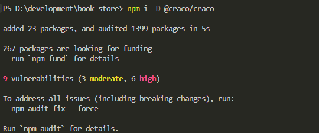
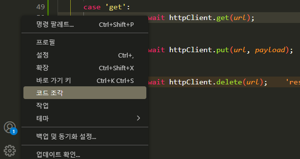
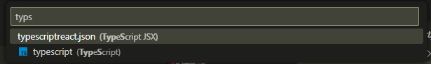
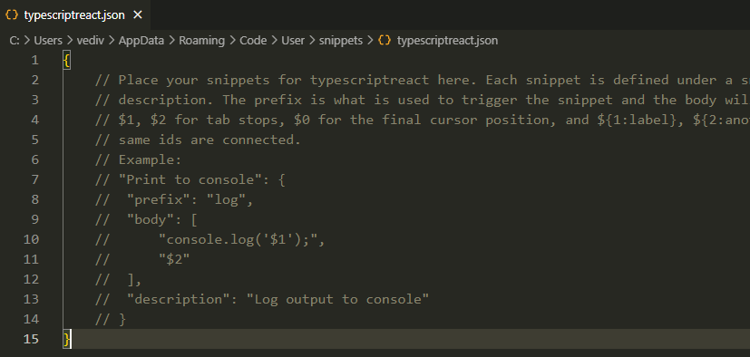
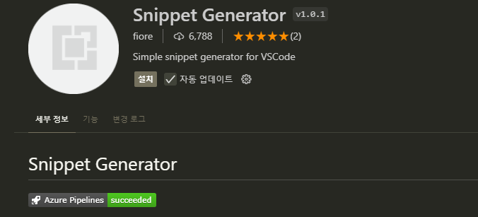
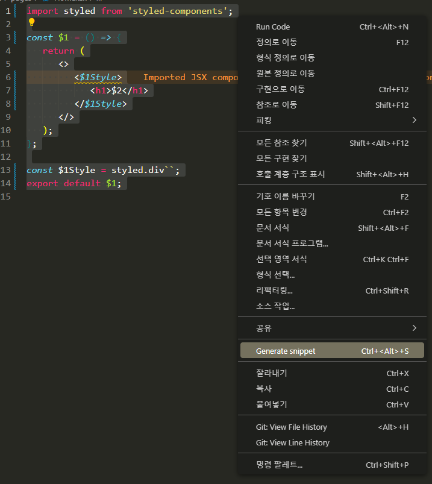
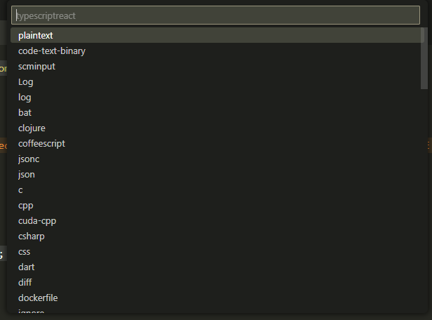

# 회고

## 회고를 하는 이유

1. 성장과 학습
2. 문제 해결
3. 유연성과 적응성
4. 퍼포먼스 향상

---

## 주요 학습했던 주제

1. 타입과 모델
2. 데이터 흐름
3. 컴포넌트 작성
4. CSS 스타일링
5. 커스텀 훅

---

## 현재 프로젝트는 상대경로로 각 모듈 및 컴포넌트를 호출

- 프로젝트 규모가 커지면, deps가 복잡해지기에 절대경로로 관리하는 것이 좋음
- craco를 사용해 경로 설정

---

# import alias

- craco 설치
- `npm i -D @craco/craco` 
    

<br>
<br>

## `tsconfig.ts`

`"include": ["src", "craco.config.js"]` 추가


## tsconfig.paths.json

```
{
   "compilerOptions": {
      "baseUrl": ".",
      "paths": {
         "@/*": ["src/*"]
      }
   }
}
```

## craco.config.js

```
const cracoAlias = require('craco-alias');

module.exports = {
   plugins: [
      {
         plugin: cracoAlias,
         options: {
            source: 'tsconfig',
            baseUrl: '.',
            tsConfigPath: 'tsconfig.paths.json',
            debug: false,
         },
      },
   ],
};
```


## package.json


`기존 실행 설정`
```
"scripts": {
    "start": "react-scripts start",
    "build": "react-scripts build",
    "test": "react-scripts test",
    "eject": "react-scripts eject",
    "typecheck": "tsc --noEmit --skipLibCheck"
},
```

`craco 실행 설정`
```
"scripts": {
    "start": "craco start",
    "build": "craco build",
    "test": "craco test",
    "eject": "react-scripts eject",
    "typecheck": "tsc --noEmit --skipLibCheck"
},
```

## Craco 적용


`기존 경로 처리 방식`
```
import styled from 'styled-components';
import { Book } from '../../models/book.model';
import { getImgSrc } from '../../utils/image';
import { formatNumber } from '../../utils/format';
import { FaHeart } from 'react-icons/fa';
import { ViewMode } from './BooksViewSwitcher';
import { Link } from 'react-router-dom';
```

`절대 경로로 변경`
```
import styled from 'styled-components';
import { Book } from '@/models/book.model';
import { getImgSrc } from '@/utils/image';
import { formatNumber } from '@/utils/format';
import { FaHeart } from 'react-icons/fa';
import { ViewMode } from '@/components/books/BooksViewSwitcher';
import { Link } from 'react-router-dom';
```


---
<br>
<br>

# 중복 코드 제거

## App.tsx
route에 배열로 path(경로)를 전달하는 구조

```
const router = createBrowserRouter([
   {
      path: '/',
      element: (
         <Layout>
            <Home />
         </Layout>
      ),
      errorElement: <Error />,
   },
    .
    .
    (중략)
    .
    .

   {
      path: '/orderList',
      element: (
         <Layout>
            <OrderList />
         </Layout>
      ),
   },
]);
```

경로가 담긴 배열 객체들을 `routeList`변수에 할당하여 외부로 분리 

```
const routerList = [
   {
      path: '/',
      element: (
         <Layout>
            <Home />
         </Layout>
      ),
      errorElement: <Error />,
   },
    .
    .
    (중략)
    .
    .

   {
      path: '/orderList',
      element: (
         <Layout>
            <OrderList />
         </Layout>
      ),
   },
]

// routeList를 순회하면서 element를 전달
const newRouteList = routeList.map((item) => {
   return {
      ...item,
      element: <Layout>{item.element}</Layout>,
      errorElement: <Error />,
   };
});


// newRouteList 인자로 전달하여 createBrowserRouter함수 실행
const router = createBrowserRouter(newRouteList);
```

리팩토링한 결과
```
const routeList = [
   {
      path: '/',
      element: <Home />,
      errorElement: <Error />,
   },
   {
      path: '/books',
      element: <Books />,
   },
   {
      path: '/signUp',
      element: <SignUp />,
   },
   {
      path: '/reset',
      element: <ResetPassword />,
   },
   {
      path: '/login',
      element: <Login />,
   },
   {
      path: '/book/:bookId',
      element: <BookDetail />,
   },
   {
      path: '/cart',
      element: <Cart />,
   },
   {
      path: '/order',
      element: <Order />,
   },
   {
      path: '/orderList',
      element: <OrderList />,
   },
];

const newRouteList = routeList.map((item) => {
   return {
      ...item,
      element: <Layout>{item.element}</Layout>,
      errorElement: <Error />,
   };
});
const router = createBrowserRouter(newRouteList);
```

`newRouteList`라는 변수명의 개념이 상대적이기 때문에 로직을 바로 변수로 할당

```
const router = createBrowserRouter(
    return {
      ...item,
      element: <Layout>{item.element}</Layout>,
      errorElement: <Error />,
    }
);
```

<br>
<br>

## order.api.ts

```
import { Order, OrderDetailItem, OrderSheet } from '../models/order.model';
import { httpClient } from './http';

export const order = async (orderData: OrderSheet) => {
   const token = localStorage.getItem('token');
   if (!token) {
      throw new Error('JWT 토큰이 없습니다. 로그인하세요.');
   }
   const response = await httpClient.post('/orders', orderData, {
      headers: {
         Authorization: `${token}`,
      },
   });
   return response.data;
};

export const fetchOrders = async () => {
   const token = localStorage.getItem('token');
   if (!token) {
      throw new Error('JWT 토큰이 없습니다. 로그인하세요.');
   }
   const response = await httpClient.get<Order[]>('/orders', {
      headers: {
         Authorization: `${token}`,
      },
   });
   return response.data;
};
export const fetchOrder = async (orderId: number) => {
   const token = localStorage.getItem('token');
   if (!token) {
      throw new Error('JWT 토큰이 없습니다. 로그인하세요.');
   }
   const response = await httpClient.get<OrderDetailItem[]>(`/orders/${orderId}`, {
      headers: {
         Authorization: `${token}`,
      },
   });
   return response.data;
};
```

### 중복으로 판단되는 부분

- `const response = await httpClient`
- `return response.data;`


### API요청 모듈화
`http.ts`
```
// http.js
type RequestMethod = 'get' | 'post' | 'put' | 'delete';

export const requestHandler = async <T>(method: RequestMethod, url: string, payload?: T) => {
   let response;

   switch (method) {
      case 'post':
         response = await httpClient.post(url, payload);
         break;
      case 'get':
         response = await httpClient.get(url);
         break;
      case 'put':
         response = await httpClient.put(url, payload);
         break;
      case 'delete':
         response = await httpClient.delete(url);
         break;
   }
};
```


#### 예시. 1
`기존 API 요청 코드`
```
export const order = async (orderData: OrderSheet) => {
   const token = localStorage.getItem('token');
   if (!token) {
      throw new Error('JWT 토큰이 없습니다. 로그인하세요.');
   }
   const response = await httpClient.post('/orders', orderData, {
      headers: {
         Authorization: `${token}`,
      },
   });
   return response.data;
};
```

`변경 API 요청 코드`
```
export const order = async (orderData: OrderSheet) => {
   return await requestHandler<OrderSheet>('post', '/orders', orderData);
};
```

#### 예시. 2
`기존 API 요청 코드`
```
export const fetchOrder = async (orderId: number) => {
   const token = localStorage.getItem('token');
   if (!token) {
      throw new Error('JWT 토큰이 없습니다. 로그인하세요.');
   }
   const response = await httpClient.get<OrderDetailItem[]>(`/orders/${orderId}`, {
      headers: {
         Authorization: `${token}`,
      },
   });
   return response.data;
};
```

`변경 API 요청 코드`
```
export const fetchOrder = async (orderId: number) => {
   return await requestHandler('get', `/orders/${orderId}`);
};
```


---
<br>
<br>

# 스니펫 만들기

- VS코드 하단 `코드조각`

    

    

    - 매우 복잡한 구조
    


- 도구를 사용해서 스니펫 생성
 


## 사용 방법

### 사용하려는 코드 작성 및 우 클릭



###  대응 언어 선택




---

<br>
<br>

# useAuth 훅 만들기

`기존 로직`
- 제출될 때 로그인 여부를 검증하는 코드
    ```
    const onSubmit = (data: LoginProps) => {
        login(data).then(
            (res) => {
            storeLogin(res.token);

            console.log(res.token);
            showAlert('로그인 되었습니다.');
            navigate('/');
            },
            (error) => {
            showAlert('로그인이 실패했습니다.');
            },
        );
    };
    ```

`변경 로직`
    
- useAuth.ts 생성
    
    ```
    export const useAuth = () => {
        //상태
        const { storeLogin, storeLogout, isLoggedIn } = useAuthStore();
        const navigate = useNavigate();
        const { showAlert } = useAlert();
        //메소드
        const userLogin = (data: LoginProps) => {
            login(data).then(
                (res) => {
                    storeLogin(res.token);

                    console.log(res.token);
                    showAlert('로그인 되었습니다.');
                    navigate('/');
                },
                (error) => {
                    showAlert('로그인이 실패했습니다.');
                },
            );
        };

        //리턴
        return { userLogin };
    };
    ```

`해당 함수 호출`
```
const onSubmit = (data: LoginProps) => {
    userLogin(data);
};
```


---
<br>
<br>

# React-query 적용

- 설치
    - `npm i react-query`


## queryClient.ts

```
import { QueryClient } from 'react-query';

export const queryClient = new QueryClient();
```

## App.tsx
```
import { QueryClientProvider } from 'react-query';

function App() {
   return (
      <QueryClientProvider client={queryClient}>
         <BookStoreThemeProvider>
            <RouterProvider router={router} />
         </BookStoreThemeProvider>
      </QueryClientProvider>
   );
}
```

- QueryClientProviderd에서 관리하는 하위 컴포넌트에서 `React-Query`를 사용할 수 있다.
- QueryClientProviderd의 대상이되는 Books.tsx
- Books.tsx에 데이터를 다루는 useBooks()
    - `const { books, pagination, isEmpty } = useBooks();`


    - useBooks.ts를 보면 `useState`와 `useEffect`로 데이터를 관리하고 있다.
        ```
        export const useBooks = () => {
        const location = useLocation();

        const [books, setBooks] = useState<Book[]>([]);
        const [pagination, setPagination] = useState<Pagination>({
            totalCount: 0,
            currentPage: 1,
        });

        const [isEmpty, setIsEmpty] = useState(true);

        useEffect(() => {
            const params = new URLSearchParams(location.search);
            fetchBooks({
                category_id: params.get(QUERYSTRING.CATEGORY_ID)
                    ? Number(params.get(QUERYSTRING.CATEGORY_ID))
                    : undefined,
                news: params.get(QUERYSTRING.NEWS) ? true : undefined,
                currentPage: params.get(QUERYSTRING.PAGE) ? Number(params.get(QUERYSTRING.PAGE)) : 1,
                limit: LIMIT,
            }).then(({ books, pagination }) => {
                setBooks(books);
                setPagination(pagination);
                setIsEmpty(books.length === 0);
            });
        }, [location.search]);
        return { books, pagination, isEmpty };
        };
        ```

        - ReactQuery로 전체 데이터를 다룰 수 있게 된다.


## 리액트 쿼리 리팩토링 

`useBooks.ts`

```
import { useEffect, useState } from 'react';
import { useLocation } from 'react-router-dom';
import { fetchBooks } from '../api/books.api';
import { QUERYSTRING } from '../constants/queryString';
import { LIMIT } from '../constants/pagination';
import { useQuery } from 'react-query';

export const useBooks = () => {
   const location = useLocation();
   const params = new URLSearchParams(location.search);
   const { data: booksData, isLoading: isBooksLoading } = useQuery(['books', location.search], () =>
      fetchBooks({
         category_id: params.get(QUERYSTRING.CATEGORY_ID)
            ? Number(params.get(QUERYSTRING.CATEGORY_ID))
            : undefined,
         news: params.get(QUERYSTRING.NEWS) ? true : undefined,
         currentPage: params.get(QUERYSTRING.PAGE) ? Number(params.get(QUERYSTRING.PAGE)) : 1,
         limit: LIMIT,
      }),
   );

   return {
      books: booksData?.books,
      pagination: booksData?.pagination,
      isEmpty: booksData?.books.length === 0,
      isBooksLoading,
   };
};
```

## 1. 기존 코드와 변경 코드의 차이점

- ### 기존 코드
    - `데이터 상태 관리`
        - useState와 useEffect를 사용해 상태(books, pagination)를 수동으로 업데이트.
    - `비동기 로직 관리`
        - fetchBooks를 호출하고, 데이터를 받아와 상태를 업데이트.
    - `의존성 관리`
        - useEffect에서 location.search를 의존성으로 등록해 URL 변경 시 데이터를 새로 로드.

- ### 변경된 코드
    - `React Query를 활용`
        - 상태 관리와 비동기 로직을 React Query에서 제공하는 useQuery로 통합.
    - `자동화된 의존성`
        - useQuery의 키(['books', location.search])를 사용해 의존성을 자동으로 관리.
    - `로딩 상태 관리`
        - React Query의 isLoading으로 로딩 상태를 자동 처리.
    - `캐싱 및 리패칭`
        - 동일한 키로 호출된 데이터를 캐싱하고, 의존성 변경 시 자동으로 리패칭.

            - ### 1. 캐싱(Caching)이란?
                - 리액트 쿼리는 서버에서 받아온 데이터를 `임시로 저장`해서 필요할 때 다시 재사용하는 기능

                #### 캐싱 사용이유
                - 중복 요청 방지:
                    - 동일한 데이터를 반복해서 서버에 요청하지 않아도 됨
                    - 같은 페이지를 여러 번 방문해도 이미 받아온 데이터는 서버에 다시 요청하지 않고 바로 사용
                - 빠른 반응성:
                    - 데이터를 이미 캐싱해뒀다면, UI가 바로 업데이트
                    - 서버 응답을 기다릴 필요가 없음

            - ### 리액트 쿼리에서 "키"란?
                - 리액트 쿼리는 데이터를 요청할 때마다 `고유한 식별자(=키)`를 사용
                - 이 키를 기준으로 데이터를 저장하거나 불러옴
                - 예시
                    -  `// 'books'라는 키 + 'category1' 조건`
                    - `useQuery(['books', 'category1'], fetchBooks);`

            - ### 리패칭(Refetching)이란?
                - 리액트 쿼리는 키가 변경되거나 데이터가 오래되었다고 판단되면, 자동으로 서버에서 새로운 데이터를 요청하는 것이 리패칭

                - 리패칭 동작 원리
                    - useQuery의 키가 변경되면, 리액트 쿼리는 이를 감지하고 데이터를 새로 요청
                    - 키가 동일하면, 캐싱된 데이터를 사용

            - ### 캐싱 + 리패칭 흐름 이해하기
                - 예시: useQuery를 활용한 도서 리스트 가져오기

                ```
                const { data: books } = useQuery(['books', location.search], () =>
                    fetchBooks({
                        category_id: params.get('category_id'),
                    })
                );
                ```

                - 동작 과정:
                    1. 처음 호출:

                        - ['books', location.search] 키를 기준으로 데이터를 서버에서 가져옴
                        - 데이터를 캐싱
                    
                    2. 키가 변경되지 않음:

                        - 동일한 키(['books', location.search])로 호출되면, 캐싱된 데이터를 즉시 반환
                    
                    3. 키가 변경됨:

                        - 예: location.search 값이 바뀌어 키가 ['books', newSearch]가 됨.
                        - 리액트 쿼리는 "새로운 데이터가 필요하다"고 판단하여 리패칭
                        - 새 데이터를 서버에서 받아오고, 캐싱된 데이터를 업데이트


## 2. 흐름 비교

- ### 기존 코드 흐름

    - `초기 상태 설정`
        - useState를 통해 books, pagination, isEmpty 초기화.
    - `URL 변경 감지`
        - useEffect의 location.search를 감지해 실행.
    - `API 호출 및 상태 업데이트`
        - fetchBooks 호출 → 데이터 수신 후 setBooks, setPagination로 수동 업데이트.
    - `빈 상태 처리`
        - 데이터 길이를 확인해 isEmpty 업데이트.

- ### 변경된 코드 흐름
    - `React Query로 상태 관리`
        - useQuery를 통해 데이터를 관리하며, books, pagination 등을 useQuery의 반환값(data)에서 추출.
    - `자동 의존성 관리`
        - useQuery의 키(['books', location.search])를 기준으로 URL 변경 시 데이터를 자동 리패칭.
    - `로딩 상태 및 빈 데이터 처리`
        - isLoading으로 로딩 상태 관리.
        - 데이터가 없을 경우 isEmpty를 booksData?.books.length === 0로 계산.

---
<br>
<br>


# early-return

```
return (
   <>
      <Title size='large'>도서 검색 결과</Title>
      <BooksStyle>
         <div className='filter'>
            f
            <BooksFilter />
            <BooksViewSwitcher />
         </div>
         {isBooksLoading && <Loading />}
         {!isEmpty && books && <BooksList books={books} />}
         {isEmpty && <BooksEmpty />}
         {!isEmpty && pagination && <Pagination pagination={pagination} />}
      </BooksStyle>
   </>
);
```

- 위 소스 코드의 연산하는 부분의 가독성이 떨어짐

   ```
   {isBooksLoading && <Loading />}
   {!isEmpty && books && <BooksList books={books} />}
   {isEmpty && <BooksEmpty />}
   {!isEmpty && pagination && <Pagination pagination={pagination} />}
   ```

- Books.tsx는 TSX라고 하는 HTML태그를 반환하는 함수

   ### 빈 페이지
   -  `{isEmpty && <BooksEmpty />}`값이 없는 조건을 사용할 필요 없이
   - const { books, pagination, isEmpty, isBooksLoading } = useBooks();의 `isEmpty`가 true인 경우,
   - ` <BooksEmpty />` 빈 페이지 컴포넌트를 리턴하도록 설정
      ```
      if (isEmpty) {
         return <BooksEmpty />;
      }
      ```

   ### 로딩
   -  `{isBooksLoading && <Loading />}` 조건을 사용할 필요 없이
   - const { books, pagination, isEmpty, isBooksLoading } = useBooks();의 `isBooksLoading`가 true인 경우,
   - ` <BooksEmpty />` 빈 페이지 컴포넌트를 리턴하도록 설정
      ```
      if (!books || !pagination || isBooksLoading) {
         return <Loading />;
      }
      ```

### 수정된 전체 소스 코드

```
const Books = () => {
   const { books, pagination, isEmpty, isBooksLoading } = useBooks();

   if (isEmpty) return <BooksEmpty />;

   if (!books || !pagination || isBooksLoading) return <Loading />;

   return (
      <>
         <Title size='large'>도서 검색 결과</Title>
         <BooksStyle>
            <div className='filter'>
               <BooksFilter />
               <BooksViewSwitcher />
            </div>
         </BooksStyle>
      </>
   );
};
```
