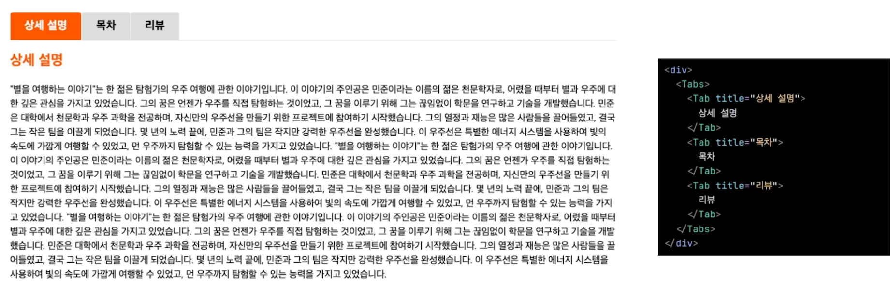

# Tap

## 구현 예시


---

- tab과 tabs를 return 하도록 구성

    - tabs의 children = 각 tab
    - tab의 children = 상세 내용
        ```
        import styled from 'styled-components';

        interface TabProps {
            title: string;
            children: React.ReactNode;
        }

        const Tab = ({ children }: TabProps) => {
        return <>{children}</>;
        };

        interface TabsProps {
            children: React.ReactNode;
            title: string;
        }
        const Tabs = ({ children }: TabsProps) => {
            return (
                <>
                    <TabsStyle>
                        <h1></h1>
                    </TabsStyle>
                </>
            );
        };

        const TabsStyle = styled.div``;
        export default { Tab, Tabs };
        ```

- useState로 각 탭 관리
    - default는 0번째 탭
    - `const [activeIndex, setActiveIndex] = useState(0);`
    
- 각 탭은 Array 형태로 전달

    - `const tabs = React.Children.toArray(children) as React.ReactElement<TabProps>[];`


- Content 영역에 Tab 컴포넌트 추가

    ```
    <div className='content'>
        <Tabs>
            <Tab title='상세 설명'>
                <Title size='medium'>상세 설명</Title>
                <EllipsisBox lineLimit={4}>{book.detail}</EllipsisBox>
            </Tab>
            <Tab title='목차'>
                <Title size='medium'>목차</Title>
                <p className='index'>{book.contents}</p>
            </Tab>
            <Tab title='리뷰'>
                <Title size='medium'>리뷰</Title>
                <BookReview reviews={reviews} onAdd={addReview}></BookReview>
            </Tab>
        </Tabs>
    </div>
    ```

- 탭 클릭 이벤트 처리
    

    ```
    <div className='tab-header'>
        {tabs.map((tab, index) => (
            <button
                onClick={() => setActiveIndex(activeIndex)}
                className={activeIndex === index ? 'active' : ''}
            >
                {tab.props.title}
            </button>
        ))}
    </div>
    ```

- 선택된 탭의 내용이 보여지도록 처리

    `<div className='tab-content'>{tabs[activeIndex]}</div>`