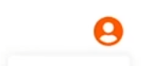

# drop-down

- drop-down 탭 내 목록을 children으로 처리
- isOpen으로 drop-down 활성화 여부 판단
- toggleButton 타입으로 ReactNode가 올 수 있도록 처리

    ```
    interface Props {
        children: React.ReactNode; 
        toggleButton: React.ReactNode;
        isOpen?: boolean;
    }

    const Dropdown = ({ children, toggleButton, isOpen = false }: Props) => {
        const [open, setOpen] = useState(isOpen);

        return (
            <>
                <DropdownStyle>
                    <button className='toggle' onClick={() => setOpen(!open)}>
                    {toggleButton}
                    </button>
                    {open && <div className='pannel'>{children}</div>}
                </DropdownStyle>
            </>
        );
    };
    ```


- drop-down을 적용할 위치에 컴포넌트 생성

    - `<Dropdown toggleButton={<FaUserCircle />}></Dropdown>`


- 버튼 활성화 여부 표시

    - isOpen 속성을 사용
    - 인터페이스 작성
        ```
        interface DropDownStyleProps {
            $open: boolean;
        }
        ```

    - 스타일에 인터페이스를 Props로 전달
        - `const DropdownStyle = styled.div<DropDownStyleProps>`

    - isOpen 값에 따라 색상 분기
        - `fill: ${({ theme, $open }) => ($open ? theme.color.primary : theme.color.text)};`
            - 기본
                
                
            - 활성화

                 


- Click OutSide, ON/OFF

    - useRef
        - `const dropdownRef = useRef<HTMLDivElement>(null);`

    - panel 외부로 ref 전달

        ```
        <>
            <DropdownStyle $open={open} ref={dropdownRef}>
                <button className='toggle' onClick={() => setOpen(!open)}>
                {toggleButton}
                </button>
                {open && <div className='pannel'>{children}</div>}
            </DropdownStyle>
        </>
        ```

    - useEffect로 Event Listener ON/OFF

        ```
        useEffect(() => {
            const handleOutSideClick = (event: MouseEvent) => {
                if (dropdownRef.current && !dropdownRef.current.contains(event.target as Node)) {
                    setOpen(false);
                }
                document.addEventListener('mousedown', handleOutSideClick);
            };
            return () => {
                document.removeEventListener('mousedown', handleOutSideClick);
            };
        }, [dropdownRef]);
        ```

        - ref 영역
            ```
            <DropdownStyle $open={open} ref={dropdownRef}>
                <button className='toggle' onClick={() => setOpen(!open)}>
                {toggleButton}
                </button>
                {open && <div className='pannel'>{children}</div>}
             </DropdownStyle>
            ```
        - ref 영역이 아닌 부분 클릭에 대한 처리
            - `if (dropdownRef.current && !dropdownRef.current.contains(event.target as Node)) {
         }`