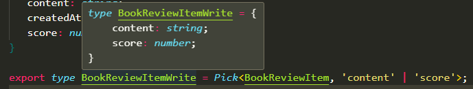

# 모킹 서버 작성 (MSW)


- https://mswjs.io/
- 업계 표준이라고 할 만큼 많이 사용되는 라이브러리

## MSW

1. Mock Service Worker
2. 존재하지 않는 API에 대한 응답을 모킹
3. service worker 에서 요청을 처리
4. chrome 기준 devTool의 Application / Service workers 의 "Bypass for
network"로 일시 정지

- moking
    - 실제로 존재하지 않는 것을 존재하는 것 처럼 생성하여 응답을 받는 것
        - 실제로 존재하지 않는 node서버를 생성해서 응답을 받음
        

## 설치

- 라이브러리 다운로드
    - `npm i msw`

- msw service worker 생성

    - 이전에는 템플릿 사용
    - 최근 마법사 wizard를 제공
        - npx msw init public/
            - public을 지정하는 이유
                - SPA에서 제공하는 파일들이 모여있음
                - MSW는 public에 지정
                
                    
    - index.tsx에 적용

        - 개발 서버에만 적용되도록 처리
        ```
        if (process.env.NODE_ENV === 'development') {
            const { worker } = require('./mock/browser');
            worker.start();
        }
        ```

    - browser 서버 파일 생성

        - 최근 node 서버에서도 많이 사용하기 때문에 browser가 분리
            - `import { setupWorker } from 'msw/browser';`

        - moking 서버 api정보가 담길 배열
            - `const handlers = [];`

        - index.tsx에서 사용할 수 있도록 처리
            - `export const worker = setupWorker(...handlers);`

    - Mock에서 사용하는 Http Response 구성

        ```
        import { BookReviewItem } from '@/models/book.model';
        import { http, httpResponse } from 'msw';

        export const reviewsById = http.get('http://localhost:5000/reviews/:bookId', () => {
            const data: BookReviewItem = [];
            return httpResponse.json(data, {
                status: 200,
            });
        });
        ```


## 리뷰 로직

### 모델 작성

- 리뷰가 담길 모델
        
        export interface BookReviewItem {
            id: number;
            userName: string;
            content: string;
            createdAt: string;
            score: number;
        }

- 타이밍 이슈
    
    

    - 모킹 실행 시점이, 요청 시점보다 나중인 경우 발생

    - 정상적인 요청인 경우

        


    - index.tsx 소스 코드 수정
        - DOM에 mount하는 부분을 함수로 래핑

        - `기존 로직`
            
        
        - `변경 로직`
            


### 리뷰 데이터 넣기

#### 리뷰 샘플 데이터 작성


#### faker.js로 더미 데이터 생성

- 가상의 데이터를 생성
- https://fakerjs.dev/
- `npm install @faker-js/faker --save-dev`

- 코드 예시
    - 8개의 더미 데이터 생성
    ```
    const mockReviewData: BookReviewItem[] = Array.from({
        length: 8,}).map((_, index) => ({
            id: index,
            userName: faker.person.firstName(),
            content: faker.lorem.paragraph(),
            createdAt: faker.date.past().toISOString(),
            score: faker.helpers.rangeToNumber({ min: 1, max: 5 }),
    }));
    ```

    - 더미 데이터 결과
    

    - faker.js 한국어 버전

        - import { faker } from '@faker-js/faker';를 

        - import { fakerKO as faker } from '@faker-js/faker';로 변경

            


### 도서 상세 화면에 리뷰 컴포넌트 생성

- BookDetail.tsx

    - 리뷰 컴포넌트 추가
        

- BookReview.tsx

    - 코드 작성

        ```
        import { BookReviewItem as IBookReviewItem } from '@/models/book.model';
        import styled from 'styled-components';
        import BookReviewItem from './BookReviewItem';

        interface Props {
            reviews: IBookReviewItem[];
        }

        const BookReview = ({ reviews }: Props) => {
            return (
                <BookReviewStyle>
                    {reviews.map((review) => (
                        <BookReviewItem review={review} />
                    ))}
                </BookReviewStyle>
            );
        };

        const BookReviewStyle = styled.div`
            display: flex;
            flex-direction: column;
            gap: 16px;
        `;
        export default BookReview;
        ```


- BookReviewItem.tsx

    - 코드 작성


        ```
        import { BookReviewItem as IBookReviewItem } from '@/models/book.model';
        import { formatDate } from '@/utils/format';
        import { FaStar } from 'react-icons/fa';
        import styled from 'styled-components';

        interface Props {
            review: IBookReviewItem;
        }

        const Star = (props: Pick<IBookReviewItem, 'score'>) => {
            return (
                <span className='start'>
                    {Array.from({ length: props.score }, (_, index) => (
                        <span>
                        <FaStar />
                        </span>
                    ))}
                </span>
            );
        };

        const BookReviewItem = ({ review }: Props) => {
            return (
                <>
                    <BookReviewItemStyle>
                        <header className='header'>
                        <div>
                            <span>{review.userName}</span>
                            <Star score={review.score} />
                        </div>
                        <div>{review.createdAt ? formatDate(review.createdAt) : ''}</div>
                        </header>

                        <div className='content'>
                        <p>{review.content}</p>
                        </div>
                    </BookReviewItemStyle>
                </>
            );
        };

        const BookReviewItemStyle = styled.div`
        display: flex;
        flex-direction: column;
        gap: 12px;
        box-shadow: 0 0 4px rgba(0, 0, 0, 0.2);
        padding: 12px;
        border-radius: ${({ theme }) => theme.borderRadius.default};

        .header {
            display: flex;
            justify-content: space-between;
            align-items: center;
            font-size: 0.875rem;
            color: ${({ theme }) => theme.color.secondary};
            padding: 0;
            .star {
                padding: 0 0 0 8px;
                svg {
                    fill: ${({ theme }) => theme.color.secondary};
                }
            }
        }
        .content {
            p {
                font-size: 1rem;
                line-height: 1.5;
                margin: 0;
            }
        }
        `;

        export default BookReviewItem;
        ```


## 리뷰 작성

- 서버 응답 로직 작성


    ```
    export const addReview = http.post('http://localhost:5000/reviews/:bookId', () => {
        return HttpResponse.json({ message: '리뷰가 등록되었습니다.' }, { status: 200 });
    });
    ```
- 생성한 API를 사용할 수 있도록 추가

    ```
    import { addReview, reviewsById } from './review';

    const handlers = [reviewsById, addReview];
    ```

- post 형식으로 데이터 요청

    ```
    export const addBookReview = async (bookId: string) => {
        return await requestHandler('post', `/reviews/${bookId}`);
    };
    ```

    - 서버에 전송할 데이터

        ```
        export interface BookReviewItem {
            id: number;
            userName: string;
            content: string;
            createdAt?: string;
            score: number;
        }
        ```
        
        - 자동 처리

            - id: 자동 생성
            - username: 로그인 정보에서 추출
            - createdAt: 자동 생성

        - 사용자 입력 필요 가공

            - content
            - score

        - bookId와 함께 해당 데이터를 인자로 넘겨받기

            - BookReviewItemWrite 타입의 data
                - content, score 데이터를 가짐

            ```
            export const addBookReview = async (bookId: string, data: BookReviewItemWrite) => {
                return await requestHandler('post', `/reviews/${bookId}`);
            };

            ```
            

        - 입력한 review 데이터를 처리할 Hook 소스 코드 작성

            ```
            const addReview = (data: BookReviewItemWrite) => {
                if (!book) return;
                addBookReview(book.id.toString(), data).then((res) => {
                    fetchBook(book.id.toString()).then((book) => {
                        setBook(book);
                    });
                });
            };
            ```
            - 리뷰 입력 후, fetchBook 함수를 사용해 해당 페이지 업데이트

        - 도서 상세보기 최상위 컴포는트에서 해당 함수 사용할 수 있도록 `addReview` 추가

            ```
            const BookDetail = () => {
                const { bookId } = useParams();
                const { book, favoriteToggle, reviews, addReview } = useBook(bookId);
            ```

            - addReview에 전달한 데이터 필요
            - addReview로 저장할 form 필요

        - 리뷰 정보 입력 받을 `BookReviewAdd.tsx` 컴포넌트 생성

            - form에서 전달되는 data인 BookReviewItemWrite을 상위 컴포넌트에 전달

                ```
                interface Props {
                   onAdd: (data: BookReviewItemWrite) => void;
                }
                ```


        - 리뷰 작성 컴포넌트를 상위 컴포넌트에 추가

            - interface에 onAdd 항목 추가
            - `<BookReviewAdd onAdd={onAdd} />` 컴포넌트 추가
            ```
            interface Props {
                reviews: IBookReviewItem[];
                onAdd: (data: BookReviewItemWrite) => void;
            }

            const BookReview = ({ reviews }: Props) => {
                return (
                    <BookReviewStyle>
                        <BookReviewAdd onAdd={onAdd} />
                        {reviews.map((review) => (
                            <BookReviewItem review={review} />
                        ))}
                    </BookReviewStyle>
                );
            };
            ```

        - Hook에서 가져온 addReview를 BookDetail 컴포넌트에서 사용 가능

            `<BookReview reviews={reviews} onAdd={addReview} />`


        - 리뷰 입력 컴포넌트

            - useForm 사용
            - BookReviewItemWrite타입 사용
            - register를 이용해 필수 입력 설정

                ```
                interface Props {
                    onAdd: (data: BookReviewItemWrite) => void;
                    }

                    const BookReviewAdd = ({ onAdd }: Props) => {
                    const {
                        register,
                        handleSubmit,
                        formState: { errors },
                    } = useForm<BookReviewItemWrite>();

                    return (
                        <>
                            <BookReviewAddStyle>
                                <form onSubmit={handleSubmit(onAdd)}>
                                <fieldset>
                                    <textarea {...register('content', { required: true })}> </textarea>
                                </fieldset>
                                <fieldset>
                                    <select {...register('score', { required: true })}>
                                        <option></option>
                                    </select>
                                </fieldset>
                                <Button size='medium' schema='primary'>
                                    작성하기
                                </Button>
                                </form>
                            </BookReviewAddStyle>
                        </>
                    );{errors.content && <p className='error-text'>리뷰 내용을 입력해 주세요</p>}
                };
                ```

                - form을 통해 전송하는 score가 string으로 전송
                    

                - useForm에서 제공하는 Number 처리, `valueAsNumber`

                    - `<select {...register('score', { required: true, valueAsNumber: true })}>`


        - useForm을 사용한 에러 메세지 설정

            `{errors.content && <p className='error-text'>리뷰 내용을 입력해 주세요</p>}`

            