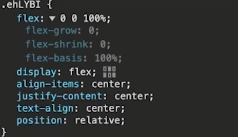

# 메인 화면

### Main페이지를 리뷰 상세정보를 조회할 때와 같이 Moking 사용

- 동일한 Mock data return

    - reviews 엔드포인트에 요청을 보내면, mockReviewData 값을 받음
    
    ```
    export const reviewForMain = http.get('http://localhost:5000/reviews', () => {
        return HttpResponse.json({ mockReviewData: '리뷰가 등록되었습니다.' }, { status: 200 });
    });
    ```

- `reviewForMain`을 핸들러로 전달

    ```
    import { setupWorker } from 'msw/browser';
    import { addReview, reviewForMain, reviewsById } from './review';

    const handlers = [reviewsById, addReview,reviewForMain];

    export const worker = setupWorker(...handlers);
    ```

### 데이터 상태를 가질 때 마다, 훅을 작성해서 처리

#### HOME 컴포넌트에서 Main의 데이터를 가진 HOOK 생성

- BookReviewItem[]타입으로 타입을 지정
- 초기 값을 빈 배열로 설정
- Main 컴포넌트에서 사용할 review 데이터
    ```
    export const useMain = () => {
        const [reviews, setReviews] = useState<BookReviewItem[]>([]);
        return reviews;
    };
    ```


#### API 요청

- fetchReviewAll라는 함수명으로 전체 리뷰 정보 조회 요청 함수
- BookReviewItem[] 타입으로 설정

    ```
    export const fetchReviewAll = async () => {
        return await requestHandler<BookReviewItem[]>('get', '/reviews');
    };
    ```


#### return하는 mock 데이터 형태

```
const mockReviewData: BookReviewItem[] = Array.from({
   length: 8,
}).map((_, index) => ({
   id: index,
   userName: faker.person.firstName(),
   content: faker.lorem.paragraph(),
   createdAt: faker.date.past().toISOString(),
   score: faker.helpers.rangeToNumber({ min: 1, max: 5 }),
}));
```


#### 전달받은 데이터 State 할당

- fetchReviewAll() 함수 성공 시, 전달 받은 데이터를 setReviews라는 useState에 할당
    ```
    export const useMain = () => {
        const [reviews, setReviews] = useState<BookReviewItem[]>([]);

        useEffect(() => {
            fetchReviewAll().then((reviews) => {
                setReviews(reviews);
            });
        }, []);

        return reviews;
    };
    ```


### 메인페이지 리뷰 영역 컴포넌트 생성

`MainReview.tsx`

- BookReviewItem 타입의 데이터를 컴포넌트에서 받음
- BookReviewItem 배열을 순회하며 각 리뷰 생성
    ```
    import { BookReviewItem as IBookReviewItem } from '@/models/book.model';

    interface Props {
        reviews: IBookReviewItem[];
    }

    const MainReview = ({ reviews }: Props) => {
        return (
            <>
                <MainReviewStyle>
                    {reviews.map((review) => (
                    <BookReview key={review.id} review={review} />
                    ))}
                </MainReviewStyle>
            </>
        );
    };
    ```

### HOME 컴포넌트에 추가

```
import MainReview from '@/components/main/MainReview';
import { useMain } from '@/hooks/useMain';
import styled from 'styled-components';

const Home = () => {
   //훅에서 데이터 받아오기
   const { reviews } = useMain();

   return (
      <>
         <HomeStyle>
            <MainReview reviews={reviews} />
         </HomeStyle>
      </>
   );
};

const HomeStyle = styled.div``;
export default Home;
```

### Slick 라이브러리

- 이미지 Slider를 사용하게 해주는 라이브러리

- 설치
    - `npm i react-slick --save`
    - `npm i react-slick-carousel`
    - `npm i --save-dev @types/react-slick`


- 라이브러리 세팅

    - `import Slider from 'react-slick';`

- Slide를 적용할 컴포넌트 감싸기

    ```
    <MainReviewStyle>
        <Slider>
            {reviews.map((review) => (
                <BookReview key={review.id} review={review} />
            ))}
        </Slider>
    </MainReviewStyle>
    ```

- 공식 홈페이지 권장 스타일 적용

    - https://github.com/akiran/react-slick
        ```
        import "slick-carousel/slick/slick.css";
        import "slick-carousel/slick/slick-theme.css";
        ```


- Slide setting

    ```
    const MainReview = ({ reviews }: Props) => {
        const sliderSettings = {
            dots: true,         //하단 페이지 네이션과 같은 점 표시
            Infinity: true,     //오른쪽 클릭 시, 제한 없이 넘김
            speed: 500,         //이미지가 넘어가는 밀리세컨
            slidesToShow: 3,    //한번에 표시될 이미지수
            slidesToScroll: 3,  //한번에 스크롤 될 이미지 수
        };

        return (
            <>
                <MainReviewStyle>
                    <Slider {...sliderSettings}>
                    {reviews.map((review) => (
                        <BookReview key={review.id} review={review} />
                    ))}
                    </Slider>
                </MainReviewStyle>
            </>
        );
    };
    ```
    
    


- slick track이 좌우로 이동하는 형태

    
    


- style

    ```
    const MainReviewStyle = styled.div`
        padding:0 0 24px 0; //하단 공간
        .slick-track {  
            padding: 12px 0; //상단, 하단 패딩
        }

        .slick-slide > div {
            margin: 0 12px; //좌, 우 margin
        }
        .slick-prev:bofore, //다음, 이전 버튼 색상 지정
        .slick-next:bofore {
            color: #000;
        }
    `;    
    ```

    


# 신간 안내 Section

- 구현 예시

    


- State 선언

    - useMain Hook에서 신간 도서 정보를 담는 State 선언
    - `const [newBooks, setNewBooks] = useState<Book>([]);`

- 신간 도서 판별

    - `books.api.ts`

        - news의 값이 true인 경우, 신간을 의미
            ```
            interface FetchBooksParams {
                category_id?: number;
                news?: boolean;
                currentPage?: number;
                limit: number;
            }
            ```
    - `useMain` Hook

        - useEffect를 통해 신간 데이터 조회
            - fetchBooks함수에 전달되는 매개변수를 통해 신간 도서 조회
            ```
            useEffect(() => {
                fetchReviewAll().then((reviews) => {
                    setReviews(reviews);
                });

                fetchBooks({
                    category_id: undefined,
                    news: true,
                    currentPage: 1,
                    limit: 4,
                });
            }, []);
            ```

            - 조회 결과로 리턴 받는 형태는 `FetchBooksResponse`

                ```
                interface FetchBooksResponse {
                    books: Book[];
                    pagination: Pagination;
                }
                ```
                - 해당 데이터를 구조 분해를 해서 받아오기

                    - `.then({ books })`

            -  조회 결과를 setNewBooks, State에 저장

                ```
                fetchBooks({
                    category_id: undefined,
                    news: true,
                    currentPage: 1,
                    limit: 4,
                }).then(({ books }))=>{
                    setNewBooks(books)
                };
                ```

            - 신간 도서 정보를 보여주는 `MainNewBooks` 컴포넌트 작성

                ```
                interface Props {
                    books: Book[];
                }

                const MainNewBooks = ({ books }: Props) => {
                    return (
                        <>
                            <MainNewBooksStyle>
                                {books.map((book) => (
                                <BookItem key={book.id} book={book} view='grid' />
                                ))}
                            </MainNewBooksStyle>
                        </>
                    );
                };
                ```
            
            - Home 컴포넌트에 신간 안내 Section에 해당 컴포넌트 추가
                - `<MainNewBooks books={newBooks} />`
                    ```
                    <>
                        <HomeStyle>
                            <section className='section'>
                                <Title size='large'>베스트 셀러</Title>
                            </section>
                            <section className='section'>
                                <Title size='large'>신간 안내</Title>
                                <MainNewBooks books={newBooks} />
                            </section>
                            <section className='section'>
                                <Title size='large'>리뷰</Title>
                                <MainReview reviews={reviews} />
                            </section>
                        </HomeStyle>
                    </>
                    ```


<br>
<br>

---
 
# 베스트 셀러 Section

- 구현 예시

    

    - mock 구현

        

        - faker를 이용한 더미 데이터를 리턴하도록 설정
        ```
        import { Book } from '@/models/book.model';
        import { http, HttpResponse } from 'msw';
        import { fakerKO as faker } from '@faker-js/faker';

        const bestBooksData: Book[] = Array.from({ length: 10 }).map((item, index) => ({
            id: index,
            title: faker.lorem.sentence(),
            img: faker.helpers.rangeToNumber({ min: 100, max: 200 }),
            category_id: faker.helpers.rangeToNumber({ min: 0, max: 2 }),
            form: '종이책',
            isbn: faker.commerce.isbn(),
            summary: faker.lorem.paragraph(),
            detail: faker.lorem.paragraph(),
            author: faker.person.firstName(),
            pages: faker.helpers.rangeToNumber({ min: 100, max: 500 }),
            contents: faker.lorem.paragraph(),
            price: faker.helpers.rangeToNumber({ min: 10000, max: 50000 }),
            likes: faker.helpers.rangeToNumber({ min: 0, max: 100 }),
            pubDate: faker.date.past().toISOString(),
        }));

        export const bestBooks = http.post('http://localhost:5000/books/best', () => {
            return HttpResponse.json(bestBooksData, { status: 200 });
        });

        ```


        - `useMain.ts`

            - Custom Hook인 useMain에서 조회한 데이터를 State에 저장
                ```
                const [bestBooks, setBestBooks] = useState<Book>[]([]);
                ```


        - 베스트셀러 도서 API 조회 요청

            ```
            export const fetchBestBooks = async () => {
                const token = localStorage.getItem('token');
                if (!token) {
                    throw new Error('JWT 토큰이 없습니다. 로그인하세요.');
                }
                const response = await httpClient.get<Book[]>(`/books/best`, {
                    headers: {
                        Authorization: `${token}`,
                    },
                });
            return response.data;
            };
            ```

        - Hook에서 useEffect로 요청 함수 실행

            ```
            fetchBestBooks().then((books)=>{
                setBestBooks(books);
            })
            ```

        - `MainBest.tsx`에서 베스트셀러 도서를 순회하며 베스트셀러 생성

            ```
            const MainBest = ({ books }: Props) => {
                return (
                    <>
                        <MainBestStyle>
                            {books.map((item, index) => (
                            <BookBestItem key={item.id} book={item} itemIndex={index} />
                            ))}
                        </MainBestStyle>
                    </>
                );
            };
            ```

<br>
<br>

---

# 베너

## 메인 페이지 / 슬라이드 배너 구현

-  구현 예시

    - viewPort를 기준으로 오른쪽 버튼을 클릭하면 Slide는 왼쪽으로 이동

        


### 배너 모델 생성

- `banner.model.ts`

    - image : picksum 사용
    - url : 배너 클릭 시 이동되는 경로
    - target : 경로를 열어줄 영역 지정
        ```
        export interface Banner {
            id: number;
            title: string;
            description: string;
            image: string;
            url: string;
            target: string;
        }
        ```


### 배너 모킹 구현

- `banner.ts`

    ```
    import { BookReviewItem } from '@/models/book.model';
    import { http, HttpResponse } from 'msw';
    import { fakerKO as faker } from '@faker-js/faker';
    import { Banner } from '@/models/banner.model';

    const bannersData: Banner[] = [
        {
            id: 1,
            title: 'banner 1',
            description: 'description 1',
            image: 'https://picsum.photos/id/111/1200/400',
            url: 'http://some.url',
            target: '_blank',
        },
        {
            id: 2,
            title: 'banner 2',
            description: 'description 2',
            image: 'https://picsum.photos/id/222/1200/400',
            url: 'http://some.url',
            target: '_self',
        },
        {
            id: 3,
            title: 'banner 3',
            description: 'description 3',
            image: 'https://picsum.photos/id/333/1200/400',
            url: 'http://some.url',
            target: '_blank',
        },
    ];

    export const banners = http.get('http://localhost:5000/banners', () => {
        return HttpResponse.json(bannersData, {
            status: 200,
        });
    });

    ```

### 배너 정보 조회 API 생성

```
import { requestHandler } from './http';

export const fetchBanners = async () => {
   return await requestHandler<Banner[]>('get', '/banners');
};
```


### 배너 Custon Hook 생성 - useMain에서 관리

- State 생성
    - `const [banners, setBanners] = useState<Banner>([])`

- useEffect로 데이터 조회

    ```
    useEffect(() => {
        fetchBanners().then((banners)=>{
            setBanners(banners)
        })
    }, []);
    ```


### 가공한 데이터 컴포넌트 적용

- `Banner.tsx`
- Banner 컴포넌트 생성

    ```
    import { Banner as IBanner } from '@/models/banner.model';
    import styled from 'styled-components';

    interface Props {
        banners: IBanner[];
    }

    const Banner = ({ banners }: Props) => {
        return (
            <>
                <BannerStyle></BannerStyle>
            </>
        );
    };

    const BannerStyle = styled.div``;
    export default Banner;

    ```

### Home 컴포넌트에 배치

```
const Home = () => {
   //훅에서 데이터 받아오기
   const { reviews, newBooks, bestBooks, banners } = useMain();

   return (
      <>
         <HomeStyle>
            <Banner banners={banners} />
            <section className='section'>
               <Title size='large'>베스트 셀러</Title>
               <MainBest books={bestBooks} />
            </section>
            <section className='section'>
               <Title size='large'>신간 안내</Title>
               <MainNewBooks books={newBooks} />
            </section>
            <section className='section'>
               <Title size='large'>리뷰</Title>
               <MainReview reviews={reviews} />
            </section>
         </HomeStyle>
      </>
   );
};
```


### 적용 - 배너 Item 생성

- 데이터는 호출됨

    

- 배너는 아직 적용 안 됨

    

- 배너 컴포넌트에서 생성

    ```
    const Banner = ({ banners }: Props) => {
        return (
            <>
                <BannerStyle></BannerStyle>
            </>
        );
    };
    ```

    - 배너 컴포넌트로 표시될 각 배너 아이템 컴포넌트
        
        

        - `BannerItem.tsx`

            ```
            import styled from 'styled-components';

            const BannerItem = () => {
                return (
                    <>
                        <BannerItemStyle>
                            <h1></h1>
                        </BannerItemStyle>
                    </>
                );
            };

            const BannerItemStyle = styled.div``;
            export default BannerItem;
                
            ```

            - 배너 값을 받아서 화면에 랜더

                - Banner 컴포넌트에서 순회하며 BannerItem 호출

                    ```
                    const Banner = ({ banners }: Props) => {
                        return (
                            <>
                                <BannerStyle>
                                    {banners.map((item, index) => (
                                    <BannerItem banner={item} />
                                    ))}
                                </BannerStyle>
                            </>
                        );
                    };
                    ```

                - BannerItem 컴포넌트에서 해당 정보 표출

                    ```
                    return (
                        <>
                            <BannerItemStyle>
                                <div>
                                
                                </div>
                            </BannerItemStyle>
                        </>
                    );
                    ```


### 적용 - 슬라이딩 처리


- 화면에 표시되는 이미지를 index로 관리

    


- `const [currentIndex, setCurrentIndex] = useState(0);`


- 현재 배너 이미지
    
    

    -`flex: 0 0 100%;`
    - flex를 통해 원래 자신이 가지고 있던 값을 유지

        

        - flex 상세 정보

            - flex-grow:0 = 늘어나는 것을 0으로 설정
            - flex-shrink:0 = 줄어드는 것을 0으로 설정
            - flex-basis:100% = 기본값으로 100%

            


#### <이전>, <다음> 버튼

- 버튼 태그 생성
    ```
    <BannerButtonStyle>
        <button onClick={handlePrev}>이전</button>
        <button onClick={handleNext}>다음</button>
    </BannerButtonStyle>
    ```

- 버튼 핸들러

    ```
    const handlePrev = () => {};
    const handleNext = () => {};
    ```

    - 버튼을 통해, currentIndex 값을 조작

        - `const [currentIndex, setCurrentIndex] = useState(0);`

            - Prev
                - currentIndex가 0일 경우, 동작하지 않도록 설정
            - Next
                - currentIndex가 마지막 요소일 경우, 동작하지 않도록 설정
            ```
            const handlePrev = () => {
                if (currentIndex === 0) return;
                setCurrentIndex(currentIndex - 1);
            };
            const handleNext = () => {
                if (currentIndex === banners.length - 1) return;
                setCurrentIndex(currentIndex + 1);
            };
            ```


#### 슬라이드 효과

- currentIndex가 변경될 때
    - translateX에 대한 계산 값
        ```
        const transFormValue = useForm(() => {
            return currentIndex * -100;
        }, [currentIndex]);
        ```

        - currentIndex 값이 0이면, 0
        - currentIndex 값이 1이면, 100
        - currentIndex 값이 2이면, 200

- transFormValue 값 사용 방법

    - BannerContainerStyle 영역에 사용
        - transFormValue 값을 전달

        ```
         <BannerContainerStyle $transFormValue={transFormValue}>
               {banners.map((item, index) => (
                  <BannerItem banner={item} />
               ))}
        </BannerContainerStyle>
        ```

        - 숫자 타입 지정
            ```
            interface BannerContainerStyleProps {
               $transFormValue: number;
            }
    
            ```

        - 제네릭으로 타입 지정
            ```
            const BannerContainerStyle = styled.div<BannerContainerStyleProps>`
                transform: translateX(${(props) => props.$transFormValue}%); //좌우로 trans
                transition: transform 0.5s ease-in-out;
            `;
            ```

        - `transform: translateX(${(props) => props.$transFormValue}%); 
            - 좌우를 trans하는 스타일 설정


            - 적용 

        - `transition: transform 0.5s ease-in-out;`
            - transform 타겟에 대해
            - 0.5s 기간 동안 애니메이션을 수행
            - 출발할 때 느리게, 도착할 때 느리게 동작

    
    - 전체 배너 영역 스타일

        ```
        const BannerStyle = styled.div`
            overflow: hidden;
            position: relative;
        `;
        ```
        - overflow: hidden; 
            - 영역 밖으로 나가는 부분을 숨김

                - overflow: hidden 적용 전

                    
                - overflow: hidden 적용 후

                    
        - position: relative;
            - 버튼 배치를 위한 설정


#### 이미지 슬라이드 내 페이지네이션 버튼

- 배너의 개수만큼 버튼을 생성

    ```
    <BannerIndicatorStyle>
        {banners.map((banner, index) => (
            <span></span>
        ))}
    </BannerIndicatorStyle>
    ```

- 현재 index 표시

    - 현재 index와 배너의 index가 같을 때, 색상 적용하도록 삼항연산자 사용
    ```
    <BannerIndicatorStyle>
        {banners.map((_, index) => (
            <span className={index === currentIndex ? 'active' : ''}></span>
        ))}
    </BannerIndicatorStyle>

    // Style
    &.active {
      background: ${({ theme }) => theme.color.primary};
   }
    ```

    - 페이지네이션 버튼 클릭 이벤트 적용
        - 선택된 index값을 받아서 active 처리
        ```
        const handleIndicatorClick = (index: number) => {
            setCurrentIndex(index);
        };

        <BannerIndicatorStyle>
            {banners.map((_, index) => (
                <span
                    className={index === currentIndex ? 'active' : ''}
                    onClick={() => handleIndicatorClick(index)}
                ></span>
            ))}
        </BannerIndicatorStyle>
        ```