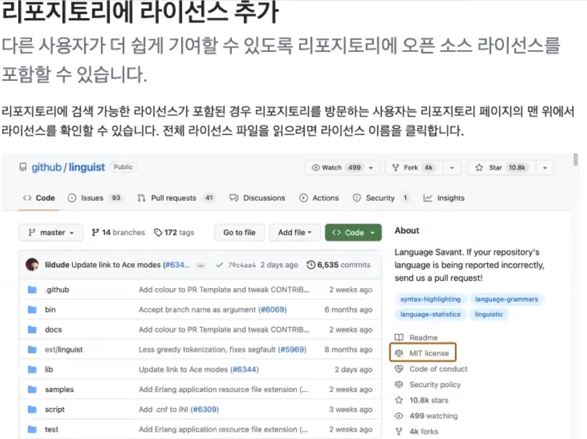
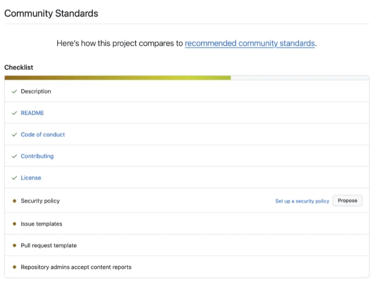

## 리포지토리에 라이선스 추가

## 오픈 소스 문서 구조
1. 기본 문서
- LICENSE.md 또는 LICENSE.txt:
    - 오픈 소스 라이선스 전문이 명시된 문서.
    - 프로젝트 최상위 디렉토리에 위치해야 함.
    - 해당 파일이 존재하면 프로젝트는 해당 라이선스 하에 배포됨.
2. 추가 문서
- README.md:
    - 프로젝트 코드의 목적 및 사용 방법을 설명.
- COPYRIGHT.txt:
    - 저작권 관련 정보 명시.
- NOTICE.txt:
    - 오픈 소스 라이선스의 주요 내용 요약.

### Contributing.md

- 프로젝트 기여를 원하는 개발자들을 위한 가이드 문서.
- 기여 방법, 절차, 프로젝트에 기여할 때 유의해야 할 사항을 설명.

### 주요 내용:

- 프로젝트 기여 환영:
    - 코드 수정, 버그 리포트, 질문, 기능 추가 등 다양한 방법으로 기여 가능.

- 기여 절차:
    - Pull Request 가이드:
        - 신규 브랜치 생성 → 수정 후 테스트 → PR 제출.
    - 기존 이슈 확인 및 중복 방지.

- PR 리뷰 및 릴리스:
    - semantic-release 사용: PR이 main 브랜치에 병합되면 자동 릴리스.
    - 커밋 메시지 규칙 준수 필요 (fix:, feat:, BREAKING CHANGE: 등).

- Stale Issue 정책:
    -  90일 이상 활동 없는 이슈/PR은 stale로 표시 후 7일 내 닫힘.

## 커뮤니티 건전성 체크리스트

## 깃허브 이슈

## GitHub 이슈(Issue)란?
- 프로젝트에서 발생할 수 있는 모든 활동에 대한 기록 및 관리 도구.
    - 예시:
        - 기획
        - 작업
        - 추가 기능
        - 버그
        - 개선
        - 질문
- 상태
    - Open:
        - 진행 중, 계획 단계(시작 전).
    - Close:
        - 완료 또는 중단된 상태.

## Pull Request(PR)이란?

- Pull: 당기다.
- Request: 요청하다.
- Branch가 Branch에 변경 내용을 요청하는 작업.

### 주요 절차:

- PR 생성:
    - 작업 브랜치에서 변경사항을 완료한 후 main 등 대상 브랜치로 병합 요청.
- 리뷰 및 승인:
    - 코드 리뷰를 통해 품질 보증.
    - Review Required 및 테스트 결과 확인.
- 병합:
    - 리뷰 및 테스트 완료 후 main 브랜치에 병합.
- 상태 확인:
    - 테스트 상태: 빌드, 테스트, 코드 품질 체크 결과 표시.
    - 변경 내역: 수정된 파일과 커밋 내용 확인 가능.
