# Full Cycle 개발과 웹 개발 파이프라인, CI/CD 개념 정리

## 1. Full Cycle 개발
- 소프트웨어 개발 전 과정을 포함하는 개발 방식.
- 아이디어, 설계, 개발, 테스트, 배포, 유지보수까지 모든 단계 관여.
- 장점: 책임의 연속성 보장, 빠른 피드백 및 수정 가능.

## 2. Pipeline (파이프라인)
- 웹 서비스 개발 과정에서 코드가 개발 → 빌드 → 테스트 → 배포로 이어지는 흐름.
- 각 단계가 자동화되어 효율성과 신뢰성을 높임.
- 목적: 코드 품질 관리, 배포 시간 단축.

## 3. CI/CD 개념
- CI (지속적 통합)
    - 개발된 코드를 지속적으로 병합, 빌드, 테스트하여 통합 문제를 빠르게 발견.
- CD
    - Continuous Delivery (지속적 인도): 테스트 완료 후, 수동 승인으로 릴리스.
    - Continuous Deployment (지속적 배포): 자동으로 프로덕션 환경에 배포.

## 4. CI/CD의 필요성
- 자동화된 프로세스를 통해 오류 감소, 생산성 향상, 시간 절약.
- 코드 품질 보장, 신속한 업데이트 제공.

## 5. CI/CD 도구
- Docker: 컨테이너화 도구. 동일한 환경에서 애플리케이션 실행.
- Kubernetes: 컨테이너 오케스트레이션 도구. 스케일링, 배포, 관리 자동화.
- Jenkins: CI/CD 자동화 도구. 빌드, 테스트, 배포 파이프라인 구성 지원.

## 6. 웹 개발 파이프라인 흐름
1. 코드 개발.
1. 빌드 단계: 코드를 컴파일하거나 필요한 아티팩트 생성.
1. 테스트 단계: 오류 및 성능 확인.
1. 코드 병합: 리포지토리에 병합 및 릴리스.
1. Continuous Delivery/Deployment:
    - CD를 통해 프로덕션 환경에 자동 배포.

        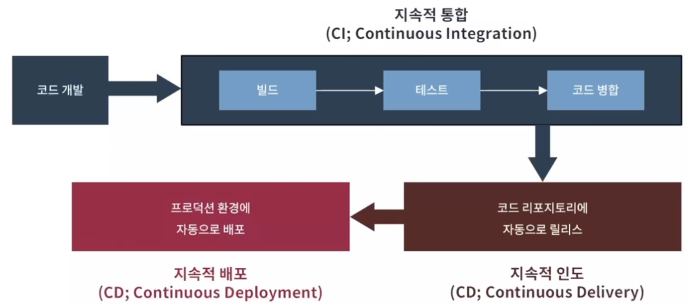

---

<br>
<br>
<br>
<br>

# 전통적 인도 프로세스와 자동화 파이프라인의 차이 및 CD(CI/CD) 구성 요소 정리

## 1. 전통적 인도 프로세스
- 단계:
    - Development
        - 분석, 계획, 구현, 단위 테스트, 데모.
    - Quality Assurance(QA)
        - 통합 테스트, 승인 테스트, 비기능 분석.
    - Operations
        - 릴리스, 모니터링.
- 한계점:
    - 느린 인도 기간
        - 요구사항 정의 후 제품 전달까지 시간 소요.
    - 느린 피드백 주기
        - 개발팀의 효율성을 저해.
    - 자동화 부족
        - 릴리스 주기가 길고 불확실성 증가.
    - 핫픽스 위험
        - 긴급 코드 수정 시 충분한 테스트 불가.
    - 개발 문화적 제약
        - 팀 스트레스, 낮은 책임감 및 만족도.

            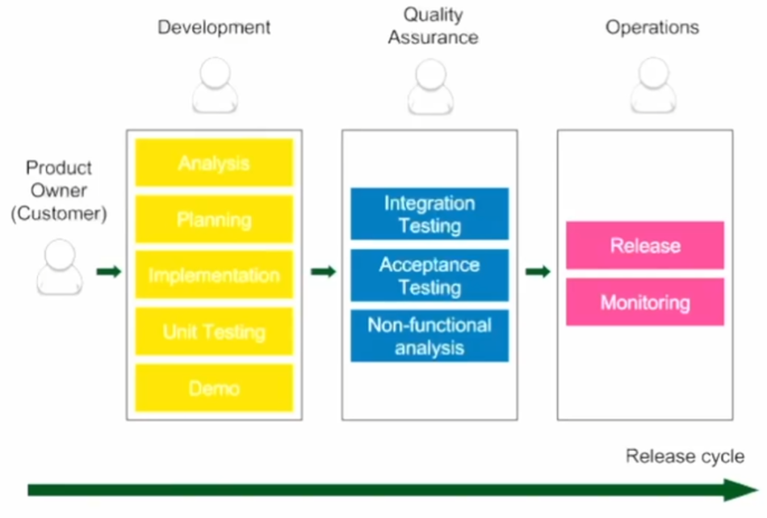

## 2. 자동화 파이프라인 (CD)
- 목적:
    - 코드 통합, 테스트, 배포를 자동화하여 빠르고 안정적인 릴리스.
    - 지속적 모니터링으로 문제 발생 시 신속 대응.
- 구성 단계:
    1. 코드 변경
        - 코드 작성 및 버전 관리.
    1. 지속적 통합 (CI)
        - 코드 병합, 빌드, 단위 테스트.
    1. 자동 인수 테스트
        - 기능 및 요구사항 충족 확인.
    1. 구성 관리
        - 배포 환경 설정 및 버전 관리.

        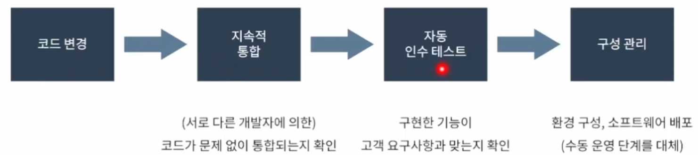

## 3. CI (지속적 통합)
- 과정
    1. 코드 체크아웃 및 빌드 실행.
    1. 단위 테스트 수행 및 코드 품질 점검.
    1. 테스트 리포트 생성 및 초기 피드백 제공.
- 이점
    - 코드 품질 보장, 팀 간 협업 강화.

## 4. CD (지속적 배포)
- 인수 테스트 (UAT):
    - 제품이 고객 요구를 충족하는지 확인.
    - 통합 테스트, 성능, 보안 등 비기능 요소 평가.
- 구성 관리:
    - 소프트웨어와 환경 변화 추적 및 제어.
    - 자동화 도구로 프로덕션 환경 설정.

## 5. CD를 위한 기술적 전제 조건
1. 자동화: 빌드, 테스트, 패키징, 배포.
1. 신속성: 파이프라인 실행 및 장애 복구.
1. 무중단 배포: 서비스 다운타임 방지.
1. 트렁크 기반 개발: 브랜치 최소화로 릴리스 주기 단축.

## 6. 결론
- 전통적 프로세스는 느림과 복잡성이 단점.
- 자동화 파이프라인(CI/CD)은 신속, 효율, 안정성 제공.
- 지속적 통합과 배포로 개발 생산성을 극대화.


---
<br>
<br>
<br>
<br>

# 파이프라인 도구 및 컨테이너화 개념

## 1. 파이프라인 도구의 역할
- 도구 사용법만 익히는 것이 아닌 각 도구가 프로세스 내에서 수행하는 역할 이해가 중요.
- 선택한 도구는 환경과 요구 사항에 맞춰 유연하게 변경 가능.

## 2. 대표적인 파이프라인 도구
- 컨테이너 가상화 및 클러스터 운영
    - Docker + Kubernetes: 애플리케이션을 격리된 환경에서 실행 및 클러스터 관리.
- 파이프라인 자동화 서버
    - Jenkins: 빌드, 테스트, 배포 자동화 지원.
- 구성 관리
    - Ansible: 배포 환경 구성 및 관리 자동화.
- 소스 코드 관리
    - GitHub: 코드 버전 관리 및 협업 플랫폼.

## 3. 컨테이너화 (Containerization)
- 응용 프로그램, 설정 파일, 라이브러리를 단일 컨테이너에 묶어 관리.
- 장점:
    - 개발 및 배포 효율성 향상.
    - 시스템 의존성 최소화로 이동성과 예측 가능성 강화.
- Docker:
    - 격리된 실행 환경 제공.
    - 하드웨어 리소스의 최적화 가능.

## 4. CI 파이프라인
- 작동 원리:
    1. 코드 변경이 리포지토리에 커밋되면 Jenkins가 빌드, 테스트, 분석 수행.
    1. 자동화된 작업으로 코드 품질 확인.
- 구조:
    - GitHub → Jenkins (빌드 및 테스트) → 배포 준비 완료.


## 5. 자동 인수 테스트
- 프로세스:
    - Docker와 Jenkins를 결합하여 테스트 환경 생성.
    - GitHub → Jenkins → Docker Host → Docker Hub.
- 목표:
    - 릴리스 전 요구 사항 충족 여부 확인.

## 6. Kubernetes 클러스터링
- Docker Host 대신 Kubernetes 클러스터로 확장 가능.
- 다중 컨테이너를 효율적으로 관리.

    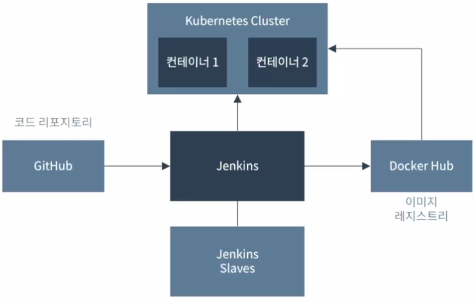

## 7. 구성 관리 (Configuration Management)
- 테스트 및 프로덕션 환경 미리 구성하여 일관된 배포 제공.
- Jenkins가 스테이징 및 프로덕션 클러스터를 관리.

    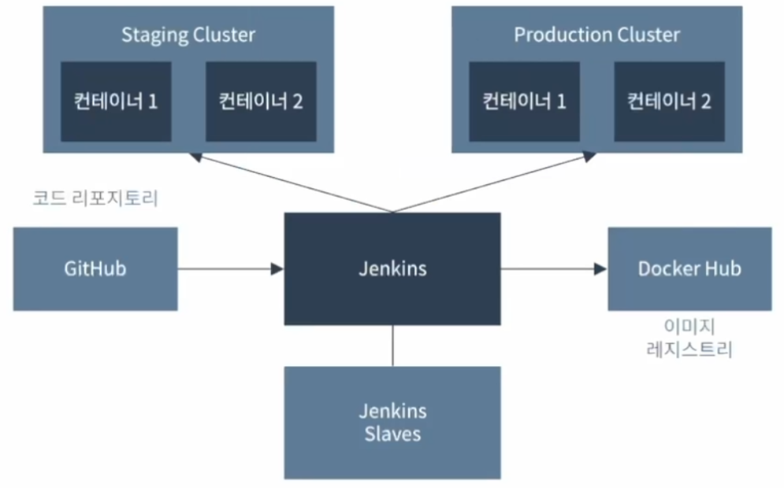

## 8. 핵심 정리
- 도구의 유연성
    - 역할과 요구 사항을 중심으로 적합한 도구 선택.
- 컨테이너화
    - 안정적인 실행 환경 제공.
- 자동화
    - CI/CD 파이프라인을 통해 효율성과 신뢰성을 극대화.

<br>
<br>
<br>
<br>

---

# 가상화와 컨테이너 기술, Docker 활용 정리

## 1. 가상화 (Virtualization)

- 개념: 물리적 컴퓨팅 자원을 추상화하여 논리적으로 분리된 환경을 제공.
    - 물리적 시스템을 가상 시스템으로 분할해 응용 프로그램과 자원이 독립적으로 상호작용.
    - 컴퓨터 안에 또 다른 가상의 컴퓨터를 실행.

## 2. 가상화의 이점

- 시스템 측면:
    - 자원 활용도 (Utilization) 향상.
    - 구성 및 복원의 용이성.
- 비즈니스 측면:
    - 비용 절감 및 다운타임 최소화.
    - 비즈니스 연속성 향상 및 데이터 센터 관리 간소화.


## 3. 서버 가상화 기술의 진화
- VM (Virtual Machine):
    - Type 1: 하드웨어 직접 실행 (Native).
    - Type 2: 호스트 OS 위에서 실행 (Hosted).
- 컨테이너:
    - 호스트 OS를 공유하며 독립된 실행 환경 제공.

## 4. 컨테이너화 (Containerization)
- 애플리케이션과 의존성을 묶어 격리된 환경에서 실행.
- VM 대비 가볍고 빠르며 자원 효율성이 높음.
- 구조:
    - 각 애플리케이션은 컨테이너 엔진을 통해 실행.
    - 예측 가능하고 일관된 환경 제공.


## 5. 컨테이너 기술의 이점
- 일관된 실행 환경 제공.
- 애플리케이션 샌드박싱으로 보안성 강화.
- 디스크 사용량 절감 및 낮은 오버헤드.


## 6. Docker의 역할
- 컨테이너 기반 가상화 플랫폼:
    - 다양한 OS에서 실행 가능 (Linux, Windows, MacOS).
    - 클라우드 서비스 (AWS, GCP)와 통합 가능.
- Docker 이미지:
    - 실행 가능한 컨테이너를 생성하기 위한 기반 구조.
- Docker Hub:
    - 컨테이너 이미지를 저장, 공유, 관리하는 플랫폼.

## 7. Docker를 활용한 개발/배포
- 구조:
    - 레이어 방식으로 이미지 생성.
    - 코드 변경 시 해당 레이어만 업데이트.
- 장점:
    - 빠른 배포와 효율적인 자원 사용.

## 8. 결론
- 가상화 기술은 자원 활용도 향상과 비용 절감을 가능하게 함.
- 컨테이너 기술은 경량화된 가상화로, 빠른 배포와 안정성을 제공.
- Docker는 현대 소프트웨어 개발과 배포에 필수적인 도구.

--- 

<br>
<br>
<br>
<br>


# 실습

`docker run hello-world`

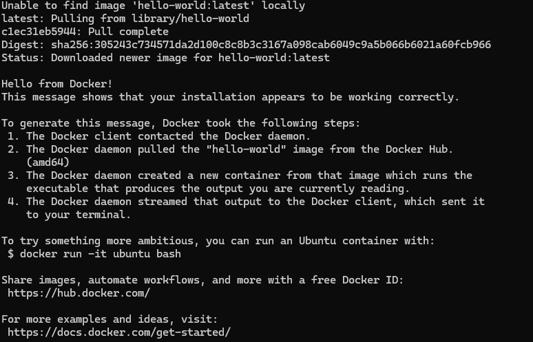

## 출력 내용

1. Unable to find image 'hello-world:latest' locally

    - 로컬 시스템에 hello-world:latest라는 이미지를 찾을 수 없다는 메시지.
    - Docker는 기본적으로 latest 태그가 붙은 이미지를 사용하려 시도.

2. latest: Pulling from library/hello-world

    - Docker가 Docker Hub의 공식 저장소(library/hello-world)에서 이미지를 다운로드.

3. c1ec31eb5944: Pull complete
    - 이미지 레이어 하나를 다운로드 완료.
    - Docker 이미지는 여러 레이어로 구성되며, 이 레이어들은 파일 시스템의 일부.

4. Digest: sha256:305243c734571da2d100c8c8b3c3167a098cab6049c9a5b066b6021a60fcb966

    - 다운로드한 이미지의 고유 해시값(Digest)으로 이미지 무결성 확인 가능.


5. Status: Downloaded newer image for hello-world:latest

    - hello-world:latest 이미지를 성공적으로 다운로드했다는 메시지.

6. Hello from Docker!

    - hello-world 컨테이너가 실행되어 터미널에 표시한 메시지.
    - Docker가 정상적으로 설치되고 동작함을 확인하는 간단한 테스트.


---

`docker search apache`
    
     Docker Hub에서 "apache" 키워드를 포함한 이미지를 검색

1. NAME

    - Docker 이미지의 이름입니다.
    - 예: apache/airflow, apache/superset 등.

2. DESCRIPTION

    - 이미지의 간단한 설명으로 이미지가 무엇을 하는지 나타냅니다.
    - 예: Apache Airflow, Apache Superset 등.

3. STARS

    - Docker Hub 사용자들이 해당 이미지에 부여한 평점(별표) 수입니다.
    - 별표는 이미지의 신뢰도와 인기도를 나타냄.
    - 예: 553(airflow), 277(superset).

4. OFFICIAL

    - 이미지가 Docker에서 공식적으로 제공하는지 여부를 나타냅니다.
    - 값이 표시되지 않았으므로, 해당 검색 결과는 Apache 재단과 관련된 커뮤니티 이미지로 추정됩니다.

---

`docker run httpd`

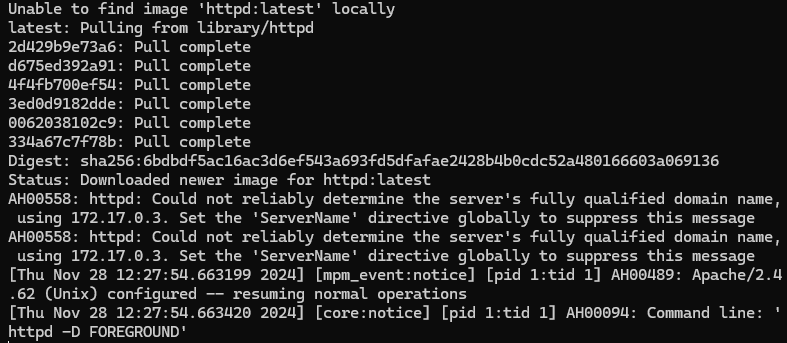

1. Unable to find image 'httpd:latest' locally

    - 로컬 시스템에 httpd:latest 이미지가 없음을 알리는 메시지.
    - Docker는 httpd 이미지를 Docker Hub에서 다운로드하려고 시도.

2. latest: Pulling from library/httpd

    - library/httpd 저장소에서 최신(latest) 버전의 이미지를 가져오는 과정.

3. Pull complete

    - 각 레이어가 성공적으로 다운로드되었음을 나타냄.
    - Docker 이미지는 여러 레이어로 구성되어 있으며, 레이어 단위로 다운로드.

4. Digest

    - 이미지의 고유 해시값으로 무결성을 확인 가능.
    - 이 값은 이미지가 변경되지 않았는지 검증할 때 사용.

5. Status: Downloaded newer image for httpd:latest

    - httpd:latest 이미지를 성공적으로 다운로드했음을 알리는 메시지.

6. AH00558: httpd: Could not reliably determine the server's fully qualified domain name

    - 서버의 FQDN(Fully Qualified Domain Name)을 확인할 수 없다는 경고.
    - Apache HTTP 서버는 기본적으로 호스트 이름을 사용하여 동작하며, Docker 컨테이너의 IP 주소(예: 172.17.0.3)로 대체됨.
    - 이 경고를 없애려면 Apache 설정 파일에서 ServerName 디렉티브를 설정해야 함.

7. Apache/2.4.62 (Unix) configured -- resuming normal operations

    - Apache HTTP 서버가 성공적으로 구성되었고, 정상적으로 실행되고 있음을 알리는 메시지.
    - 실행된 버전은 Apache 2.4.62.

8. Command line: 'httpd -D FOREGROUND'

    - Apache가 포그라운드에서 실행 중임을 나타냄.
    - Docker 컨테이너는 백그라운드에서 실행되기 때문에 httpd도 컨테이너 내에서 포그라운드 모드로 실행.


---

<br>
<br>
<br>
<br>

# DOCKER 이미지 조회

`docker images`

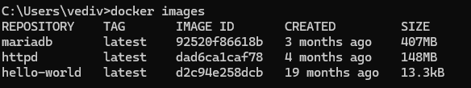


# 실행 중인 DOCKER 이미지 조회

`docker ps`

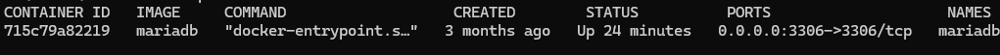


# DOCKER 이미지 삭제

`docker rmi [이미지 이름]`

- `docker rmi httpd`

    ```
    Error response from daemon: conflict: unable to remove repository reference "httpd" (must force) - container 9c23db7c4265 is using its referenced image dad6ca1caf78
    ```
    
> httpd 이미지가 참조된 컨테이너가 실행 중이거나 중지된 상태라서 해당 이미지를 삭제할 수 없음을 나타냄


- 실행은 종료됐지만 컨테이너에 올려져 있는 상태

    ```
    docker ps -a

    CONTAINER ID   IMAGE         COMMAND                   CREATED          STATUS                      PORTS                    NAMES
    9c23db7c4265   httpd         "httpd-foreground"        16 minutes ago   Exited (0) 6 minutes ago                             angry_ganguly
    aa86b9112cc0   hello-world   "/hello"                  27 minutes ago   Exited (0) 27 minutes ago                            goofy_stonebraker
    6c0801bc56ac   hello-world   "/hello"                  28 minutes ago   Exited (0) 27 minutes ago                            reverent_dewdney
    715c79a82219   mariadb       "docker-entrypoint.s…"   3 months ago     Up 29 minutes               0.0.0.0:3306->3306/tcp   mariadb
    ```

- 컨테이너 삭제

    ```
    docker rm 9c23db7c4265  // CONTAINER ID

    9c23db7c4265
    ```

- 다시 httpd 이미지 삭제

    ```
    docker images

    REPOSITORY    TAG       IMAGE ID       CREATED         SIZE
    mariadb       latest    92520f86618b   3 months ago    407MB
    httpd         latest    dad6ca1caf78   4 months ago    148MB
    hello-world   latest    d2c94e258dcb   19 months ago   13.3kB
    ```

    ```
    docker rmi dad6ca1caf78

    Untagged: httpd:latest
    Untagged: httpd@sha256:6bdbdf5ac16ac3d6ef543a693fd5dfafae2428b4b0cdc52a480166603a069136
    Deleted: sha256:dad6ca1caf78e98e22e8e5a406ab4a3427cedfff254c7fcc9dc3b2ca922c642b
    Deleted: sha256:092628e738116611e1bda846f338ba9bef1cc2a033dcc436b44b4dacead40078
    Deleted: sha256:456ff357a71a1c90c94e4495325203fa902f8382cac26c0a03714dce602dcd99
    Deleted: sha256:14d87f17c8b8cdb6546161cf49ff82631b15543e54b678c2dee4f7888456f5f7
    Deleted: sha256:565135b3f0ec83dab78e23227d394efd5739080a312269f96b184740e562cb06
    Deleted: sha256:559984f97411f386dcbe5f41ffc76ef63f5af393a69c3834317da70eb4d16f48
    Deleted: sha256:c3548211b8264f8bfa47a6727043a64f1791b82ac965a284a7ea187e971a95e2
    ```

---

<br>
<br>
<br>
<br>

#  Docker 이미지와 컨테이너의 차이 및 명령어 정리

## 1. Docker 이미지 (Docker Images)
- 응용 프로그램 실행에 필요한 모든 파일과 설정을 묶어 둔 파일.
- 특징:
    - 상태를 저장하지 않음 (Stateless).
    - 계층화된 구조로 이미지를 기반으로 다른 이미지 생성 가능.
    - 네트워크를 통해 전송 가능하며 레지스트리에 저장 가능.
    - 이름 및 버전 태그를 지정하여 관리.

## 2. Docker 컨테이너 (Docker Containers)
- Docker 이미지로부터 실행된 인스턴스.
- 특징:
    - 동일한 이미지에서 여러 개의 컨테이너 실행 가능.
    - 상태를 저장할 수 있음 (Stateful), 컨테이너 종료 시 상태가 소멸.
    - 독립된 환경을 제공하며 가상 컴퓨터와 유사한 역할.


## 3. Docker 이미지와 컨테이너 비교
|항목	|Docker 이미지	|Docker 컨테이너|
|-------|--------------|---------------|
|정의	|실행 가능한 파일들의 묶음|	실행 중인 인스턴스|
|상태 저장	|저장하지 않음 (Stateless)|	저장 가능 (Stateful)|
|용도	|실행 환경 정의 및 배포|	실행된 환경에서 응용 프로그램 동작 관리|

## 4. Docker 명령어 요약

- 이미지와 컨테이너 실행
    - docker run <이미지 이름>: 이미지를 기반으로 컨테이너 생성 및 실행.
    - docker ps, docker ps -a: 실행 중이거나 중단된 컨테이너 조회.
    - docker images: 로컬에 저장된 이미지 목록 조회.

- 컨테이너 관리
 
    - docker stop <컨테이너 이름/ID>: 실행 중인 컨테이너 중지.
    - docker rm <컨테이너 이름/ID>: 컨테이너 삭제.

- 이미지 관리
 
    - docker rmi <이미지 이름/ID>: 이미지 삭제.

## 5. 결론
- Docker 이미지는 컨테이너를 생성하기 위한 기반이며 상태가 없는 구조.
- Docker 컨테이너는 이미지를 실행한 독립적 환경으로, 상태를 저장 가능.
- Docker 명령어를 활용해 컨테이너와 이미지를 효율적으로 관리 가능.


---

<br>
<br>
<br>
<br>


# Docker Image 생성 실습

1. Apache HTTP 서버(httpd)를 실행하기 위해 Docker 컨테이너를 생성하고 실행하는 명령어

    ```
    docker run httpd

    Unable to find image 'httpd:latest' locally
    latest: Pulling from library/httpd
    2d429b9e73a6: Pull complete
    d675ed392a91: Pull complete
    4f4fb700ef54: Pull complete
    3ed0d9182dde: Pull complete
    0062038102c9: Extracting [==================================================>]  26.04MB/26.04MB
    334a67c7f78b: Download complete
    ```

2. 이미지(httpd)를 사용해 컨테이너를 생성하고, 그 안에서 Bash 쉘을 실행하는 명령어

    - 콘솔에 붙은 상태로 컨테이너 실행
    - 컨테이너 내부 쉘 연결
        
        ```
        docker run -it httpd /bin/bash
        
        root@94c52d65dc46:/usr/local/apache2#
        ```
        
        - docker run
            - 새로운 컨테이너를 생성하고 실행합니다.
        - -it

            - -i (interactive)
                - 컨테이너의 표준 입력(STDIN)을 활성화하여 입력을 받을 수 있도록 함.
            - -t (tty)
                - 가상 터미널(TTY)을 할당하여 사용자가 콘솔 환경에서 작업할 수 있도록 함.
                - 이 옵션을 함께 사용하면 Bash 셸처럼 대화형 환경을 제공
        - httpd
        
            - Apache HTTP 서버의 Docker 이미지.
            - 이 이미지를 기반으로 컨테이너를 생성.
        
        - /bin/bash
        
            - 컨테이너 내부에서 실행할 명령어.
            - Apache HTTP 서버는 기본적으로 httpd -D FOREGROUND를 실행하지만, 이 명령어에서는 /bin/bash를 실행하여 컨테이너 내부의 셸 환경에 진입.

    - 쉘을 이용해 컨테이너 상태를 조작

2. 다른 출력이 나오도록 변경

    ```
    grep DocumentRoot /usr/local/apache2/conf/httpd.conf

    # DocumentRoot: The directory out of which you will serve your
    DocumentRoot "/usr/local/apache2/htdocs"
    # access content that does not live under the DocumentRoot
    ```

    - /usr/local/apache2/htdocs
        - 해당 경로의 index.html을 표출


    ```
    ls -l

    total 40
    drwxr-xr-x 2 root root 4096 Nov 12 02:04 bin
    drwxr-xr-x 2 root root 4096 Nov 12 02:04 build
    drwxr-xr-x 2 root root 4096 Nov 12 02:04 cgi-bin
    drwxr-xr-x 4 root root 4096 Nov 12 02:04 conf
    drwxr-xr-x 3 root root 4096 Nov 12 02:04 error
    drwxr-xr-x 2 root root 4096 Nov 12 02:04 htdocs
    drwxr-xr-x 3 root root 4096 Nov 12 02:04 icons
    drwxr-xr-x 2 root root 4096 Nov 12 02:04 include
    drwxr-xr-x 2 root root 4096 Nov 12 02:04 logs
    drwxr-xr-x 2 root root 4096 Nov 12 02:04 modules
    ```

    ```
    ls -l

    total 4
    -rw-r--r-- 1 501 staff 45 Jun 11  2007 index.html
    ```

    ```
    cat index.html
    
    <html><body><h1>It works!</h1></body></html>
    ```

### 파일 내용 변경

    ```
    index.html
    
    <html><body><h1>Docker</h1></body></html>
    
    (ctrl + D)
    ```

    - 쉘을 통해 index.html 내용 변경 완료
        ```
        cat index.html
        
        <html><body><h1>Docker</h1></body></html>
        ```


### Docker 컨테이너 내부에서 Apache를 실행할 때 사용

    ```
    httpd-foreground

    AH00558: httpd: Could not reliably determine the server's fully qualified domain name, using 172.17.0.3. Set the 'ServerName' directive globally to suppress this message
    AH00558: httpd: Could not reliably determine the server's fully qualified domain name, using 172.17.0.3. Set the 'ServerName' directive globally to suppress this message
    [Thu Nov 28 13:26:43.104654 2024] [mpm_event:notice] [pid 15:tid 15] AH00489: Apache/2.4.62 (Unix) configured -- resuming normal operations
    [Thu Nov 28 13:26:43.104819 2024] [core:notice] [pid 15:tid 15] AH00094: Command line: 'httpd -D FOREGROUND'
    ^C[Thu Nov 28 13:27:42.014296 2024] [mpm_event:notice] [pid 15:tid 15] AH00491: caught SIGTERM, shutting dow
    ```

### 컨테이너에서 빠져나오기

    ```
    root@94c52d65dc46:/usr/local/apache2/htdocs# exit

    exit

    C:\Users\vediv>
    ```

### 다시 httpd 실행
    - 변경한 index.html이 저장되어 있는지를 확인
        - 저장되지 않음
        
            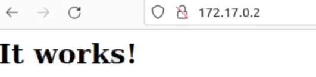


### 현재 컨테이너 상황 조회

    - index.html을 수정한 컨테이너와 다시 실행한 httpd 컨테이너는 다른 컨테이너
        ```
        docker ps -a

        CONTAINER ID   IMAGE         COMMAND                   CREATED              STATUS                         PORTS                    NAMES
        048dc782b54d   httpd         "httpd-foreground"        About a minute ago   Exited (0) 6 seconds ago                                focused_booth
        94c52d65dc46   httpd         "/bin/bash"               20 minutes ago       Exited (0) 2 minutes ago                                bold_bardeen
        ae66c2f5f574   httpd         "httpd-foreground"        31 minutes ago       Exited (0) 21 minutes ago                               friendly_davinci
        27d6b8b5a15e   hello-world   "/hello"                  33 minutes ago       Exited (0) 33 minutes ago                               lucid_hugle
        aa86b9112cc0   hello-world   "/hello"                  About an hour ago    Exited (0) About an hour ago                            goofy_stonebraker
        6c0801bc56ac   hello-world   "/hello"                  About an hour ago    Exited (0) About an hour ago                            reverent_dewdney
        715c79a82219   mariadb       "docker-entrypoint.s…"   3 months ago         Up About an hour               0.0.0.0:3306->3306/tcp   mariadb
        ```

### 수정한 index.html이 있는 컨테이너에 접근하기

    ```
    docker start 048dc782b54d

    048dc782b54d
    ```

    - 컨테이너 조회

        - CONTAINER ID:048dc782b54d가 실행되고 있다.

            ```
            docker ps -a

            CONTAINER ID   IMAGE         COMMAND                   CREATED             STATUS                          PORTS                    NAMES
            048dc782b54d   httpd         "httpd-foreground"        12 minutes ago      Exited (0) 3 minutes ago                                 focused_booth
            94c52d65dc46   httpd         "/bin/bash"               31 minutes ago      Up About a minute               80/tcp                   bold_bardeen
            ae66c2f5f574   httpd         "httpd-foreground"        42 minutes ago      Exited (0) About a minute ago                            friendly_davinci
            27d6b8b5a15e   hello-world   "/hello"                  44 minutes ago      Exited (0) 44 minutes ago                                lucid_hugle
            aa86b9112cc0   hello-world   "/hello"                  About an hour ago   Exited (0) About an hour ago                             goofy_stonebraker
            6c0801bc56ac   hello-world   "/hello"                  About an hour ago   Exited (0) About an hour ago                             reverent_dewdney
            715c79a82219   mariadb       "docker-entrypoint.s…"   3 months ago        Up About an hour                0.0.0.0:3306->3306/tcp   mariadb
            ```

    - 해당 컨테이너 쉘에 접근

        ```
        docker exec -it 048dc782b54d /bin/bash
    
        root@048dc782b54d:/usr/local/apache2#
        ```

        ```
        root@ae66c2f5f574:/usr/local/apache2# ls -l

        total 40
        drwxr-xr-x 2 root root 4096 Nov 12 02:04 bin
        drwxr-xr-x 2 root root 4096 Nov 12 02:04 build
        drwxr-xr-x 2 root root 4096 Nov 12 02:04 cgi-bin
        drwxr-xr-x 4 root root 4096 Nov 12 02:04 conf
        drwxr-xr-x 3 root root 4096 Nov 12 02:04 error
        drwxr-xr-x 2 root root 4096 Nov 12 02:04 htdocs
        drwxr-xr-x 3 root root 4096 Nov 12 02:04 icons
        drwxr-xr-x 2 root root 4096 Nov 12 02:04 include
        drwxr-xr-x 1 root root 4096 Nov 28 13:37 logs
        drwxr-xr-x 2 root root 4096 Nov 12 02:04 modules
        ```

    - index.html에 접근

        ```
        root@94c52d65dc46:/usr/local/apache2# cat ./htdocs/index.html
        
        <html><body><h1>Docker</h1></body></html>
        ```

        - 수정한 텍스트를 확인

    - 수동으로 웹 서버 실행

        ```
        root@94c52d65dc46:/usr/local/apache2# httpd-foreground

        AH00558: httpd: Could not reliably determine the server's fully qualified domain name, using 172.17.0.3. Set the 'ServerName' directive globally to suppress this message
        AH00558: httpd: Could not reliably determine the server's fully qualified domain name, using 172.17.0.3. Set the 'ServerName' directive globally to suppress this message
        [Thu Nov 28 13:43:25.232918 2024] [mpm_event:notice] [pid 21:tid 21] AH00489: Apache/2.4.62 (Unix) configured -- resuming normal operations
        [Thu Nov 28 13:43:25.233013 2024] [core:notice] [pid 21:tid 21] AH00094: Command line: 'httpd -D FOREGROUND'
        ```


### 변경된 상태로 이미지 생성하기

    ```
    docker ps -a

    CONTAINER ID   IMAGE         COMMAND                   CREATED             STATUS                         PORTS                    NAMES
    048dc782b54d   httpd         "httpd-foreground"        15 minutes ago      Exited (0) 5 minutes ago                                focused_booth
    94c52d65dc46   httpd         "/bin/bash"               34 minutes ago      Up 3 minutes                   80/tcp                   bold_bardeen
    ae66c2f5f574   httpd         "httpd-foreground"        44 minutes ago      Exited (0) 3 minutes ago                                friendly_davinci
    27d6b8b5a15e   hello-world   "/hello"                  47 minutes ago      Exited (0) 47 minutes ago                               lucid_hugle
    aa86b9112cc0   hello-world   "/hello"                  About an hour ago   Exited (0) About an hour ago                            goofy_stonebraker
    6c0801bc56ac   hello-world   "/hello"                  About an hour ago   Exited (0) About an hour ago                            reverent_dewdney
    715c79a82219   mariadb       "docker-entrypoint.s…"   3 months ago        Up About an hour               0.0.0.0:3306->3306/tcp   mariadb
    ```


    ```
    docker commit 94c52d65dc46 my_httpd:0.1

    sha256:2c33960e4d98ae936f38880f41baf9eeed681f03046b1ffc8ab35bb75da2bbed
    ```

    - 새로운 이미지 생성 완료
        ```
        docker images

        REPOSITORY    TAG       IMAGE ID       CREATED          SIZE
        my_httpd      0.1       2c33960e4d98   26 seconds ago   148MB
        mariadb       latest    92520f86618b   3 months ago     407MB
        httpd         latest    dad6ca1caf78   4 months ago     148MB
        hello-world   latest    d2c94e258dcb   19 months ago    13.3kB
        ```

        - 어떠한 레지스트리 or 레포지토리에도 올려지지 않은 상태
        - 내 컴퓨터에만 생성된 상태

    
    - 생성한 이미지 실행

        ```
        docker run my_httpd:0.1 httpd-foreground
        
        AH00558: httpd: Could not reliably determine the server's fully qualified domain name, using 172.17.0.4. Set the 'ServerName' directive globally to suppress this message
        AH00558: httpd: Could not reliably determine the server's fully qualified domain name, using 172.17.0.4. Set the 'ServerName' directive globally to suppress this message
        [Thu Nov 28 13:48:40.499740 2024] [mpm_event:notice] [pid 1:tid 1] AH00489: Apache/2.4.62 (Unix) configured -- resuming normal operations
        [Thu Nov 28 13:48:40.500203 2024] [core:notice] [pid 1:tid 1] AH00094: Command line: 'httpd -D FOREGROUND'
        ```


### 이미지 생성 자동화

- Dockerfile
    - 계층 구조를 이용하여 도커 이미지를 만드는 절차를 기술하는 파일 (텍스트)
        - FROM [--platform=<platform>] <image> [AS <name>]
        - RUN <command>
        - ENTRYPOINT ["executable", "param1", "param2"]
- 이미지 빌드 명령어
    - docker build [OPTIONS] PATH | URL | -

`docker build -t my_httpd:0.2 .`


- 로컬에서 생성한 이미지를 레지스트리에 등록

    - `docker login`

    - `docker tag_my_httpd:0.2 vedivero/my_httpd:0.2`


## docker login

- 도커 로그인
    ```
    docker login

    Log in with your Docker ID or email address to push and pull images from Docker Hub. If you don't have a Docker ID, head over to https://hub.docker.com/ to create one.
    You can log in with your password or a Personal Access Token (PAT). Using a limited-scope PAT grants better security and is required for organizations using SSO. Learn more at https://docs.docker.com/go/access-tokens/

    Username: vedivero@gmail.com
    Password:

    Login Succeeded
    ```

- 이미지 태그 이름 지정
    ```
    docker tag my_httpd:0.1 vedivero/my_httpd:0.1

    docker images

    my_httpd            0.1       2c33960e4d98   32 minutes ago   148MB
    vedivero/my_httpd   0.1       2c33960e4d98   32 minutes ago   148MB
    ```

- 이미지 푸시
    ```
    docker push vedivero/my_httpd:0.1

    The push refers to repository [docker.io/vedivero/my_httpd]
    145b5c528f51: Pushed
    9ce89b648dd7: Mounted from library/httpd
    d32b5bce7355: Mounted from library/httpd
    5e96151062b7: Mounted from library/httpd
    5f70bf18a086: Mounted from library/httpd
    8cc10dae2ae3: Mounted from library/httpd
    c3548211b826: Mounted from library/httpd
    0.1: digest: sha256:4cb09159aed5eb0f0b37484ff951db62bb81c6d0fd2e8506624ede5cbd720f95 size: 1779
    ```

- docker 홈페이지에 등록된 것을 확인

    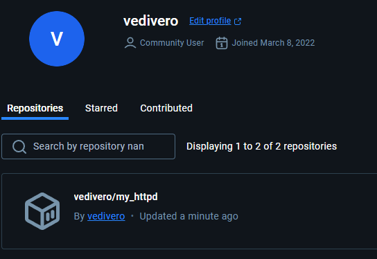


# 푸시한 이미지를 로컬에 다운로드

- 컨테이너 삭제

    - `docker rm <이미지 이름>

        ```
        docker rm 6c0801bc56ac aa86b9112cc0 27d6b8b5a15e ae66c2f5f574 94c52d65dc46 048dc782b54d 824d522a35b6

        6c0801bc56ac
        aa86b9112cc0
        27d6b8b5a15e
        ae66c2f5f574
        048dc782b54d
        824d522a35b6
        Error response from daemon: cannot remove container "/bold_bardeen": container is running: stop the container before removing or force remove
        ```
            - 실행 중인 컨테이너 제외 이미지 삭제 완료

        - 실행 중인 컨테이너 중지 시키고 삭제

        ```
        docker stop 94c52d65dc46
        94c52d65dc46

        docker rm 94c52d65dc46
        94c52d65dc46

        docker ps -a
        CONTAINER ID   IMAGE   COMMAND    CREATED    STATUS    PORTS   NAMES
        ```


- 이미지 삭제

    - 이미지 조회

        ```
        docker images

        REPOSITORY          TAG       IMAGE ID       CREATED          SIZE
        my_httpd            0.1       2c33960e4d98   41 minutes ago   148MB
        vedivero/my_httpd   0.1       2c33960e4d98   41 minutes ago   148MB
        httpd               latest    dad6ca1caf78   4 months ago     148MB
        hello-world         latest    d2c94e258dcb   19 months ago    13.3kB
        ```

    - 삭제

        - 태그된 이미지 삭제

            ```
            docker rmi my_httpd:0.1
            
            Untagged: my_httpd:0.1
            ```

        - 그 외 이미지 삭제

            ```
            docker rmi 2c33960e4d98 dad6ca1caf78

            Untagged: vedivero/my_httpd:0.1
            Untagged: vedivero/my_httpd@sha256:4cb09159aed5eb0f0b37484ff951db62bb81c6d0fd2e8506624ede5cbd720f95
            Deleted: sha256:2c33960e4d98ae936f38880f41baf9eeed681f03046b1ffc8ab35bb75da2bbed
            Deleted: sha256:16d319be2aca4d508eb8c8d3712ff7d60bb99052b8ed99c3fc0e7f861be159f2
            Untagged: httpd:latest
            Untagged: httpd@sha256:6bdbdf5ac16ac3d6ef543a693fd5dfafae2428b4b0cdc52a480166603a069136
            Deleted: sha256:dad6ca1caf78e98e22e8e5a406ab4a3427cedfff254c7fcc9dc3b2ca922c642b
            Deleted: sha256:092628e738116611e1bda846f338ba9bef1cc2a033dcc436b44b4dacead40078
            Deleted: sha256:456ff357a71a1c90c94e4495325203fa902f8382cac26c0a03714dce602dcd99
            Deleted: sha256:14d87f17c8b8cdb6546161cf49ff82631b15543e54b678c2dee4f7888456f5f7
            Deleted: sha256:565135b3f0ec83dab78e23227d394efd5739080a312269f96b184740e562cb06
            Deleted: sha256:559984f97411f386dcbe5f41ffc76ef63f5af393a69c3834317da70eb4d16f48
            Deleted: sha256:c3548211b8264f8bfa47a6727043a64f1791b82ac965a284a7ea187e971a95e2
            ```

        - 원격 저장소에서 이미지 내려받기

            ```
            docker run vedivero/my_httpd:0.1

            Unable to find image 'vedivero/my_httpd:0.1' locally
            0.1: Pulling from vedivero/my_httpd
            2d429b9e73a6: Pull complete
            d675ed392a91: Pull complete
            4f4fb700ef54: Pull complete
            3ed0d9182dde: Pull complete
            0062038102c9: Pull complete
            334a67c7f78b: Pull complete
            c4d133659abd: Pull complete
            Digest: sha256:4cb09159aed5eb0f0b37484ff951db62bb81c6d0fd2e8506624ede5cbd720f95
            Status: Downloaded newer image for vedivero/my_httpd:0.1
            ```

        - 로컬 이미지 조회

            ```
            docker images

            REPOSITORY          TAG       IMAGE ID       CREATED          SIZE
            vedivero/my_httpd   0.1       2c33960e4d98   46 minutes ago   148MB
            ```


# 요약 정리

- 도커의 편리함 (CI/CD 관점에서 생각해 보기)
  - 응용을 실행하는 데 이용되는 실제 (물리적) 컴퓨터 환경과 독립적으로 통일된 실행 환경 제공 가능
  - 이미지로부터 여러 개의 동일한 컨테이너 인스턴스를 만들고 실행 가능
  - 필요한 소프트웨어 도구 및 설정 파일 등을 사전에 지정해 두고 알려진 상태로 컨테이너 생성 가능 (자동화!)

- 남아 있는 일들
  - 환경 변수의 이용
  - 컨테이너들 사이 및 호스트와 컨테이너 사이에 TCP/IP를 이용한 통신 가능하게 하기
  - 호스트와 컨테이너 사이의 볼륨 공유
  - 도커 클린업


---

<br>
<br>
<br>
<br>

# 도커 응용 파일 만들기 

## 폴더 생성

    ```
    mkdir express-docker
    ```

## JavaScript 응용 스크립트 생성
    ```
    C:\Users\vediv\express-docker>echo const express = require('express'); > app.js
    C:\Users\vediv\express-docker>echo const app = express(); >> app.js
    C:\Users\vediv\express-docker>echo const PORT = 3000; >> app.js
    C:\Users\vediv\express-docker>echo app.get('/', (req, res) => res.send('Hello from Express in Docker!')); >> app.js
    C:\Users\vediv\express-docker>echo app.listen(PORT, () => console.log(`Server is running on port ${PORT}`)); >> app.js
    ```

    - 파일 내용 확인
    
        ```
        type app.js
        const express = require('express');
        const app = express();
        const PORT = 3000;
        app.get('/', (req, res) = from Express in Docker!'));
        app.listen(PORT, () = is running on port ${PORT}`));
        ```

## Dockerfile 생성

    - Node.js 베이스 이미지와 JavaScript 패키지를 설치

        ```
        echo FROM node:14 > Dockerfile
        echo WORKDIR /usr/src/app >> Dockerfile
        echo COPY package*.json ./ >> Dockerfile
        echo RUN npm install >> Dockerfile
        echo COPY . . >> Dockerfile
        echo EXPOSE 3000 >> Dockerfile
        echo CMD ["node", "app.js"] >> Dockerfile
        ```

## package.json 생성
    
    - Express 패키지를 설치

        ```
        echo { > package.json
        echo "name": "express-docker", >> package.json
        echo "version": "1.0.0", >> package.json
        echo "main": "app.js", >> package.json
        echo "scripts": { "start": "node app.js" }, >> package.json
        echo "dependencies": { "express": "^4.18.2" } >> package.json
        echo } >> package.json
        ```

## Docker 이미지 빌드

    ```
    docker build -t express-app:1.0 .
    [+] Building 74.6s (11/11) FINISHED                                                                                docker:desktop-linux
    => [internal] load build definition from Dockerfile                                                                               0.0s
    => => transferring dockerfile: 169B                                                                                               0.0s
    => [internal] load metadata for docker.io/library/node:14                                                                         2.4s
    => [auth] library/node:pull token for registry-1.docker.io                                                                        0.0s
    => [internal] load .dockerignore                                                                                                  0.0s
    => => transferring context: 2B                                                                                                    0.0s
    => [1/5] FROM docker.io/library/node:14@sha256:a158d3b9b4e3fa813fa6c8c590b8f0a860e015ad4e59bbce5744d2f6fd8461aa                  61.6s
    => => resolve docker.io/library/node:14@sha256:a158d3b9b4e3fa813fa6c8c590b8f0a860e015ad4e59bbce5744d2f6fd8461aa                   0.1s
    => => sha256:1d12470fa662a2a5cb50378dcdc8ea228c1735747db410bbefb8e2d9144b5452 7.51kB / 7.51kB                                     0.0s
    => => sha256:b253aeafeaa7e0671bb60008df01de101a38a045ff7bc656e3b0fbfc7c05cca5 7.86MB / 7.86MB                                     1.3s
    => => sha256:3d2201bd995cccf12851a50820de03d34a17011dcbb9ac9fdf3a50c952cbb131 10.00MB / 10.00MB                                   1.2s
    => => sha256:a158d3b9b4e3fa813fa6c8c590b8f0a860e015ad4e59bbce5744d2f6fd8461aa 776B / 776B                                         0.0s
    => => sha256:2cafa3fbb0b6529ee4726b4f599ec27ee557ea3dea7019182323b3779959927f 2.21kB / 2.21kB                                     0.0s
    => => sha256:2ff1d7c41c74a25258bfa6f0b8adb0a727f84518f55f65ca845ebc747976c408 50.45MB / 50.45MB                                   3.5s
    => => sha256:1de76e268b103d05fa8960e0f77951ff54b912b63429c34f5d6adfd09f5f9ee2 51.88MB / 51.88MB                                   5.6s
    => => sha256:d9a8df5894511ce28a05e2925a75e8a4acbd0634c39ad734fdfba8e23d1b1569 191.85MB / 191.85MB                                11.2s
    => => extracting sha256:2ff1d7c41c74a25258bfa6f0b8adb0a727f84518f55f65ca845ebc747976c408                                          5.0s
    => => sha256:6f51ee005deac0d99898e41b8ce60ebf250ebe1a31a0b03f613aec6bbc9b83d8 4.19kB / 4.19kB                                     3.8s
    => => sha256:5f32ed3c3f278edda4fc571c880b5277355a29ae8f52b52cdf865f058378a590 35.24MB / 35.24MB                                   6.8s
    => => sha256:0c8cc2f24a4dcb64e602e086fc9446b0a541e8acd9ad72d2e90df3ba22f158b3 2.29MB / 2.29MB                                     6.0s
    => => sha256:0d27a8e861329007574c6766fba946d48e20d2c8e964e873de352603f22c4ceb 450B / 450B                                         6.3s
    => => extracting sha256:b253aeafeaa7e0671bb60008df01de101a38a045ff7bc656e3b0fbfc7c05cca5                                          0.7s
    => => extracting sha256:3d2201bd995cccf12851a50820de03d34a17011dcbb9ac9fdf3a50c952cbb131                                          0.4s
    => => extracting sha256:1de76e268b103d05fa8960e0f77951ff54b912b63429c34f5d6adfd09f5f9ee2                                          4.7s
    => => extracting sha256:d9a8df5894511ce28a05e2925a75e8a4acbd0634c39ad734fdfba8e23d1b1569                                         13.1s
    => => extracting sha256:6f51ee005deac0d99898e41b8ce60ebf250ebe1a31a0b03f613aec6bbc9b83d8                                          0.0s
    => => extracting sha256:5f32ed3c3f278edda4fc571c880b5277355a29ae8f52b52cdf865f058378a590                                          3.5s
    => => extracting sha256:0c8cc2f24a4dcb64e602e086fc9446b0a541e8acd9ad72d2e90df3ba22f158b3                                          0.7s
    => => extracting sha256:0d27a8e861329007574c6766fba946d48e20d2c8e964e873de352603f22c4ceb                                          0.0s
    => [internal] load build context                                                                                                  0.0s
    => => transferring context: 606B                                                                                                  0.0s
    => [2/5] WORKDIR /usr/src/app                                                                                                     3.2s
    => [3/5] COPY package*.json ./                                                                                                    0.2s
    => [4/5] RUN npm install                                                                                                          6.2s
    => [5/5] COPY . .                                                                                                                 0.3s
    => exporting to image                                                                                                             0.4s
    => => exporting layers                                                                                                            0.3s
    => => writing image sha256:51fb631bb04ae5318ab1410422e461c87f7266b70bdee7f0779501460ae702fb                                       0.0s
    => => naming to docker.io/library/express-app:1.0                                                                                 0.0s

    What's next:
        View a summary of image vulnerabilities and recommendations → docker scout quickview
    ```


## Docker 컨테이너 실행

    ```
    docker run -p 3000:3000 express-app:1.0
    ```

## 실행 화면

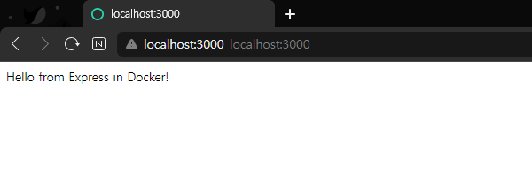

---

<br>
<br>
<br>
<br>

# 컨테이너 다루기

## 1. Docker 명령어와 의미

- 명령어: docker run --rm -e NAME=Docker-rm hello:0.2

    - 의미:
        - --rm: 컨테이너 실행 후 종료 시 자동 삭제.
        - -e NAME=Docker-rm: 환경 변수를 컨테이너 내부에서 NAME이라는 이름으로 사용하고 값은 Docker-rm으로 설정.
        - hello:0.2: hello라는 이미지의 0.2 태그 버전으로 컨테이너 실행.
    - 사용 이유: 실행 후 불필요한 컨테이너가 남는 것을 방지하고, 컨테이너 내부에서 환경 변수 값을 테스트.

- 명령어: docker ps -a
    - 의미:
        - docker ps: 실행 중인 컨테이너 리스트 출력.
        - -a: 종료된 컨테이너까지 포함하여 모든 컨테이너 리스트 출력.
    - 사용 이유: 현재 컨테이너 상태를 확인하고, 특정 컨테이너가 종료되었는지 확인.


- 명령어: docker rm <컨테이너 ID>
    - 의미:
        - 특정 컨테이너를 삭제.
    - 사용 이유: 더 이상 필요하지 않은 컨테이너를 삭제하여 리소스 정리.

- 명령어: docker rmi <이미지 ID>
    - 의미:
        - 특정 Docker 이미지를 삭제.
    - 사용 이유: 불필요한 이미지를 삭제하여 저장 공간 확보.


## 2. Docker 네트워크와 포트 관련
- 명령어: docker run -d --rm -p 8888:8080 tomcat
    - 의미:
        - -d: 컨테이너를 백그라운드에서 실행.
        - --rm: 실행 종료 후 컨테이너 자동 삭제.
        - -p 8888:8080: 호스트의 8888 포트를 컨테이너의 8080 포트에 매핑.
    - tomcat: Tomcat 이미지를 사용하여 컨테이너 실행.
    - 사용 이유: Tomcat 컨테이너를 실행하고, 외부에서 호스트의 8888 포트를 통해 Tomcat 서비스에 접근 가능.

## 3. Docker 클린업

- 명령어: docker container prune
    - 의미:
        - 종료된 모든 컨테이너 삭제.
        - 사용 이유: 리소스 정리를 통해 Docker 시스템을 최적화.

- 명령어: docker image prune -a
    - 의미:
        - 사용되지 않는 모든 이미지를 삭제.
    - 사용 이유: 오래된 이미지 및 더 이상 필요하지 않은 이미지를 삭제하여 디스크 공간 확보.


---

<br>
<br>
<br>
<br>


# 컨테이너 안의 파일들과 도커 볼륨

- nginx 이미지 내려받기
    ```
    docker run --rm -d -p 8080:80 --name my_nginx nginx:latest

    Unable to find image 'nginx:latest' locally
    latest: Pulling from library/nginx
    2d429b9e73a6: Already exists
    20c8b3871098: Pull complete
    06da587a7970: Pull complete
    f7895e95e2d4: Pull complete
    7b25f3e99685: Pull complete
    dffc1412b7c8: Pull complete
    d550bb6d1800: Pull complete
    Digest: sha256:0c86dddac19f2ce4fd716ac58c0fd87bf69bfd4edabfd6971fb885bafd12a00b
    Status: Downloaded newer image for nginx:latest
    d22eb91d90018e85f88e5fa3673a22530aa81ff1ecc47c6420cb3679f0db0524
    ```

    ```
    docker ps

    CONTAINER ID   IMAGE             COMMAND                   CREATED          STATUS          PORTS                    NAMES
    d22eb91d9001   nginx:latest      "/docker-entrypoint.…"   24 seconds ago   Up 23 seconds   0.0.0.0:8080->80/tcp     my_nginx
    ```

- 쉘에서 my_nginx 실행

    ```
    docker exec -it my_nginx /bin/bash

    root@d22eb91d9001:/# ls -l /usr/share/nginx/html
    total 8
    -rw-r--r-- 1 root root 497 Nov 26 15:55 50x.html
    -rw-r--r-- 1 root root 615 Nov 26 15:55 index.html
    ```

- index.html 파일
    ```
    root@d22eb91d9001:/# cat /usr/share/nginx/html/index.html

    <!DOCTYPE html>
    <html>
        <head>
            <title>Welcome to nginx!</title>
            <style>
            html { color-scheme: light dark; }
            body { width: 35em; margin: 0 auto;
            font-family: Tahoma, Verdana, Arial, sans-serif; }
            </style>
        </head>
        <body>
            <h1>Welcome to nginx!</h1>
            <p>If you see this page, the nginx web server is successfully installed and
            working. Further configuration is required.</p>

            <p>For online documentation and support please refer to
            <a href="http://nginx.org/">nginx.org</a>.<br/>
            Commercial support is available at
            <a href="http://nginx.com/">nginx.com</a>.</p>

            <p><em>Thank you for using nginx.</em></p>
        </body>
    </html>
    ```

    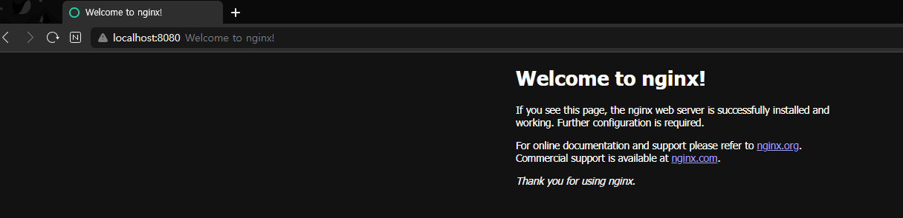


## 대체할 파일 복사

- index.html 생성해서 해당 경로에 복사
    ```
    docker cp index.html my_nginx:/usr/share/nginx/html

    Successfully copied 2.05kB to my_nginx:/usr/share/nginx/html
    ```

- 변경한 파일이 로드된다.

    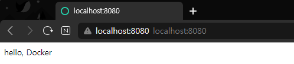