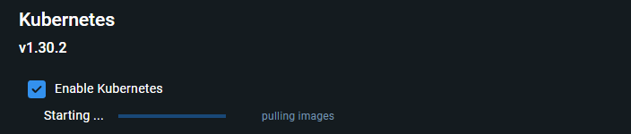

# 쿠버네티스

## 마이크로서비스 아키텍처 (MSA)

- 정의: 시스템을 독립적인 서비스로 나누어 개발하는 아키텍처 스타일.
    - 특징:
    - 각 서비스는 특정 기능만 수행하고 독립적으로 배포 가능.
    - 전통적인 모놀리식 아키텍처와 달리 서비스 간 의존도를 낮춤.
    - 서비스 간 통신은 보통 API를 통해 이루어짐.
- 장점:
    - 확장성: 개별 서비스 단위로 확장 가능.
    - 유연성: 특정 서비스만 업데이트/변경 가능.
    - 효율성: 팀별로 분리된 서비스 개발이 가능.


<br>
<br>


## 컨테이너 인프라와 MSA의 관계
- 컨테이너 모델 특징:
    - 각 서비스는 독립된 컨테이너로 배포.
    - 컨테이너는 필요한 실행 환경을 포함해 동일한 상태에서 실행 가능.
- 적용 사례:
    - 사용자 인터페이스, 비즈니스 로직, 데이터베이스, 백업 서비스 등 역할별로 분리된 컨테이너 사용.

<br>
<br>


## 쿠버네티스(Kubernetes)
- 정의: 컨테이너 오케스트레이션 솔루션.
    - 컨테이너의 배포, 확장, 관리를 자동화.
- 특징:
    - 다수의 컨테이너를 클러스터로 관리.
    - 동적 확장 및 장애 복구 지원.
    - CI/CD 환경에서 유용.
- 구성 요소:
    - 마스터 노드(Control Plane): API 서버, 스케줄러, 컨트롤러 매니저 등.
    - 워커 노드(Worker Node): 컨테이너 실행 및 관리(CRI, kubelet 등).


<br>
<br>


## Pod와 컨테이너


- Pod:
    - Kubernetes에서 가장 작은 배포 단위.
    - 하나 이상의 컨테이너를 포함.
- 컨테이너:
    - 실제 실행 단위로, Pod 안에서 동작.
- 연관성:
    - Pod는 컨테이너 간 네트워크와 스토리지를 공유.

   
<br>
<br>

 


## Kubernetes가 제공하는 주요 기능
- 컨테이너 밸런싱:
    - Pod의 부하를 균등하게 분산.
- 트래픽 로드 밸런싱:
    - 다수의 Pod 간 트래픽을 균등하게 분배.
- 수평적 확장 (HPA):
    - 부하에 따라 Pod 수를 자동 조절.
- 오류 복구:
    - 장애 발생 시 새로운 Pod를 생성해 서비스 유지.
- 롤링 업데이트:
    - 점진적으로 업데이트 배포.
- 스토리지 오케스트레이션:
    - 다양한 스토리지 시스템을 동적으로 연결.
- 서비스 디스커버리:
    - 동적으로 생성되는 Pod를 DNS 기반으로 관리.

<br>
<br>


## Kubernetes의 생명 주기
1. 생성 요청: kubectl을 통해 API 서버에 Pod 생성 요청.
1. 상태 기록: API 서버가 etcd에 상태 저장.
1. 스케줄링: Pod를 실행할 워커 노드를 결정.
1. 실행: 워커 노드의 kubelet이 컨테이너를 실행.

<br>
<br>


## Kubernetes 오브젝트
- Pod: 컨테이너의 집합으로 단일 작업 수행.
- Namespace: 리소스 그룹 관리.
- Volume: Pod에서 사용할 디렉토리 제공.
- Service: Pod의 네트워크 접근을 추상화.

<br>
<br>


## Kubernetes 클러스터 인프라 구성
- 로컬 환경:
    - 개발 단계에서 사용, kubeadm이나 Docker Desktop 설치.
- Public Cloud:
    - AWS EKS, GCP GKE, Microsoft AKS.
- On-Prem 설치:
    - SUSE Rancher, RedHat OpenShift.


<br>
<br>


# 도커 데스크톱을 이용한 로컬 환경 클러스터 구성

- Enable Kubernetes 체크하기

    

    - 설치

        


<br>
<br>


## kubectl 명령어 설치

-  버전 확인

    ```
    kubectl version --client

    Client Version: v1.30.2
    Kustomize Version: v5.0.4-0.20230601165947-6ce0bf390ce3
    ```
- `kunectl get nodes` 명렁어 입력

    ```
    kubectl get nodes

    NAME             STATUS   ROLES           AGE     VERSION
    docker-desktop   Ready    control-plane   5m44s   v1.30.2
    ```

    필드 설명:
    - NAME: 노드 이름 (예: docker-desktop).
    - STATUS: 클러스터의 상태 (예: Ready는 정상 상태).
    - ROLES: 노드 역할 (예: control-plane은 관리 노드).
    - AGE: 노드가 생성된 시간.
    - VERSION: 쿠버네티스 버전.

<br>
<br>


## 문제가 발생할 경우
- (1) kubectl 명령어를 인식하지 못할 때
    - kubectl이 설치되지 않았거나 PATH 환경 변수에 추가되지 않았을 수 있습니다.
        - 다시 설치하거나 경로를 확인

            `where kubectl`
            
            ```
            where kubectl

            C:\Program Files\Docker\Docker\resources\bin\kubectl.exe
            ```

- (2) Kubernetes 클러스터가 동작하지 않을 때
    - Docker Desktop의 Kubernetes 설정이 활성화되어 있는지 확인.
        - Docker Desktop 상태를 확인하고, 필요시 재시작

        - `Restart Docker Desktop`


---

<br>
<br>
<br>
<br>

# 쿠버네티스 기본 사용법

<br>
<br>


## 노드(Nod), 포드(Pod) 정보  조회

- 노드(Nod) 정보

    ```
    kubectl get nodes

    NAME             STATUS   ROLES           AGE     VERSION
    docker-desktop   Ready    control-plane   5m44s   v1.30.2
    ```

- 포드(Pod) 정보

    ```
    kubectl get pods

    No resources found in default namespace.
    ```

    ```
    kubectl get pods --all-namespaces

    NAMESPACE     NAME                                     READY   STATUS    RESTARTS   AGE
    kube-system   coredns-7db6d8ff4d-6d6q2                 1/1     Running   0          14m
    kube-system   coredns-7db6d8ff4d-7chhp                 1/1     Running   0          14m
    kube-system   etcd-docker-desktop                      1/1     Running   0          14m
    kube-system   kube-apiserver-docker-desktop            1/1     Running   0          15m
    kube-system   kube-controller-manager-docker-desktop   1/1     Running   0          14m
    kube-system   kube-proxy-grf8d                         1/1     Running   0          14m
    kube-system   kube-scheduler-docker-desktop            1/1     Running   0          15m
    kube-system   storage-provisioner                      1/1     Running   0          14m
    kube-system   vpnkit-controller                        1/1     Running   0          14m
    ```

<br>
<br>


## 컨테이너 이미지를 이용한 포드 생성

- 포드 생성

    ```
    kubectl run nginx-pod --image=nginx
    
    pod/nginx-pod created
    ```

- 생성된 포드 조회

    ```
    kubectl get pods

    NAME        READY   STATUS    RESTARTS   AGE
    nginx-pod   1/1     Running   0          42s
    ```

    - 상세 조회

        ```
        kubectl get pods -o wide

        NAME        READY   STATUS    RESTARTS   AGE     IP         NODE             NOMINATED NODE   READINESS GATES
        nginx-pod   1/1     Running   0          2m10s   10.1.0.6   docker-desktop   <none>           <none>
        ```


<br>
<br>


## 쿠버네티스 디플로이먼트 (Kubernetes Deployment)

<br>
<br>


### Deployment란?

- Kubernetes의 오브젝트 형태 중 하나로, 애플리케이션 배포를 위해 가장 많이 사용됨.
- 애플리케이션의 배포, 업데이트, 롤백 등의 기능을 유연하게 관리.
- 레플리카셋 (ReplicaSet) 기반으로 동일한 모양의 다수의 Pod를 생성하고 관리.
- 일반적으로 상태가 없는(Stateless) 애플리케이션 배포에 적합.

<br>
<br>


### 주요 특징

- 유지보수 및 관리

    - 동적 업데이트: 애플리케이션 업데이트 시, 무중단 배포(Rolling Update)가 가능.
    - 롤백(Rollback): 문제가 발생하면 이전 버전으로 손쉽게 복구.
    - 버전 관리: 배포 버전을 명시적으로 관리하여 안정성 확보.

- 상태관리
 
    - 디플로이먼트는 선언적 방식으로 동작.
    - 사용자가 **의도된 상태(Desired State)**를 정의하면, Kubernetes가 자동으로 이를 유지.
- Pod 복제
 
    - 디플로이먼트는 ReplicaSet을 통해 Pod 복제본을 생성 및 관리.
    - 복제본의 개수는 사용자가 정의 가능하며, 수평 확장을 통해 부하를 분산.
- Stateless 애플리케이션
 
    - 주로 데이터 저장을 요구하지 않는 서비스에 적합.
    - 예: 웹 애플리케이션의 프론트엔드.

<br>
<br>


### 동작 방식

- 디플로이먼트 정의

    - Deployment 오브젝트는 YAML 또는 JSON 파일로 정의.
    - 사용자가 원하는 Pod의 수, 이미지, 업데이트 정책 등을 선언.

- ReplicaSet 관리

    - Deployment는 ReplicaSet을 생성하여 Pod의 복제본을 관리.
    - Kubernetes가 ReplicaSet의 상태를 지속적으로 모니터링하며, 설정된 수의 Pod를 유지.

- 의도된 상태 관리
 
    - 사용자가 선언한 상태(예: Pod 5개 실행)를 Kubernetes가 감지하고 조정.
    - Pod가 삭제되거나 장애가 발생하면, 자동으로 새로운 Pod를 생성하여 상태 복구.

<br>
<br>


## 디플로이먼트 생성 방법

- 생성 명령문
    ```
    kubectl create deployment dpy-nginx --image=nginx

    deployment.apps/dpy-nginx created
    ```


- 디플로이먼트 조회

    ```
    kubectl get deployment -o wide

    NAME        READY   UP-TO-DATE   AVAILABLE   AGE   CONTAINERS   IMAGES   SELECTOR
    dpy-nginx   1/1     1            1           44s   nginx        nginx    app=dpy-nginx
    ```

        - 필드 설명:
            - NAME
                - Deployment의 이름 (dpy-nginx).
            - READY
                - 배포된 Pod의 상태를 나타냅니다.
                - 1/1: 총 1개의 Pod가 배포되었으며, 정상적으로 준비 상태입니다.
            - UP-TO-DATE
                - 현재 업데이트된 Pod의 수입니다(Deployment에 의해 관리).
            - AVAILABLE
                - 클러스터에서 사용 가능한 상태의 Pod 수.
            - AGE
                - Deployment가 생성된 이후의 시간 (44s는 44초).
            - CONTAINERS
                - Deployment에서 실행 중인 컨테이너의 이름 (nginx).
            - IMAGES
                - Deployment에서 사용하는 Docker 이미지 이름 (nginx).
            - SELECTOR
                - Pod를 선택하는 데 사용하는 레이블. 여기서는 app=dpy-nginx가 Pod를 선택

- 디플로이먼트 상세 정보 조회

    ```
    kubectl describe deployment dpy-nginx
    Name:                   dpy-nginx
    Namespace:              default
    CreationTimestamp:      Fri, 29 Nov 2024 13:08:34 +0900
    Labels:                 app=dpy-nginx
    Annotations:            deployment.kubernetes.io/revision: 1
    Selector:               app=dpy-nginx
    Replicas:               1 desired | 1 updated | 1 total | 1 available | 0 unavailable
    StrategyType:           RollingUpdate
    MinReadySeconds:        0
    RollingUpdateStrategy:  25% max unavailable, 25% max surge
    Pod Template:
    Labels:  app=dpy-nginx
    Containers:
    nginx:
        Image:         nginx
        Port:          <none>
        Host Port:     <none>
        Environment:   <none>
        Mounts:        <none>
    Volumes:         <none>
    Node-Selectors:  <none>
    Tolerations:     <none>
    Conditions:
    Type           Status  Reason
    ----           ------  ------
    Available      True    MinimumReplicasAvailable
    Progressing    True    NewReplicaSetAvailable
    OldReplicaSets:  <none>
    NewReplicaSet:   dpy-nginx-76f8d594c6 (1/1 replicas created)
    Events:
    Type    Reason             Age    From                   Message
    ----    ------             ----   ----                   -------
    Normal  ScalingReplicaSet  2m40s  deployment-controller  Scaled up replica set dpy-nginx-76f8d594c6 to 1    
    ```


- 디플로이먼트를 동적으로 늘리는 명령어

    > Kubernetes Deployment에서 관리하는 Pod의 개수를 동적으로 3개로 설정하는 명령어

    ```
    kubectl scale deployment dpy-nginx --replicas=3
    
    deployment.apps/dpy-nginx scaled
    ```

    - dpy-nginx Deployment가 관리하는 Pod의 복제본(replica)을 3개로 확장
    - 3개의 Pod가 실행되므로, 하나의 Pod에 문제가 생기더라도 나머지 2개가 서비스를 계속 제공

        > 애플리케이션의 안정성과 가용성 증가

    - 트래픽 처리 능력 증가

        - Pod의 개수가 늘어나면 더 많은 요청(트래픽)을 처리
        - Kubernetes는 요청을 모든 Pod에 균등하게 분산(로드 밸런싱)하므로, 트래픽 증가에 유연하게 대응

- 늘어난 Pod 확인

    ```
    kubectl get pods -o wide

    NAME                         READY   STATUS    RESTARTS   AGE     IP         NODE             NOMINATED NODE   READINESS GATES
    dpy-nginx-76f8d594c6-7ksfg   1/1     Running   0          2m30s   10.1.0.8   docker-desktop   <none>           <none>
    dpy-nginx-76f8d594c6-jc628   1/1     Running   0          19m     10.1.0.7   docker-desktop   <none>           <none>
    dpy-nginx-76f8d594c6-p5bq4   1/1     Running   0          2m30s   10.1.0.9   docker-desktop   <none>           <none>
    nginx-pod                    1/1     Running   0          29m     10.1.0.6   docker-desktop   <none>           <none>
    ```

    - 각각의 클러스터 내부 IP가 다름
    - Pod마다 하나씩 IP가 부여

        - 디플로이 조회

            ```
            kubectl get deployment

            NAME        READY   UP-TO-DATE   AVAILABLE   AGE
            dpy-nginx   3/3     3            3           21m
            ```

            - 컨테이너 3개가 조회됨


<br>
<br>


## 클러스터 외부로 노출시키기

- Pod 조회

    ```
    kubectl get pods

    NAME                         READY   STATUS    RESTARTS   AGE
    dpy-nginx-76f8d594c6-7ksfg   1/1     Running   0          6m21s
    dpy-nginx-76f8d594c6-jc628   1/1     Running   0          23m
    dpy-nginx-76f8d594c6-p5bq4   1/1     Running   0          6m21s
    nginx-pod          
    ```


- `nginx-pod` Pod를 외부로 노출

    ```
    kubectl expose pod nginx-pod --type=NodePort --name=pod-svc --port=80

    service/pod-svc exposed
    ```

        명령어 구성 및 옵션
    - kubectl expose

        - Kubernetes 리소스를 외부에 노출하기 위한 명령어
        - 이 경우, Pod를 노출하여 외부에서 접근할 수 있도록 Service를 생성
 
    - pod nginx-pod

        - 노출 대상이 되는 리소스(Pod)의 이름
        - 여기서는 nginx-pod라는 Pod를 외부에 노출
    
    - --type=NodePort
        
        - Service의 유형을 지정
        - NodePort는 Kubernetes 클러스터 외부에서 노출된 특정 포트(NodePort)를 통해 - Pod에 접근할 수 있도록 설정
 
    - --name=pod-svc
        
        - 생성되는 Service의 이름을 지정
        - 여기서는 pod-svc라는 이름의 Service가 생성
 
    - --port=80
        
        - Service가 클라이언트 요청을 수신할 포트를 지정
        - 클라이언트는 Service의 80번 포트를 통해 Pod에 접근

- Kubernetes 클러스터에서 생성된 Service 목록을 확인하는 명령어

    ```
    kubectl get svc

    NAME         TYPE        CLUSTER-IP     EXTERNAL-IP   PORT(S)        AGE
    kubernetes   ClusterIP   10.96.0.1      <none>        443/TCP        79m
    pod-svc      NodePort    10.97.174.79   <none>        80:32515/TCP   7m2s
    ```

-   출력 필드 설명
    -   NAME
    
        -   Service의 이름
        -   예: kubernetes, pod-svc.
    -   TYPE
       
        -   Service의 유형
            -   ClusterIP: 클러스터 내부에서만 접근 가능한 IP를 제공(기본값).
            -   NodePort: 클러스터 외부에서도 접근 가능하도록 노드의 포트를 통해 노출.
            -   LoadBalancer: 클라우드 제공자가 제공하는 로드밸런서를 통해 외부에 노출.
            -   ExternalName: 외부 DNS 이름을 서비스 이름에 매핑.
    
    -   CLUSTER-IP
       
        -   클러스터 내부에서 Service에 접근할 수 있는 IP 주소
        -   Service는 이 IP를 통해 Pod와 통신

    -   EXTERNAL-IP
        -   클러스터 외부에서 Service에 접근할 수 있는 IP 주소
        -   NodePort와 LoadBalancer 타입에서 설정되며, <none>이면 외부 노출이 설정되지 않은 상태

    -   PORT(S)
        -   Service가 사용하는 포트
        -   형식: <서비스-포트>:<노드-포트>/<프로토콜>
        -   예: 80:32000/TCP
            -   80: Service가 사용하는 포트.
            -   32000: 외부에서 접근 가능한 NodePort.
            -   TCP: 사용 프로토콜.
    -   AGE
        -   Service가 생성된 이후의 시간


- 로컬 머신에서 포트 32515로 HTTP 요청을 보내고 응답을 확인하는 명령어

    - curl

        - HTTP 요청을 보내고 응답을 확인하는 도구
        - curl은 HTTP GET 요청을 기본으로 수행

    ```
    curl localhost:32515

    <!DOCTYPE html>
    <html>
        <head>
            <title>Welcome to nginx!</title>
            <style>
            html { color-scheme: light dark; }
            body { width: 35em; margin: 0 auto;
            font-family: Tahoma, Verdana, Arial, sans-serif; }
            </style>
        </head>
        <body>
            <h1>Welcome to nginx!</h1>
            <p>If you see this page, the nginx web server is successfully installed and
            working. Further configuration is required.</p>

            <p>For online documentation and support please refer to
            <a href="http://nginx.org/">nginx.org</a>.<br/>
            Commercial support is available at
            <a href="http://nginx.com/">nginx.com</a>.</p>

            <p><em>Thank you for using nginx.</em></p>
        </body>
    </html>
    ```

- 접속한 화면

    


<br>
<br>


## 오브젝트 삭제 방법

- svc 조회

    ```
    kubectl get svc

    NAME         TYPE        CLUSTER-IP     EXTERNAL-IP   PORT(S)        AGE
    kubernetes   ClusterIP   10.96.0.1      <none>        443/TCP        87m
    pod-svc      NodePort    10.97.174.79   <none>        80:32515/TCP   15m
    ```


- 서비스 삭제 

    ```
    kubectl delete service pod-svc
    
    service "pod-svc" deleted
    ```

- 삭제한 서비스 실행해서 확인

    ```
    curl localhost:32515

    curl: (7) Failed to connect to localhost port 32515 after 2254 ms: Could not connect to server
    ```

    - 서버에 연결할 수 없다는 메세지 출력

    


<br>
<br>


## 포드 삭제

- 디플로이먼트 생성에 의해 만들어진 포드 삭제

    - 포드 조회

        ```
        kubectl get pods

        NAME                         READY   STATUS    RESTARTS   AGE
        dpy-nginx-76f8d594c6-7ksfg   1/1     Running   0          26m
        dpy-nginx-76f8d594c6-jc628   1/1     Running   0          44m
        dpy-nginx-76f8d594c6-p5bq4   1/1     Running   0          26m
        nginx-pod                    1/1     Running   0          54m
        ```

    - 삭제 할 포드 

        - dpy-nginx-76f8d594c6-7ksfg   1/1     Running   0          26m

    - 삭제 명령어 실행

        ```
        kubectl delete pod dpy-nginx-76f8d594c6-7ksfg

        pod "dpy-nginx-76f8d594c6-7ksfg" deleted
        ```

    - 포드 조회

        ```
        kubectl get pods

        NAME                         READY   STATUS    RESTARTS   AGE
        dpy-nginx-76f8d594c6-jc628   1/1     Running   0          45m
        dpy-nginx-76f8d594c6-p5bq4   1/1     Running   0          27m
        dpy-nginx-76f8d594c6-qnwsz   1/1     Running   0          5s
        nginx-pod                    1/1     Running   0          55m
        ```

        - dpy-nginx-76f8d594c6-7ksfg 포드는 삭제됐지만
        - 새로운 포드가 그 자리에 생성

        > 디플로이먼트에 생성된 포드 상태를 유지하려 함

    - 디플로이먼츠 삭제

        - 디플로이먼츠 조회

            ```
            kubectl get deployments

            NAME        READY   UP-TO-DATE   AVAILABLE   AGE
            dpy-nginx   3/3     3            3           48m
            ```

    - 삭제

        ```
        kubectl delete deployment dpy-nginx
        
        deployment.apps "dpy-nginx" deleted
        ```

    - 삭제 됐는지 확인하기 위해 디플로이먼츠 조회

        ```
        kubectl get deployments

        No resources found in default namespace.
        ```

<br>
<br>


## 매니페스트 (Manifest)        

- 개념
    - Kubernetes의 오브젝트 명세를 파일로 기록한 것.
    - 주로 YAML 형식을 사용하여 작성됨.
    - YAML: Yet Another Markup Language 또는 YAML Ain’t Markup Language의 약자.
- 역할
    - 각 오브젝트에 대해 의도하는 상태(Desired State)를 정의.
    - 이를 오브젝트 스펙(Object Specification)이라고도 함.
    - 파일을 기반으로 Kubernetes에서 오브젝트를 생성, 수정 가능.


---

<br>
<br>
<br>
<br>

# 쿠버네티스를 이용한 서비스 운용


>간단한 테스트용 flask 웹 응용을 만들고 이것을 nginx 위에 쌓아 도커 이미지 만들기

>만들어진 이미지를 이용한 컨테이너를 실행하고 서비스로 노출하도록 매니페스트 작성

>이 응용을 (수동으로) k8s 클러스터에 배포하고 예외상황에 대한 k8s 의 대처 방식 관측

<br>
<br>


## 실습 도구로서의 웹 서버 만들기

- 예제로 (쿠버네티스 동작을 관찰하기 위해) 간단한 웹 응용을 제작

    - 기능: 웹 요청을 수신하여 이의 응답으로 다음의 두 가지 정보를 출력
        - hostname: 이것은 어떻게 설정될까? 노드의 정보인가?
        - IP 주소: 이것은 또 어떻게 설정될까? 포드에 동적으로 붙여지는 것인가?

- 구현 방법

- docker build 를 통해 (Dockerfile 작성) 예제 서버 이미지 작성
    - 웹 서버로는 nginx 를 이용 (base image 는 nginx:latest)
    - Flask 를 이용한 웹 응용 작성
    - 설정 및 구동 파일 등은 각각 작성해서 이미지에 추가
- 목적?
    - 클러스터에서 수신한 요청에 대하여 k8s 가 반응하는 방식을 간단히 (hostname 과 IP 로) 모니터링


<br>
<br>


## 서버 구성 준비

<br>
<br>


### requirements.txt 생성

- 이 파일은 Flask와 같은 Python 패키지 의존성을 정의

    ```
    echo Flask > requirements.txt
    ```

    

    - echo Flask는 파일에 Flask라는 텍스트를 작성.
    - `>`는 requirements.txt 파일에 내용을 작성하거나 새로 생성.


<br>
<br>


### site.conf 생성

- 이 파일은 Nginx 서버의 설정 파일로, Nginx가 Flask 애플리케이션을 프록시로 연결하도록 설정

    ```
    (
        More? echo server {
        More? echo     listen 80\;;
        More? echo     server_name localhost\;;
        More? echo     access_log /var/log/nginx/access.log main\;;
        More? echo     location / {
        More? echo         proxy_pass http://127.0.0.1:5000\;;
        More? echo     }
        More? echo }
        More? 
    )
    > site.conf
    ```

    

    - 설명:
        - (와 )로 여러 줄의 텍스트를 하나의 파일에 작성.
        - `>`는 site.conf 파일에 내용을 작성하거나 새로 생성.
        - 각 라인 끝에 \;는 Nginx 설정에서 세미콜론이 필수이므로 추가.

<br>
<br>


### start.sh 생성

- 이 파일은 Nginx 서비스를 시작하고 Flask 애플리케이션을 실행하는 스크립트

    ```
    (
    echo service nginx start
    echo /flaskapp/venv/bin/flask --app run --host 0.0.0.0
    ) > start.sh
    ```

    - 위와 같이 여러 줄을 작성하여 start.sh 파일을 생성.
    - Nginx를 시작하고 Flask 애플리케이션을 실행하는 명령어 포함.

<br>
<br>


### 파일 생성 확인

```
dir

2024-11-29 (금)  오후 05:26    <DIR>          .
2024-11-29 (금)  오후 05:22    <DIR>          ..
2024-11-29 (금)  오후 05:24                 8 requirements.txt
2024-11-29 (금)  오후 05:26               181 site.conf
```

<br>
<br>


### app.py 파일 생성

- CMD에서 Flask 애플리케이션 파일 app.py를 생성

    ```
    echo from flask import Flask > app.py
    echo. >> app.py
    echo app = Flask(__name__) >> app.py
    echo. >> app.py
    echo @app.route("/") >> app.py
    echo def hello(): >> app.py
    echo     return "Hello, World!" >> app.py
    ```

<br>
<br>


### start.sh 파일 생성

- CMD에서 start.sh 파일을 생성

    ```
    echo #!/bin/bash > start.sh
    echo service nginx start >> start.sh
    echo /flaskapp/venv/bin/flask --app app run --host=0.0.0.0 --port=5000 >> start.sh
    ```

<br>
<br>


### Dockfile 생성

```
echo FROM nginx:latest > Dockerfile
```


- Dockerfile

    ```
    FROM nginx:latest
    RUN apt update
    RUN apt install -y python3-full
    RUN apt install -y procps

    WORKDIR /flaskapp
    RUN python3 -m venv /flaskapp/venv
    COPY requirements.txt requirements.txt
    RUN /flaskapp/venv/bin/pip install -r requirements.txt

    COPY app.py app.py
    COPY site.conf /etc/nginx/sites-available/flaskapp.conf
    RUN ln -s /etc/nginx/sites-available/flaskapp.conf /etc/nginx/conf.d
    RUN mv /etc/nginx/conf.d/default.conf /etc/nginx/conf.d/default.conf.bak

    COPY start.sh start.sh
    RUN chmod 777 start.sh

    ENTRYPOINT ["/flaskapp/start.sh"]
    ```

<br>
<br>


### Docker 이미지 빌드

- Dockerfile이 저장된 디렉터리로 이동하여 Docker 이미지를 빌드

    ```
    docker build -t flask-nginx .

    => [internal] load build definition from Dockerfile 0.0s
    => => transferring dockerfile: 599B 0.0s
    => [internal] load metadata for docker.io/library/nginx:latest  0.0s
    => [internal] load .dockerignore  0.0s
    => => transferring context:  2B  0.0s
    => [internal] load build context  0.0s
    => => transferring context: 254B  0.0s
    => CACHED [ 1/14] FROM docker.io/library/nginx:latest 0s
    => [ 2/14] RUN apt update 2.8s
    => [ 3/14] RUN apt install -y python3-full  15.1s
    => [ 4/14] RUN apt install -y procps  1.9s
    => [ 5/14] WORKDIR /flaskapp  0.0s
    => [ 6/14] RUN python3 -m venv /flaskapp/venv  3s
    => [ 7/14] COPY requirements.txt requirements.txt  0.0s
    => [ 8/14] RUN /flaskapp/venv/bin/pip install -r requirements.txt  1.9s
    => [ 9/14] COPY app.py app.py  0.0s
    => [10/14] COPY site.conf /etc/nginx/sites-available/flaskapp.conf  0.0s
    => [11/14] RUN ln -s /etc/nginx/sites-available/flaskapp.conf /etc/nginx/conf.d  0.4s
    => [12/14] RUN mv /etc/nginx/conf.d/default.conf /etc/nginx/conf.d/default.conf.bak  0.7s
    => [13/14] COPY start.sh start.sh  0.0s
    => [14/14] RUN chmod 777 start.sh 0.8s
    => exporting to image 1.4s
    => => exporting layers 1.4s
    => => writing image sha256:8affbda88f47c0186cad16dd757a2872c90d18461fbea14dd8bce7d0da76e150 0.0s
    => => naming to docker.io/library/flask-nginx
    ```


    - 빌드한 이미지 확인

        ```
        docker images
        REPOSITORY     TAG     IMAGE ID       CREATED          SIZE
        flask-nginx   latest  8affbda88f47   10 minutes ago   400MB
        hostname      latest  8affbda88f47   10 minutes ago   400MB
        ```

<br>
<br>


## 이미지 태그

```
docker tag hostname:latest vedivero/hostname:latest
```

<br>
<br>


## 리포지토리에 푸시

```
docker push vedivero/hostname:latest
The push refers to repository [docker.io/vedivero/hostname]
3c725b70fa18: Pushed
2f9c430d93f2: Pushed
595929f9c568: Pushed
14acfa49c1d1: Pushed
8a52de9ef73b: Pushed
8f829467b210: Pushed
719e6cf444dd: Pushed
681dbbc10225: Pushed
a706e0bb1073: Pushed
9063e30bb70f: Pushed
59f8c51c98ba: Pushed                                                                                                                                                                                             e18f354706d5: Pushed
f74c01256b76: Pushed
16d387d1e121: Mounted from library/nginx
d77616dbf44e: Mounted from library/nginx
1013a9d59e8c: Mounted from library/nginx
3f49e906ca03: Mounted from library/nginx
fb34e34b4693: Mounted from library/nginx
93a30ca6feb4: Mounted from library/nginx
c3548211b826: Mounted from vedivero/my_httpd
latest: digest: sha256:4573b3a3418c1144d4ad99d3ba342ea6b6770425cdce104c79df1c00eea2ee99 size: 4490
```

- 푸시된 이미지

    


푸시가 성공하면

리포지토리에서 이미지지를 풀(pull)하여

컨테이너 생성에 이용할 수 있게 됨


<br>
<br>


## 매니페스트 작성


- deployment.yaml

    ```
    echo apiVersion: apps/v1 > deployment.yaml
    echo kind: Deployment >> deployment.yaml
    echo metadata: >> deployment.yaml
    echo  name: dpy-hname" >> deployment.yaml
    echo  labels:" >> deployment.yaml
    echo    app: hostname" >> deployment.yaml
    echo spec: >> deployment.yaml
    echo  replicas: 3" >> deployment.yaml
    echo  selector:" >> deployment.yaml
    echo    matchLabels:" >> deployment.yaml
    echo      app: hostname" >> deployment.yaml
    echo  template:" >> deployment.yaml
    echo    metadata:" >> deployment.yaml
    echo      labels:" >> deployment.yaml
    echo        app: hostname" >> deployment.yaml
    echo    spec:" >> deployment.yaml
    echo      containers:" >> deployment.yaml
    echo      - name: hname" >> deployment.yaml
    echo        image: vedivero/hostname:latest" >> deployment.yaml
    echo        ports:" >> deployment.yaml
    echo        - containerPort: 80" >> deployment.yaml
    ```


- service.yaml

    ```
    echo apiVersion: v1 > service.yaml
    echo kind: Service >> service.yaml
    echo metadata: >> service.yaml
    echo "  name: svc-hname" >> service.yaml
    echo spec: >> service.yaml
    echo "  type: NodePort" >> service.yaml
    echo "  selector:" >> service.yaml
    echo "    app: hostname" >> service.yaml
    echo "  ports:" >> service.yaml
    echo "  - name: http" >> service.yaml
    echo "    protocol: TCP" >> service.yaml
    echo "    port: 80" >> service.yaml
    echo "    targetPort: 80" >> service.yaml
    echo "    nodePort: 30000" >> service.yaml
    ```


<br>
<br>


##  Kubernetes 클러스터에 정의된 리소스를 생성

```
kubectl apply -f deployment.yaml

deployment.apps/dpy-hname created
```

- 디플로이먼트 조회

    ```
    kubectl get deployments

    NAME        READY   UP-TO-DATE   AVAILABLE   AGE
    dpy-hname   3/3     3            3           2m37s
    ```

    - Deployment 리소스가 생성
    - Deployment는 Pod의 생성과 관리를 담당하는 Kubernetes 리소스
    - dpy-hname Deployment에서 정의한 설정에 따라 생성된 것

        ```
        kubectl get pods
        
        NAME                         READY   STATUS    RESTARTS   AGE
        dpy-hname-7ccff44bdc-btln4   1/1     Running   0          4m49s
        dpy-hname-7ccff44bdc-r99rs   1/1     Running   0          4m49s
        dpy-hname-7ccff44bdc-skk5k   1/1     Running   0          4m49s
        ```

        ```
        kubectl get pods -o wide

        NAME                         READY   STATUS    RESTARTS   AGE     IP          
        dpy-hname-7ccff44bdc-btln4   1/1     Running   0          8m34s   10.1.0.12   dpy-hname-7ccff44bdc-r99rs   1/1     Running   0          8m34s   10.1.0.13   
        dpy-hname-7ccff44bdc-skk5k   1/1     Running   0          8m34s   10.1.0.11   
        ```

<br>
<br>


## 생성한 디플로이먼츠를 노출시키기 위해 노드 포트로 된 서비스를 생성

```
kubectl apply -f service.yaml

service/svc-hname created
```

- 확인 
    ```
    kubectl get svc

    NAME         TYPE        CLUSTER-IP      EXTERNAL-IP   PORT(S)        AGE
    svc-hname    NodePort    10.104.119.22   <none>        80:30000/TCP   12s
    ```

- Kubernetes 클러스터 내에서 서비스와 파드가 정상적으로 작동하고 있음

    ```
    curl localhost:30000

    <p>Hostname: dpy-hname-7ccff44bdc-skk5k</p><p>IPv4 Address: 10.1.0.17</p>
    ```

        <p>Hostname: dpy-hname-7ccff44bdc-skk5k</p>

    - Hostname은 실행 중인 Pod의 이름
        - Pod 이름 dpy-hname-7ccff44bdc-skk5k는 Kubernetes가 자동 생성한 파드 이름
        - dpy-hname은 디플로이먼트 이름과 연결
    
    - <p>IPv4 Address: 10.1.0.17</p>

        - IPv4 Address는 해당 파드의 클러스터 내부 IP 주소입니다.
        - 클러스터 네트워크에서 다른 파드가 이 IP를 통해 통신할 수 있습니다.
    
    - curl localhost:30000

        - 이 명령어는 로컬 호스트의 포트 30000에 요청을 보낸 것입니다.
        - NodePort 서비스가 localhost:30000을 Kubernetes 클러스터의 파드에 매핑하고 있음을 보여줍니다.


- 부하 균등화

    ```
    curl localhost:30000
    <p>Hostname: dpy-hname-7ccff44bdc-r99rs</p><p>IPv4 Address: 10.1.0.19</p>

    curl localhost:30000
    <p>Hostname: dpy-hname-7ccff44bdc-skk5k</p><p>IPv4 Address: 10.1.0.17</p>

    curl localhost:30000
    <p>Hostname: dpy-hname-7ccff44bdc-btln4</p><p>IPv4 Address: 10.1.0.16</p>
    ```

    - 반복 실행 시 아이피 변경되는 현상
        - 동일한 기능을 하는 똑같은 모습의 Pod들을 레플리카 셋이라고 한다
        - Kubernetes 서비스가 로드 밸런싱을 수행하기 때문ㄹ

            ```
            kubectl get pods

            NAME                         READY   STATUS    RESTARTS      AGE
            dpy-hname-7ccff44bdc-btln4   1/1     Running   1 (10m ago)   8h
            dpy-hname-7ccff44bdc-r99rs   1/1     Running   1 (10m ago)   8h
            dpy-hname-7ccff44bdc-skk5k   1/1     Running   1 (10m ago)   8h
            ```


<br>
<br>


# 주기적인 요청을 반복하는 테스트

- 반복된 요청의 클러스터 내의 예외상황이 발생하는 경우 쿠버네티스가 어떻게 동작하는지 관찰

    - 1. 디플로이먼트의 레플리카셋에 포함된 포드가 사멸하는 경우

    - 2. 특정 포드에서 실행하는 컨테이너에 오류가 발생하는 경우


<br>
<br>


## 요청을 반복하는 스크립트 생성

```
echo $i = 0
while ($true) {
    $response = Invoke-RestMethod "http://localhost:30000"
    $i++
    Write-Host -NoNewline "$i "
    Write-Host ($response -replace '\n', " ")
    Start-Sleep -Seconds 1
}
```

<br>
<br>


## deployments.yaml 파일 수정

- replicas를 1로 수정

    ```
    apiVersion: apps/v1
    kind: Deployment
    metadata:
    name: dpy-hname
    labels:
        app: hostname
    spec:
    replicas: 1
    selector:
        matchLabels:
        app: hostname
    template:
        metadata:
        labels:
            app: hostname
        spec:
        containers:
        - name: hname
            image: vedivero/hostname:latest
            ports:
            - containerPort: 80
    ```

<br>
<br>


## Kubernetes 클러스터에 설정 파일(deployment.yaml)을 적용

```
kubectl apply -f deployment.yaml

deployment.apps/dpy-hname configured
```

<br>
<br>


## 테스트 포드가 사멸하는 경우

- 포드 조회

    ```
    kubectl get pods

    NAME                         READY   STATUS        RESTARTS      AGE
    dpy-hname-784984b456-7n6b2   0/1     Error         1 (5s ago)    9s
    dpy-hname-7ccff44bdc-btln4   1/1     Running       1 (17m ago)   8h <<<
    dpy-hname-7ccff44bdc-r99rs   1/1     Terminating   1 (17m ago)   8h
    dpy-hname-7ccff44bdc-skk5k   1/1     Terminating   1 (17m ago)   8h
    ```
    - 하나의 pod만 작동 중


- 요청을 반복하는 스크립트 파일 실행

    ```
    ./check.ps1

    1 <p>Hostname: dpy-hname-7ccff44bdc-btln4</p><p>IPv4 Address: 10.1.0.16</p>
    2 <p>Hostname: dpy-hname-7ccff44bdc-btln4</p><p>IPv4 Address: 10.1.0.16</p>
    3 <p>Hostname: dpy-hname-7ccff44bdc-btln4</p><p>IPv4 Address: 10.1.0.16</p>
    4 <p>Hostname: dpy-hname-7ccff44bdc-btln4</p><p>IPv4 Address: 10.1.0.16</p>
    5 <p>Hostname: dpy-hname-7ccff44bdc-btln4</p><p>IPv4 Address: 10.1.0.16</p>
    6 <p>Hostname: dpy-hname-7ccff44bdc-btln4</p><p>IPv4 Address: 10.1.0.16</p>
    7 <p>Hostname: dpy-hname-7ccff44bdc-btln4</p><p>IPv4 Address: 10.1.0.16</p>
    ```

    - 하나의 pod로 가동되고 있음을 확인

- IP를 체크해 해당 Pod가 맞는지 확인

    ```
    kubectl get pods -o wide

    NAME                         READY   STATUS             RESTARTS       AGE   IP       
    dpy-hname-784984b456-7n6b2   0/1     CrashLoopBackOff   7 (3m4s ago)   14m   10.1.0.22 <<<
    dpy-hname-7ccff44bdc-btln4   1/1     Running            1 (31m ago)    8h    10.1.0.16
    ```

<br>
<br>


## 가동 중인 상태에서 Pod 삭제

- 삭제 명령어
    ```
    kubectl delete pod dpy-hname-7ccff44bdc-btln4

    pod "dpy-hname-7ccff44bdc-btln4" deleted
    ```

- Pod 상세 조회

    ```
    kubectl get pods -o wide

    NAME                         READY   STATUS             RESTARTS       AGE   IP       
    dpy-hname-784984b456-7n6b2   0/1     CrashLoopBackOff   7 (5m1s ago)   16m   10.1.0.22
    dpy-hname-7ccff44bdc-7t4rc   1/1     Running            0              16s   10.1.0.23
    dpy-hname-7ccff44bdc-btln4   1/1     Terminating        1 (33m ago)    8h    10.1.0.16 <<<

    ```

    - 기존에 동작하던 Pod(dpy-hname-7ccff44bdc-btln4)는 삭제 중 (Terminating)
    - 새로운 Pod(dpy-hname-7ccff44bdc-7t4rc가 Running 상태로 응답을 받는다


- 하나의 Pod가 실행되고 있음을 확인

    ```
    kubectl get deployment dpy-hname

    NAME        READY   UP-TO-DATE   AVAILABLE   AGE
    dpy-hname   1/1     1            1           9h
    ```

<br>
<br>


## 확인한 점

디플로이먼트의 상태 유지

- 디플로이먼트에 의하여 포드들이 배포된 상태에서 이 중 하나 이상의 포드가 (어떤 이유로든) 사멸하면
k8s 는 새로운 포드를 생성하고 같은 종류 (이미지가 동일한) 의 컨테이너를 실행함

- 포드가 사멸하면 k8s 는 새로운 포드를 생성함으로써 디플로이먼트에 선언된 "의도된 상태" 를 유지하려고 함

- 클러스터 외부에는 별도의 서비스에 의하여 노출되므로 개별 포드의 클러스터 내 (동적 할당되는) IP 주소 등에
대해서는 사용자가 관리할 필요 없음

- 단, 포드는 언제든지 죽을 수 있는 오브젝트이므로 컨테이너에 기반한 응용을 개발함에 있어 상태를 띠지 않는
(stateless) 방식으로 만들어야 함


<br>
<br>


## 컨테이너 오류 발생 상황 가정

- 반복 요청하는 스크립트 파일 실행

    ```
    ./check.ps1

    1 <p>Hostname: dpy-hname-7ccff44bdc-7t4rc</p><p>IPv4 Address: 10.1.0.23</p>
    2 <p>Hostname: dpy-hname-7ccff44bdc-7t4rc</p><p>IPv4 Address: 10.1.0.23</p>
    3 <p>Hostname: dpy-hname-7ccff44bdc-7t4rc</p><p>IPv4 Address: 10.1.0.23</p>
    4 <p>Hostname: dpy-hname-7ccff44bdc-7t4rc</p><p>IPv4 Address: 10.1.0.23</p>
    5 <p>Hostname: dpy-hname-7ccff44bdc-7t4rc</p><p>IPv4 Address: 10.1.0.23</p>
    6 <p>Hostname: dpy-hname-7ccff44bdc-7t4rc</p><p>IPv4 Address: 10.1.0.23</p>
    7 <p>Hostname: dpy-hname-7ccff44bdc-7t4rc</p><p>IPv4 Address: 10.1.0.23</p>
    8 <p>Hostname: dpy-hname-7ccff44bdc-7t4rc</p><p>IPv4 Address: 10.1.0.23</p>
    ```

- 컨테이너 쉘에 접속

    ```
    kubectl exec -it dpy-hname-7ccff44bdc-7t4rc -- /bin/bash
    
    root@dpy-hname-7ccff44bdc-7t4rc:/flaskapp#
    ```

- 접속한 컨테이너 내 파일 조회

    ```
    root@dpy-hname-7ccff44bdc-7t4rc:/flaskapp# ls
    
    __pycache__  app.py  requirements.txt  start.sh  venv
    ```


- `flask` 포함한 프로세스를 검색하는 명령어

    ```
    ps ax | grep flask

    1 ?        Ssl    0:00 /usr/bin/qemu-aarch64 /bin/sh /bin/sh -c "/flaskapp/start.sh"
    8 ?        Sl     0:00 /usr/bin/qemu-aarch64 /bin/sh /bin/sh /flaskapp/start.sh
    61 ?        Sl     0:04 /usr/bin/qemu-aarch64 /flaskapp/venv/bin/python3 /flaskapp/venv/bin/python3 /flaskapp/venv/bin/flask --app app run --host 0.0.0.0 
    547 pts/0    Sl+    0:00 /usr/bin/qemu-aarch64 /usr/bin/grep grep flask
    ```
        - 해당 스크립트 파일이 실행 중인 프로세스의 PID는 61번

- 프로세스 Kill

    ```
    kill -9 61
    ```

    ```
    359 <p>Hostname: dpy-hname-7ccff44bdc-7t4rc</p><p>IPv4 Address: 10.1.0.23</p>
    Invoke-RestMethod :
    502 Bad Gateway
    502 Bad Gateway
    nginx/1.25.3
    위치 C:\Users\vediv\kubernetes\check.ps1:3 문자:17
    +     $response = Invoke-RestMethod "http://localhost:30000"
    +                 ~~~~~~~~~~~~~~~~~~~~~~~~~~~~~~~~~~~~~~~~~~
        + CategoryInfo          : InvalidOperation: (System.Net.HttpWebRequest:HttpWebRequest) [Invoke-RestMethod], WebExc
    eption
        + FullyQualifiedErrorId : WebCmdletWebResponseException,Microsoft.PowerShell.Commands.InvokeRestMethodCommand

    360 <p>Hostname: dpy-hname-7ccff44bdc-7t4rc</p><p>IPv4 Address: 10.1.0.23</p>
    Invoke-RestMethod :
    502 Bad Gateway
    502 Bad Gateway
    nginx/1.25.3
    위치 C:\Users\vediv\kubernetes\check.ps1:3 문자:17
    +     $response = Invoke-RestMethod "http://localhost:30000"
    +                 ~~~~~~~~~~~~~~~~~~~~~~~~~~~~~~~~~~~~~~~~~~
        + CategoryInfo          : InvalidOperation: (System.Net.HttpWebRequest:HttpWebRequest) [Invoke-RestMethod], WebExc
    eption
        + FullyQualifiedErrorId : WebCmdletWebResponseException,Microsoft.PowerShell.Commands.InvokeRestMethodCommand

    361 <p>Hostname: dpy-hname-7ccff44bdc-7t4rc</p><p>IPv4 Address: 10.1.0.23</p>
    362 <p>Hostname: dpy-hname-7ccff44bdc-7t4rc</p><p>IPv4 Address: 10.1.0.23</p>
    363 <p>Hostname: dpy-hname-7ccff44bdc-7t4rc</p><p>IPv4 Address: 10.1.0.23</p>
    364 <p>Hostname: dpy-hname-7ccff44bdc-7t4rc</p><p>IPv4 Address: 10.1.0.23</p>
    ```
    - 잠시 응답을 못하고 있다가 다시 응답


<br>
<br>

## 해당 Pod에 Restart 발생

- 문제가 발생하여 쿠버네티스가 다시 컨테이너를 생성하여 응용을 지속 실행
    
    ```
    kubectl get pods

    NAME                         READY   STATUS             RESTARTS         AGE
    dpy-hname-7ccff44bdc-7t4rc   1/1     Running            1 (105s ago)     15m
    ```