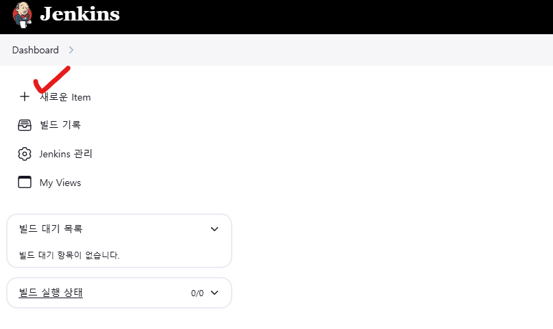

# 젠킨스

## 젠킨스(Jenkins) 개념

- 오픈 소스 자동화 서버: 자바(Java)로 작성된 지속적 인도(CD) 및 통합(CI) 프로세스를 지원하는 도구.
- 기원: 초기에는 Hudson으로 불리다가 Oracle이 인수 후 Jenkins로 변경.
- 특징: MIT 라이선스 기반의 확장성과 유연성이 높은 오픈 소스.

## CI/CD 시나리오

- CI(Continuous Integration):
    - 개발자가 코드 변경을 GitHub 등의 리포지토리에 푸시하면 Jenkins가 자동으로 빌드와 테스트를 수행.
- CD(Continuous Delivery/Deployment):
    - 컨테이너화된 소프트웨어를 배포하고 운영 환경에 적합하게 조정.

## CI 파이프라인

- 구성요소:
    - GitHub(소스 코드 저장소)
    - Jenkins(자동 빌드 및 테스트 서버)
    - Jenkins Slave(작업 분산 처리)
- 코드 푸시 → Jenkins 빌드/테스트 → 어플리케이션 배포.

## Jenkins의 특징

- 다양한 프로그래밍 언어 지원.
- 플러그인으로 기능 확장 가능.
- 컨테이너 및 클러스터 환경에서도 부드럽게 동작.
- 마스터/슬레이브(Agent) 구조를 통한 분산 처리.

## Jenkins 아키텍처

- 마스터 역할:
    - 작업 스케줄링, HTTP 요청 처리, 빌드 시작 트리거 등.
- 에이전트(Slave):
    - 마스터에서 지정한 작업을 실행하는 역할.

## 수평적 확장

- 개발 팀이 확장됨에 따라 Jenkins 인스턴스를 추가하여 작업 부하 분산 가능.
- 팀별로 독립적인 설정 가능.

## 테스트와 프로덕션 인스턴스

- Jenkins는 항상 테스트 및 프로덕션 용도로 분리하여 운영.
- 시스템 변경 전 철저한 검증 후 프로덕션에 적용


---

<br>
<br>
<br>
<br>

# 쿠버네티스 클러스터에 젠킨스 설치

## 1. Kubernetes 클러스터에 소프트웨어 설치
- Kubernetes 클러스터 환경에서는 많은 오브젝트와 리소스를 효율적으로 관리해야 함.
- 복잡한 작업을 간소화하기 위해 Helm과 같은 도구를 사용.
- Jenkins와 같은 소프트웨어를 Kubernetes 환경에서 배포하는 데 유용.

## 2. Helm

- 정의: Kubernetes를 위한 패키지 매니저로, 소프트웨어 배포 및 관리를 돕는 도구.

    - 주요 역할

        - 이미 정의된 차트(chart)를 통해 패키지를 검색, 설치, 관리.
        - 소프트웨어와 종속 관계를 쉽게 처리하며 설치/삭제 효율화.
        - 보안 관리 지원: 패키지 무결성 확인 및 디지털 인증서 활용.
        - 유사 도구: Linux의 apt, yum, rpm과 비슷한 방식으로 작동.


## Helm - Windows 설치

공식 사이트

헬름 : https://helm.sh/ko/docs/intro/quickstart/

## Windows 설치

### 1. Chocolatey를 이용한 설치

- PowerShell을 관리자 권한으로 실행하여 아래 명령어를 입력

    ```
    Set-ExecutionPolicy Bypass -Scope Process -Force; [System.Net.ServicePointManager]::SecurityProtocol = [System.Net.SecurityProtocolType]::Tls12; iex ((New-Object System.Net.WebClient).DownloadString('https://community.chocolatey.org/install.ps1'))
    ```

    

### 2. Helm 설치

#### Chocolatey로 Helm을 설치

```
choco install kubernetes-helm
```

- Install log

    ```
    chocolatey.nupkg file not installed in lib.
    Attempting to locate it from bootstrapper.
    PATH environment variable does not have C:\ProgramData\chocolatey\bin in it. Adding...
    경고: Not setting tab completion: Profile file does not exist at 'C:\Users\vediv\OneDrive\문서\WindowsPowerShell\Microsoft.PowerShell_profile.ps1'.
    Chocolatey CLI (choco.exe) is now ready.
    You can call choco from anywhere, command line or powershell by typing choco.
    Run choco /? for a list of functions.
    You may need to shut down and restart powershell and/or consoles
    first prior to using choco.
    Ensuring Chocolatey commands are on the path
    Ensuring chocolatey.nupkg is in the lib folder
    PS C:\Windows\system32> choco install kubernetes-helm
    Chocolatey v2.4.0
    Installing the following packages:
    kubernetes-helm
    By installing, you accept licenses for the packages.
    Downloading package from source 'https://community.chocolatey.org/api/v2/'
    Progress: Downloading kubernetes-helm 3.16.2... 100%

    kubernetes-helm v3.16.2 [Approved]
    kubernetes-helm package files install completed. Performing other installation steps.
    The package kubernetes-helm wants to run 'chocolateyInstall.ps1'.
    Note: If you don't run this script, the installation will fail.
    Note: To confirm automatically next time, use '-y' or consider:
    choco feature enable -n allowGlobalConfirmation
    Do you want to run the script?([Y]es/[A]ll - yes to all/[N]o/[P]rint): y

    Downloading kubernetes-helm 64 bit
    from 'https://get.helm.sh/helm-v3.16.2-windows-amd64.zip'
    Progress: 100% - Completed download of C:\Users\vediv\AppData\Local\Temp\chocolatey\kubernetes-helm\3.16.2\helm-v3.16.2-windows-amd64.zip (16.94 MB).
    Download of helm-v3.16.2-windows-amd64.zip (16.94 MB) completed.
    Hashes match.
    Extracting C:\Users\vediv\AppData\Local\Temp\chocolatey\kubernetes-helm\3.16.2\helm-v3.16.2-windows-amd64.zip to C:\ProgramData\chocolatey\lib\kubernetes-helm\tools...
    C:\ProgramData\chocolatey\lib\kubernetes-helm\tools
    ShimGen has successfully created a shim for helm.exe
    The install of kubernetes-helm was successful.
    Deployed to 'C:\ProgramData\chocolatey\lib\kubernetes-helm\tools'

    Chocolatey installed 1/1 packages.
    See the log for details (C:\ProgramData\chocolatey\logs\chocolatey.log).
    ```


#### 헬름 설치 확인

```
helm version

version.BuildInfo{Version:"v3.16.2", GitCommit:"13654a52f7c70a143b1dd51416d633e1071faffb", GitTreeState:"clean", GoVersion:"go1.22.7"}
```


#### 헬름 리포지토리 추가

```
helm repo add jenkinsci https://charts.jenkins.io

"jenkinsci" has been added to your repositories
```

#### 헬름 리포지토리 업데이트

```
helm repo update

Hang tight while we grab the latest from your chart repositories...
...Successfully got an update from the "jenkinsci" chart repository
Update Complete. ⎈Happy Helming!⎈
```


#### 리포지토리 확인

```
helm repo list

NAME            URL
jenkinsci       https://charts.jenkins.io
```


#### Jenkins 설치

```
helm install my-jenkins jenkinsci/jenkins

NAME: my-jenkins
LAST DEPLOYED: Mon Dec  2 13:54:10 2024
NAMESPACE: default
STATUS: deployed
REVISION: 1
NOTES:
1. Get your 'admin' user password by running:
kubectl exec --namespace default -it svc/my-jenkins -c jenkins -- /bin/cat /run/secrets/additional/chart-admin-password && echo
2. Get the Jenkins URL to visit by running these commands in the same shell:
echo http://127.0.0.1:8080
kubectl --namespace default port-forward svc/my-jenkins 8080:8080

3. Login with the password from step 1 and the username: admin
4. Configure security realm and authorization strategy
5. Use Jenkins Configuration as Code by specifying configScripts in your values.yaml file, see documentation: http://127.0.0.1:8080/configuration-as-code and examples: https://github.com/jenkinsci/configuration-as-code-plugin/tree/master/demos

For more information on running Jenkins on Kubernetes, visit:
https://cloud.google.com/solutions/jenkins-on-container-engine

For more information about Jenkins Configuration as Code, visit:
https://jenkins.io/projects/jcasc/


NOTE: Consider using a custom image with pre-installed plugins
```


    - Docker에 설치된 Jenkins

        

#### PORT 설정

```
kubectl port-forward svc/my-jenkins 8080:8080

Forwarding from 127.0.0.1:8080 -> 8080
Forwarding from [::1]:8080 -> 8080
```

    - 접속 테스트

        


### 관리자 비밀번호 알아내기

#### 현재 네임스페이스에 존재하는 모든 Secret 리소스를 조회하는 명령어

```
kubectl get secrets

NAME                               TYPE                 DATA   AGE
my-jenkins                         Opaque               2      12m
sh.helm.release.v1.my-jenkins.v1   helm.sh/release.v1   1      12m
```

#### Kubernetes 클러스터에서 my-jenkins라는 이름의 Secret 리소스를 조회하는 명령어

```
kubectl get secret my-jenkins

NAME         TYPE     DATA   AGE
my-jenkins   Opaque   2      13m
```

####  Kubernetes 클러스터에서 my-jenkins라는 이름의 Secret 리소스를 YAML 형식으로 출력하는 명령어

```
kubectl get secret my-jenkins -o yaml

apiVersion: v1
data:
jenkins-admin-password: QWhBc3JjNlE2ejZlTUl4YTBORnJwRQ==
jenkins-admin-user: YWRtaW4=
kind: Secret
metadata:
annotations:
    meta.helm.sh/release-name: my-jenkins
    meta.helm.sh/release-namespace: default
creationTimestamp: "2024-12-02T04:54:11Z"
labels:
    app.kubernetes.io/component: jenkins-controller
    app.kubernetes.io/instance: my-jenkins
    app.kubernetes.io/managed-by: Helm
    app.kubernetes.io/name: jenkins
    helm.sh/chart: jenkins-5.7.17
name: my-jenkins
namespace: default
resourceVersion: "66370"
uid: 6feb3b8b-743f-4fef-993f-dc2f1657ac53
type: Opaque
```


#### PowerShell에서 Base64 디코딩

- 사용자 이름 디코딩
    
    ```
    [System.Text.Encoding]::UTF8.GetString([System.Convert]::FromBase64String("YWRtaW4="))

    admin
    ```

- 비밀번호 디코딩

    ```
    [System.Text.Encoding]::UTF8.GetString([System.Convert]::FromBase64String("QWhBc3JjNlE2ejZlTUl4YTBORnJwRQ=="))

    AhAsrc6Q6z6eMIxa0NFrpE
    ```


#### 계정 정보를 사용해서 로그인

    

    


#### Jenkins 비밀번호 변경

- 홈페이지 내 설정으로 변경할 수 있지만 포드가 새로 시작되면 비밀번호가 초기 비밀번호로 복구
- Jenkins의 로그인 정보를 Kubernetes Object가 Secret Type으로 관리하기 때문

- POWERSHELL에서 비밀번호 인코딩하기

    비밀번호로 사용할 "jenkins" 인코딩
    ```
     [Convert]::ToBase64String([System.Text.Encoding]::UTF8.GetBytes("jenkins"))
    
    amVua2lucw==
    ```

- 인코딩한 비밀번호를 적용

    


#### 변경한 비밀번호로 접속하기 위한 Jenkins Pod 삭제

- Pod 삭제

    ```
    kubectl delete pod my-jenkins-0

    pod "my-jenkins-0" deleted
    ```

- 재시작 중

    ```
    kubectl get pods

    NAME                         READY   STATUS     RESTARTS      AGE
    my-jenkins-0                 0/2     Init:1/2   0             16s
    ```

- 재시작 완료된 jenkins

    ```
    kubectl get pods

    NAME                         READY    STATUS     RESTARTS      AGE
    my-jenkins-0                 Running  Init:1/2   0             16s
    ```

---

### Jenkins 기초 설정


- 언어 설정
    - 사용자 인터페이스에 기본적으로 적용되는 언어 설정을 영어로 고정
        - 메뉴명 등이 달라서 겪을 수 있는 혼란을 피하려는 목적
    - 플러그인 "Locale" 을 설치
    - Manage Jenkins > System > Locale

- 시간대 설정
    - 자신이 살고 있는 지역의 시간대로 서버 시간대를 설정
        - 빌드 시작 및 종료 시각 등의 기록을 해석하는 데 혼란을 피하려는 목적
    - People > [계정 선택]> Configure > User Defined Time Zone


---

<br>
<br>
<br>
<br>

# 젠킨스 기본 사용법

## NewItem

- 새로운 item 선택

    

- Pipeline 선택

    

- Script 작성 후 Save

    

- 진행 중인 Build

    

- 빌드가 완료된 로그 확인

    


    - hello world 출력 성공

        ```
        Started by user Jenkins Admin
        [Pipeline] Start of Pipeline
        [Pipeline] node
        Agent default-6rcrt is provisioned from template default
        ---
        apiVersion: "v1"
        kind: "Pod"
        metadata:
        annotations:
            kubernetes.jenkins.io/last-refresh: "1733122708024"
        labels:
            jenkins/label-digest: "8fab65c8a9d5b0a4569008bc73fec246dea65062"
            jenkins/my-jenkins-jenkins-agent: "true"
            jenkins/label: "my-jenkins-jenkins-agent"
            kubernetes.jenkins.io/controller: "http___my-jenkins_default_svc_cluster_local_8080x"
        name: "default-6rcrt"
        namespace: "default"
        spec:
        containers:
        - args:
            - "********"
            - "default-6rcrt"
            env:
            - name: "JENKINS_SECRET"
            value: "********"
            - name: "JENKINS_TUNNEL"
            value: "my-jenkins-agent.default.svc.cluster.local:50000"
            - name: "JENKINS_AGENT_NAME"
            value: "default-6rcrt"
            - name: "REMOTING_OPTS"
            value: "-noReconnectAfter 1d"
            - name: "JENKINS_NAME"
            value: "default-6rcrt"
            - name: "JENKINS_AGENT_WORKDIR"
            value: "/home/jenkins/agent"
            - name: "JENKINS_URL"
            value: "http://my-jenkins.default.svc.cluster.local:8080/"
            image: "jenkins/inbound-agent:3273.v4cfe589b_fd83-1"
            imagePullPolicy: "IfNotPresent"
            name: "jnlp"
            resources:
            limits:
                memory: "512Mi"
                cpu: "512m"
            requests:
                memory: "512Mi"
                cpu: "512m"
            tty: false
            volumeMounts:
            - mountPath: "/home/jenkins/agent"
            name: "workspace-volume"
            readOnly: false
            workingDir: "/home/jenkins/agent"
        nodeSelector:
            kubernetes.io/os: "linux"
        restartPolicy: "Never"
        serviceAccountName: "default"
        volumes:
        - emptyDir:
            medium: ""
            name: "workspace-volume"

        Running on default-6rcrt in /home/jenkins/agent/workspace/hello world
        [Pipeline] {
        [Pipeline] stage
        [Pipeline] { (hello)
        [Pipeline] echo
        Hello, world!
        [Pipeline] }
        [Pipeline] // stage
        [Pipeline] }
        [Pipeline] // node
        [Pipeline] End of Pipeline
        Finished: SUCCESS
        ```


## 동적 에이전트 프로비저닝 테스트

1. (인위적으로) 빌드 과정이 오래 걸리는 파이프라인을 구성
1. 순차적으로 여러 차례의 빌드를 스케줄 ("Build Now" 버튼을 여러 번 눌러서)
1. Jenkins 의 동작과 k8s 클러스터의 상태를 관찰


### (인위적으로) 빌드 과정이 오래 걸리는 파이프라인을 구성

- 스크립트 수정

    - sleep 300 추가
        ```
            pipeline{
                agent any
                stages {
                    stage("hello") {
                        steps {
                            sleep 300
                            echo "Hello, world!"
                        }
                    }
                }
            }
        ```
- 빌드 5번 실행

    

    - jenkins Agent가 실행되고 있는 5개의 Pod

        ```
        kubectl get pod

        NAME                         READY   STATUS    RESTARTS      AGE
        default-03hg6                1/1     Running   0             58s
        default-cvnlv                1/1     Running   0             61s
        default-j8ctm                1/1     Running   0             56s
        default-lkb31                1/1     Running   0             46s
        default-lrrs4                1/1     Running   0             66s
        ```
        - sleep 300 옵션에 의해 5분 동안 대기할 것

---

<br>
<br>
<br>
<br>

## 파이프라인 테스트

### 간단한 파이프라인을 구성
- docker build && push
- kubectl 에 의하여 deployment 및 service 생성
- 위의 파이프라인 정의를 Jenkinsfile 로 만들고 이것을 리포지토리에 등록하여 빌드 과정 자동화

### 새로운 아이템

- 프로젝트 이름 정의

    

- 스크립트 작성

    


# Jenkins 파이프라인의 구성
- Jenkins 파이프라인 정의에는 두 가지 방식이 있음
    - 선언적인 (declarative) 방식: 우리가 지금까지 실습한 방법
        - 빌드 단계 (stage) 를 선언적으로 정의하는 방식
    - 스크립트 (scripted) 방식: 아직까지는 마주친 적 없지만 앞으로 만나보게 될 것
        - 빌드 단계 (stage) 를 절차적으로 기술하는 (스크립트를 실행하는) 방식
- 두 가지 방식으로 파이프라인 실습을 해 보았음
    - Jenkins UI 에서 선언적 스크립트를 입력하는 방식
    - GitHub repo 에 Jenkinsfile 로 파이프라인 스크립트를 저장하는 방식

---

<br>
<br>
<br>
<br>

# CI 파이프라인 기초

## CI 파이프라인 및 실습 정리

- CI 파이프라인
    - 파이프라인 정의: 새로운 애플리케이션을 Kubernetes(K8s)에 배포하는 일련의 과정.
    1. docker build → 애플리케이션 이미지 빌드.
    1. docker push → 이미지 저장소에 업로드.
    1. kubectl create → Kubernetes 클러스터에 생성.
    1. kubectl expose → 서비스 외부 노출.

- 자동화 도구: Jenkins를 사용해 빌드, 테스트, 배포 단계 자동화.
- Pipeline 구조:
    - Stage: 단계별 작업 구성.
    - Step: 개별 작업 세부 실행.

## 간단한 파이프라인 실습
- 예제:
    - 간단한 덧셈 API(Spring Boot 기반).
    - Query String으로 입력, 텍스트로 결과 출력.
- 실습 단계:
    - GitHub에 Private Repository 생성.
    - Gradle 빌드 설정(JDK 필요).
    - 컨테이너 이미지 제작 후 Jenkins Agent에 포함.

## GitHub Repository 설정
- Private Repository 생성.
    - .gitignore 템플릿: Gradle.
- Private 설정으로 인증 요구.
    - 읽기/쓰기 접근 권한 제어.
- 초기화: README 파일 포함.

## GitHub 접근용 SSH Key 생성
- 이유:
    - HTTPS 대신 SSH 프로토콜 이용 권장.
    - Username/Password 인증 대신 키페어 사용.
- 생성 방법:
    - ssh-keygen으로 Public/Private Key 생성.
    - Public Key를 GitHub에 등록.
- 주의:
    - Private Key 유출 금지.
    - Jenkins에 Key 등록 예정.


# GitHub 및 Jenkins를 활용한 CI/CD 환경 구성

## 1. 로컬 리포지토리 생성
- SSH 프로토콜로 GitHub 접근 테스트:
    ```
    ssh -T git@github.com
    ```
    성공 메시지 확인.

- GitHub 리포지토리 복제:
    ```
    git clone git@github.com:<username>/<repository>.git
    ```

## 2. Spring Boot 프로젝트 생성
- Spring Initializr 사용:
    - URL: https://start.spring.io
    - 설정:
        - Project: Gradle - Groovy
        - Language: Java
        - Spring Boot Version: 3.2.0
        - Java Version: 17
        - Dependency: Spring Web
    - 생성 후 다운로드 및 로컬에 배치.


## 3. Gradle 빌드 실행

- Gradle 빌드

    ```
    ./gradlew build
    ```
    빌드 성공 메시지 확인.

## 4. Jenkins 설정
- 필수 플러그인 설치:
    - Pipeline: Stage View Plugin.
- GitHub Credential 추가:
    - Jenkins 관리 > Credentials > Add > SSH Key 설정.
    - ID: github-credentials.

## 5. JDK 설치
- Jenkins Tools Configuration:
    - URL: Oracle JDK 17 다운로드 링크 추가.
    - 자동 설치 설정.

## 6. Jenkins Pipeline 구성
- 새 Pipeline 생성:
    - Item > Pipeline 선택.
    - Pipeline Script 입력 예시:

        ```
        pipeline {
            agent { kubernetes { yaml ''' ... ''' } }
            tools { jdk 'default-jdk' }
            stages {
                stage('Checkout') {
                steps {
                    git url: 'git@github.com:<username>/<repository>.git', 
                        branch: 'master', 
                        credentialsId: 'github-credentials'
                }
                }
                stage('Compile') {
                steps {
                    sh './gradlew compileJava'
                }
                }
            }
        }
        ```


---

<br>
<br>
<br>
<br>

# 단위 테스트(Unit Test) 및 파이프라인 통합

## 단위 테스트의 중요성
- 효율성 향상:
    - 잠재적 결함을 초기에 발견 가능.
    - 코드 안정성과 품질 개선.
- 테스트 커버리지 중요:
    - 모든 코드에 대해 테스트 작성 필요.

## 단위 테스트 작성
- JUnit 활용:
- 테스트 클래스: CalculatorTest
- 위치: src/test/java/com/example/calculator/CalculatorTest.java
- 코드 예시:

    ```
    package com.example.calculator;
    import org.junit.Test;
    import static org.junit.Assert.assertEquals;

    public class CalculatorTest {
        private Calculator calculator = new Calculator();

        @Test
        public void testSum() {
            assertEquals(5, calculator.sum(2, 3));
        }

        @Test
        public void testMul() {
            assertEquals(6, calculator.mul(2, 3));
        }
    }
    ```
- Gradle 설정:
    - build.gradle에 추가:

        ```
        testImplementation 'junit:junit:4.13'
        testRuntimeOnly 'org.junit.vintage:junit-vintage-engine'
        ```


## 테스트 실행 및 결과

- 명령어:
    ```
    ./gradlew test
    ```
- 결과:
    - 모든 테스트 성공 시 BUILD SUCCESSFUL.
    - 실패 시 에러 메시지 및 원인 확인 가능.


## Jenkins 파이프라인에 테스트 통합

- 스테이지 추가:
    ```
    stage("Unit Test") {
        steps {
            script {
                container('builder') {
                    sh "./gradlew test"
                }
            }
        }
    }
    ```
- 구성 요약:
    - 기존 빌드 단계 이후에 테스트 스테이지 추가.
    - 모든 코드가 GitHub에 푸시된 상태에서 테스트 실행.


---

<br>
<br>
<br>
<br>

# 코드 품질 및 CI 파이프라인 완성

## 코드 품질의 정의
- 기능성:
    - 요구된 기능을 정확히 수행하는 코드.
- 좋은 코드란?:
    - 읽기 쉬운 코드.
    - 재활용성과 유지보수성이 높은 코드.

## 코드 품질의 판단 기준
- 테스트 커버리지:
    - 단위 테스트를 통해 코드의 테스트 범위 측정.
    - 도구: JaCoCo.
- 코딩 규약 준수:
    - 스타일 가이드라인에 따라 작성된 코드 측정.
    - 도구: Checkstyle.

## 실습 흐름 요약
- 테스트 커버리지 분석:
    - JaCoCo를 활용해 Gradle 설정 후 테스트 실행.
    - Jenkins 파이프라인에 테스트 커버리지 스테이지 추가.
- 코딩 규약 분석:
    - Checkstyle 설정 후 규약 준수 여부 테스트.
    - Jenkins 파이프라인에 Checkstyle 스테이지 추가.
- CI 파이프라인 완성:
    - 변경 사항(Push)이 발생할 때 자동으로 빌드 실행.
    - SCM(소스 제어 관리)과 통합해 효율적인 관리 구현.