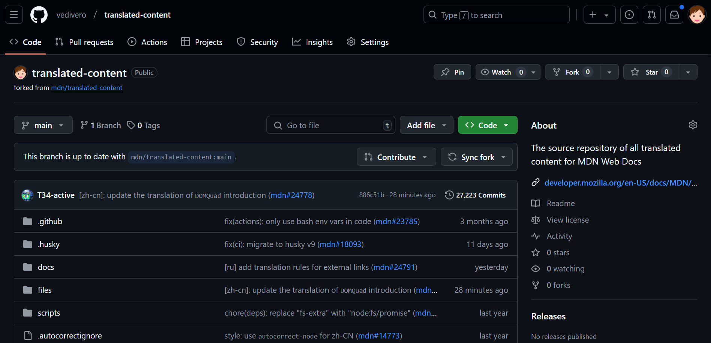
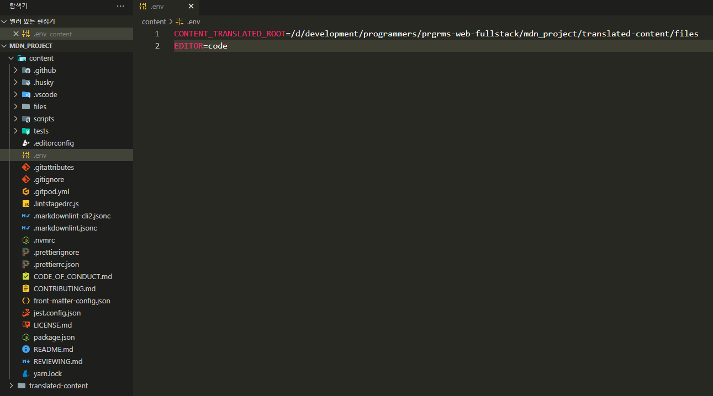
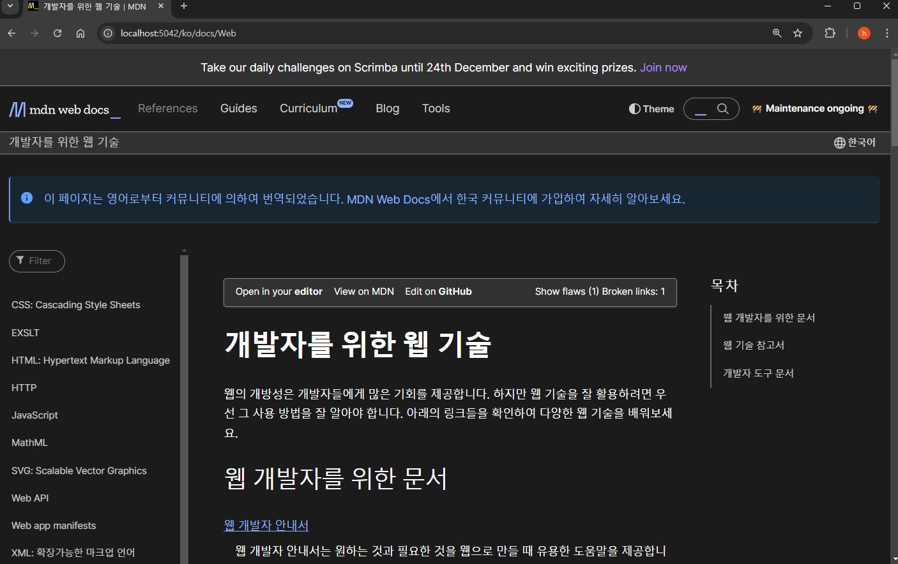

# MDN Web Docs Contributor 

## 1. Fork

- https://github.com/mdn/translated-content/blob/main/docs/ko/README.md

    

## 2. Clone

- 프로젝트 내려 받기

    - `$ git clone https://github.com/vedivero/translated-content.git mdn_project`

        ```
        Cloning into 'mdn_project'...
        remote: Enumerating objects: 993173, done.
        remote: Counting objects: 100% (560/560), done.
        remote: Compressing objects: 100% (351/351), done.
        Receiving objects:  60% (595904/993173), 323.22 MiB | 21.06 MiB/s
        ````

## 3. 작업할 브랜치 생성

- 현재 브랜치

    - /mdn_project (main)
        
        ```
        $ git checkout -b fix-ko-docs
        Switched to a new branch 'fix-ko-docs'
        ```

- 변경한 브랜치
    - /mdn_project (fix-ko-docs)

        - 현재 브랜치 확인
            ```
            $ git branch
            
            * fix-ko-docs
            main
            ```


## 4. env 설정 파일

- content 프로젝트에 설정 파일 추가

    - 내 컴퓨터의 경로로 설정
    

## 5. yarn 설치

- npm이 설치되어 있으면 따로 설치하지 않아도 됨

    ```
    $ npm -v
    10.5.2
    ```

    ```
    $ node -v
    v20.13.1
    ```

- yarn

    ```
    $ yarn

    yarn install v1.22.22
    warning package.json: No license field
    info No lockfile found.
    warning package-lock.json found. Your project contains lock files generated by tools other than Yarn. It is advised not to mix package managers in order to avoid resolution inconsistencies caused by unsynchronized lock files. To clear this warning, remove package-lock.json.
    warning No license field
    [1/4] Resolving packages...
    [2/4] Fetching packages...
    [3/4] Linking dependencies...
    [4/4] Building fresh packages...
    success Saved lockfile.
    Done in 0.15s.
    ```

- yarn install

    `/mdn_project/content (main)`
    ```
    $ yarn install

    yarn install v1.22.22
    warning ..\..\package.json: No license field
    [1/5] Validating package.json...
    [2/5] Resolving packages...
    [3/5] Fetching packages...
    [4/5] Linking dependencies...
    warning "@mdn/yari > @inquirer/prompts@7.1.0" has unmet peer dependency "@types/node@>=18".
    warning "@mdn/yari > @lit/react@1.0.6" has unmet peer dependency "@types/react@17 || 18".
    warning "@mdn/yari > @use-it/interval@1.0.0" has unmet peer dependency "react@>=16.8".
    warning "@mdn/yari > react-markdown@9.0.1" has unmet peer dependency "@types/react@>=18".
    warning "@mdn/yari > react-markdown@9.0.1" has unmet peer dependency "react@>=18".
    warning "@mdn/yari > react-modal@3.16.1" has unmet peer dependency "react@^0.14.0 || ^15.0.0 || ^16 || ^17 || ^18".
    warning "@mdn/yari > react-modal@3.16.1" has unmet peer dependency "react-dom@^0.14.0 || ^15.0.0 || ^16 || ^17 || ^18".
    warning "@mdn/yari > @codemirror/lang-css > @codemirror/autocomplete@6.18.0" has unmet peer dependency "@codemirror/view@^6.0.0".
    warning "@mdn/yari > @inquirer/prompts > @inquirer/checkbox@4.0.2" has unmet peer dependency "@types/node@>=18".
    warning "@mdn/yari > @inquirer/prompts > @inquirer/confirm@5.0.2" has unmet peer dependency "@types/node@>=18".
    warning "@mdn/yari > @inquirer/prompts > @inquirer/editor@4.1.0" has unmet peer dependency "@types/node@>=18".
    warning "@mdn/yari > @inquirer/prompts > @inquirer/expand@4.0.2" has unmet peer dependency "@types/node@>=18".
    warning "@mdn/yari > @inquirer/prompts > @inquirer/input@4.0.2" has unmet peer dependency "@types/node@>=18".
    warning "@mdn/yari > @inquirer/prompts > @inquirer/number@3.0.2" has unmet peer dependency "@types/node@>=18".
    warning "@mdn/yari > @inquirer/prompts > @inquirer/password@4.0.2" has unmet peer dependency "@types/node@>=18".
    warning "@mdn/yari > @inquirer/prompts > @inquirer/rawlist@4.0.2" has unmet peer dependency "@types/node@>=18".
    warning "@mdn/yari > @inquirer/prompts > @inquirer/search@3.0.2" has unmet peer dependency "@types/node@>=18".
    warning "@mdn/yari > @inquirer/prompts > @inquirer/select@4.0.2" has unmet peer dependency "@types/node@>=18".
    warning "@mdn/yari > @inquirer/prompts > @inquirer/checkbox > @inquirer/type@3.0.1" has unmet peer dependency "@types/node@>=18".
    [5/5] Building fresh packages...
    [1/6] ⠠ @mdn/rari
    [2/6] ⠠ @vscode/ripgrep
    [-/6] ⠠ waiting...
    [-/6] ⠐ waiting...
    [-/6] ⠐ waiting...
    ```

## 6. yarn start

```
$ yarn start

yarn run v1.22.22
warning ..\..\package.json: No license field
$ yarn up-to-date-check && env-cmd --silent cross-env CONTENT_ROOT=files REACT_APP_DISABLE_AUTH=true BUILD_OUT_ROOT=build yari-server
warning ..\..\package.json: No license field
$ node scripts/up-to-date-check.js
(node:28604) ExperimentalWarning: Importing JSON modules is an experimental feature and might change at any time
(Use `node --trace-warnings ...` to show where the warning was created)
(node:9588) ExperimentalWarning: Importing JSON modules is an experimental feature and might change at any time
(Use `node --trace-warnings ...` to show where the warning was created)
[HPM] Proxy created: /  -> http://localhost:8080
[HPM] Proxy created: /  -> https://developer.mozilla.org
[HPM] Proxy created: /  -> https://developer.allizom.org
CONTENT_ROOT: D:\development\programmers\prgrms-web-fullstack\mdn_project\content\files
Listening on port 5042
Your EDITOR is set to: code
```

- 접속

    - localhost:5042

        


