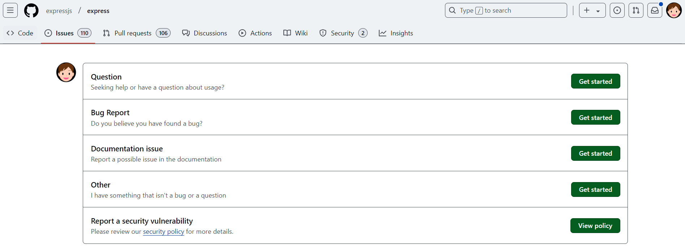
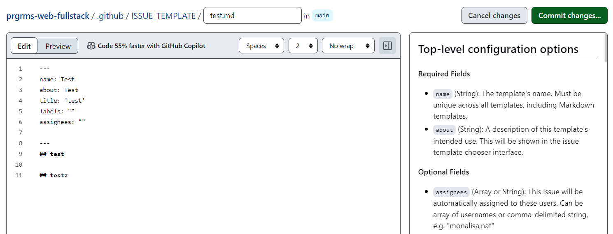

# 문서 템플릿 제작

## github에서 제공해주는 템플릿 기능
- issue template
- pull request template
- etc

## 실습 1 - 템플릿 생성

- Add file

    

- issue_template.md 파일 생성

    

- issue 생성

    

    - 설정한 템플릿이 적용되어 있다.

    - 무작위의 불특정 다수가 오픈 소스에 기여하기 때문에 양식 사용이 유용

## 실습 2 - 다중 이슈 템플릿 만들기

- MDN issue

    

- expressjs
    
    

- set up template

    - setting > general
    
        

        - 버그 보고서
        - 기능 요청
        - 사용자 정의의
        

    - 템플릿 설정

            

    - 확인

        - new issue에 생성된 템플릿

            
            

    - 마크다운 코드로 생성

        

        