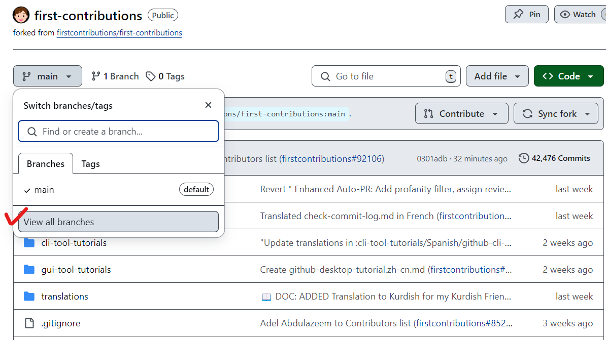
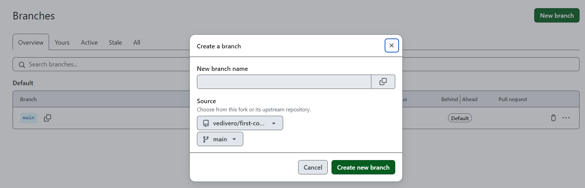
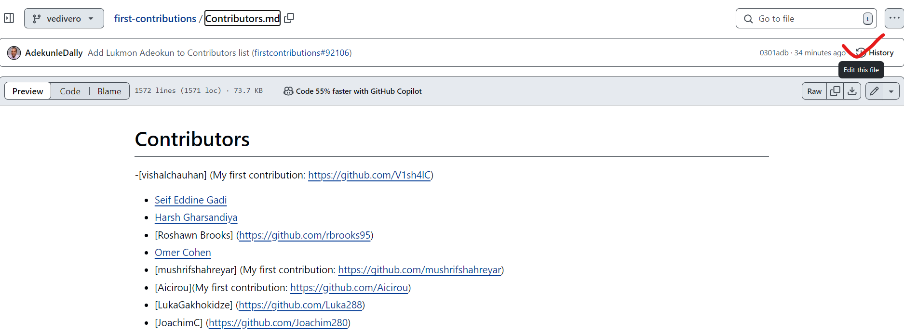
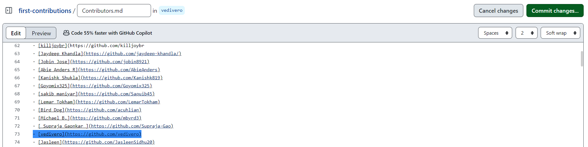
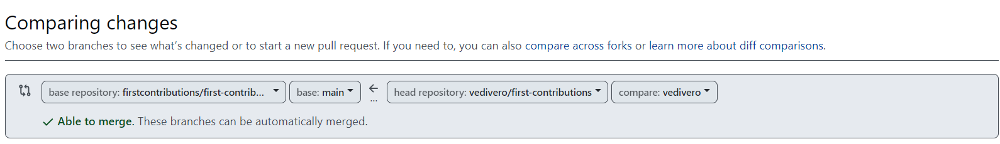

# first-contributions

- firstcontributions

    - https://github.com/firstcontributions/first-contributions?tab=readme-ov-file


- 한글 번역
    - https://github.com/firstcontributions/first-contributions/blob/main/translations/README.ko.md

## Fork

- 리포지토리 Fork

    - https://github.com/firstcontributions/first-contributions

        

## Contribute

- Contributors.md

    - 내 브랜치 생성

        ```
        git checkout -b add-vedivero

        Switched to a new branch 'add-vedivero'
        ```

    - 나의 깃허브 주소 입력

        


    - git status

        ```
        On branch add-vedivero
        Changes not staged for commit:
        (use "git add <file>..." to update what will be committed)
        (use "git restore <file>..." to discard changes in working directory)
                modified:   Contributors.md

        no changes added to commit (use "git add" and/or "git commit -a")
        ```


    - git commit

        ```
        $ git commit -m "Add vedivero to Contributors list"
        On branch add-vedivero
        Changes not staged for commit:
        (use "git add <file>..." to update what will be committed)
        (use "git restore <file>..." to discard changes in working directory)
                modified:   Contributors.md

        no changes added to commit (use "git add" and/or "git commit -a")
        ```

    - git push 

        ```
        $ git push origin add-vedivero
        Total 0 (delta 0), reused 0 (delta 0), pack-reused 0 (from 0)
        remote:
        remote: Create a pull request for 'add-vedivero' on GitHub by visiting:
        remote:      https://github.com/vedivero/first-contributions/pull/new/add-vedivero
        remote:
        To https://github.com/vedivero/first-contributions.git
        * [new branch]          add-vedivero -> add-vedivero
        ```

    - 원격 저장소 확인

        

    - Pull Request

        

    - Merge 확인

        