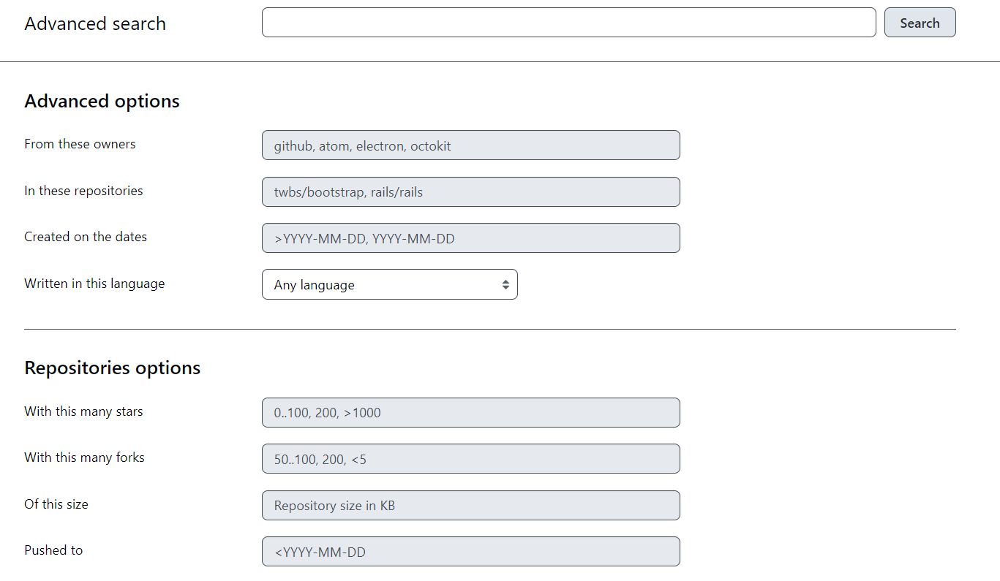
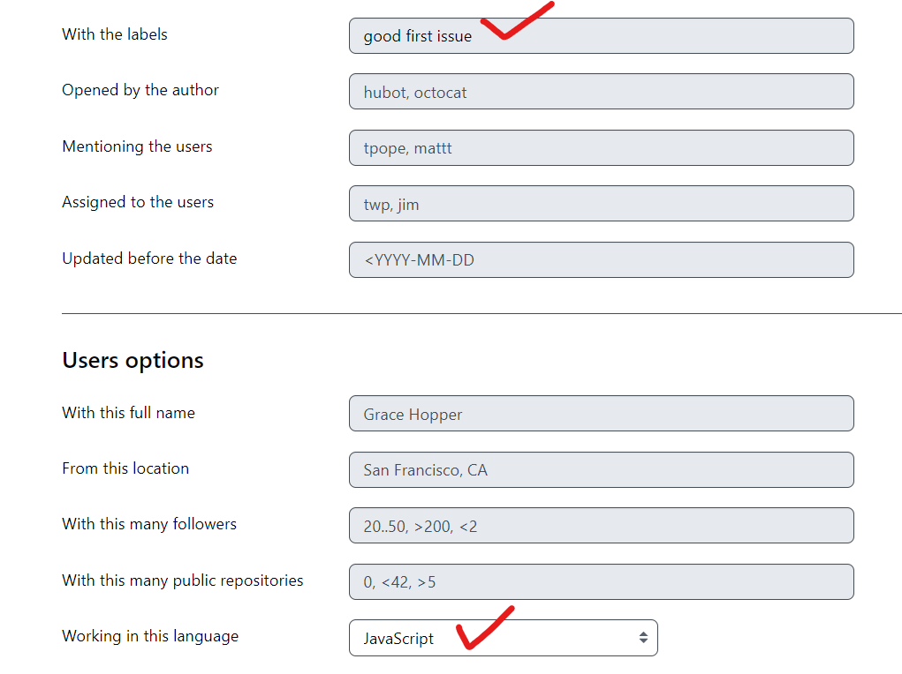
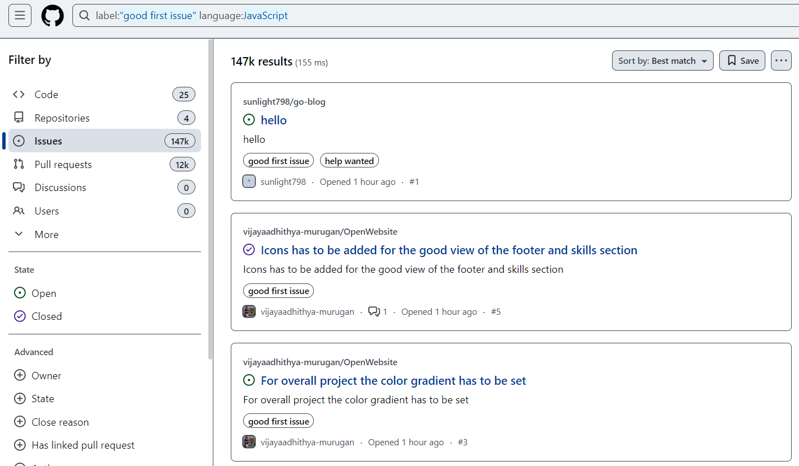

# 실전 오픈소스 프로젝트 기여 방법 for beggiers

## 오픈소스 프로젝트 검색 팁
- https://github.com/search/advanced 이용 => label:"good first issue"
    - 검색 상세 옵션 설정

        

- github 검색 추천 labels
    - good first issue

        

        - 검색 결과

            

- contribution welcome
- first-timer-only
- low-haning-fruit
- help wanted
