# 오픈소스 저장소 생성 및 설정

## Organization 생성

- Organization 생성

    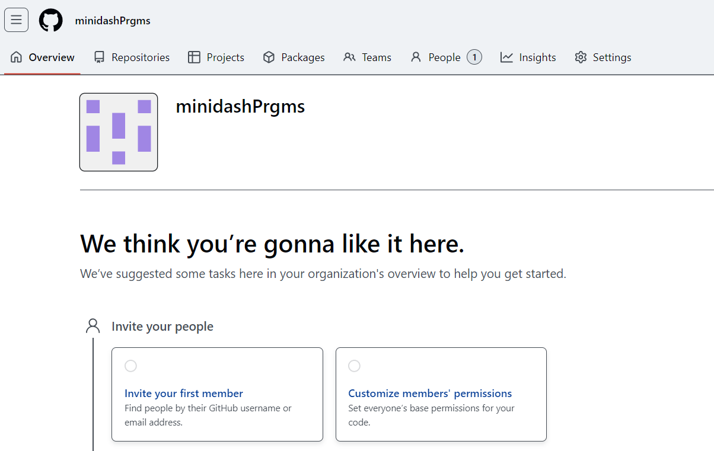

- Repository 생성

    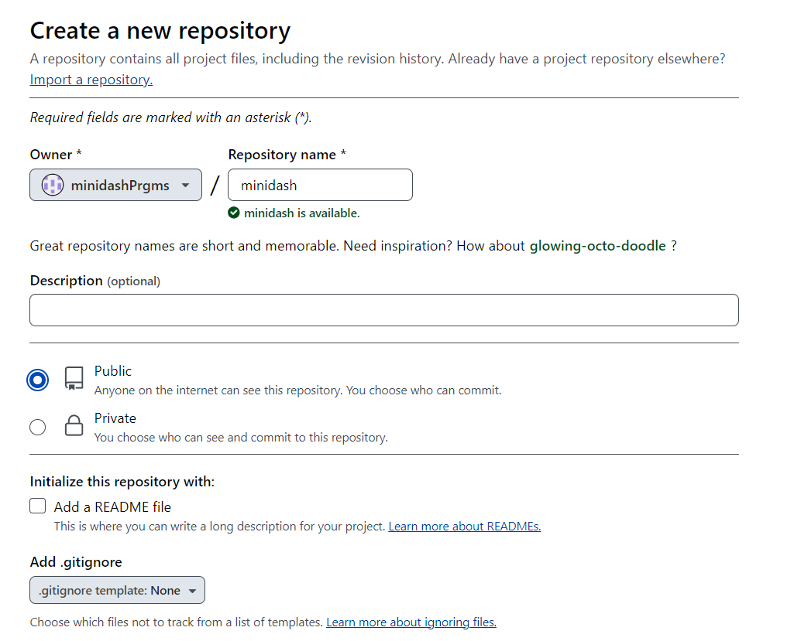

- branch 설정

    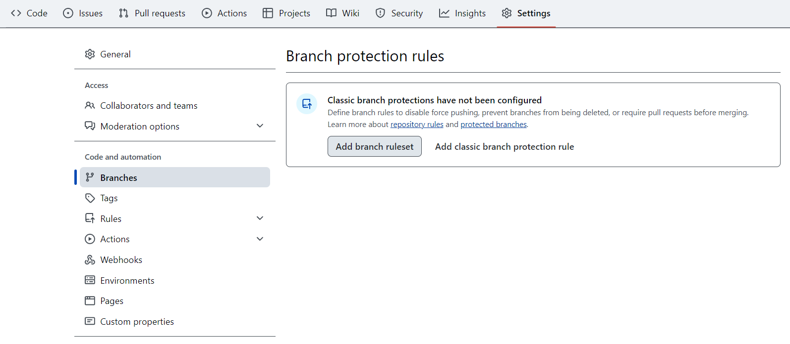

    - 병합 승인 설정

        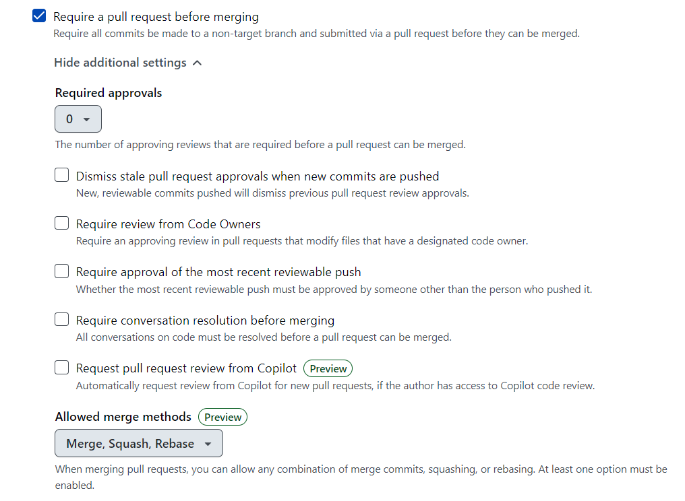
- 생성된 Rule

    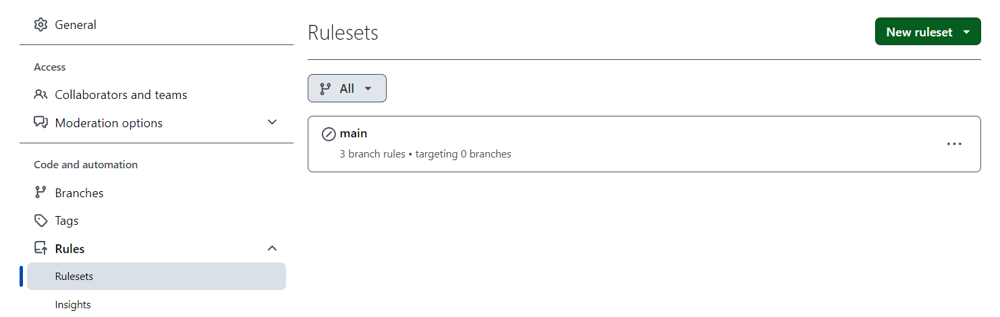

## 이슈 생성

- 로컬 작업 공간에서 이슈 생성

    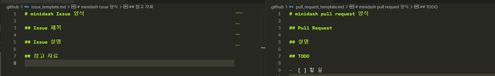

- 원격 저장소에서 이슈 생성시 템플릿 적용

    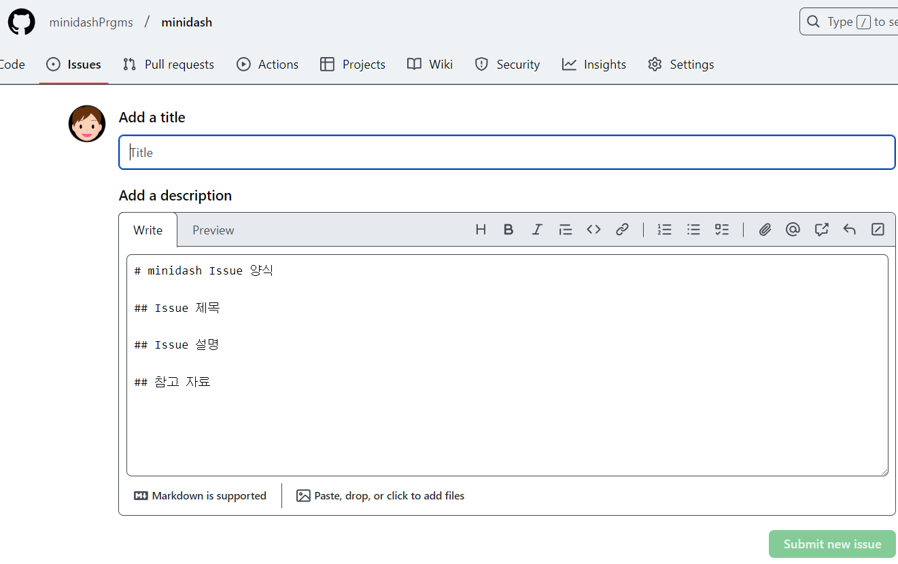


## ReadMe.md 작성

- 기여자에게 해당 프로젝트 및 설정 방법을 알려주는 내용 작성

    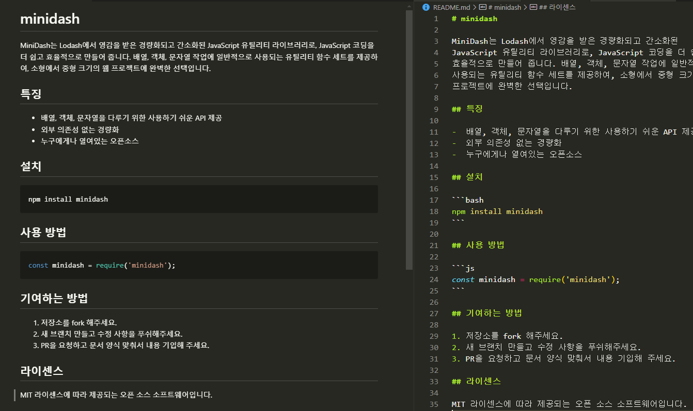
    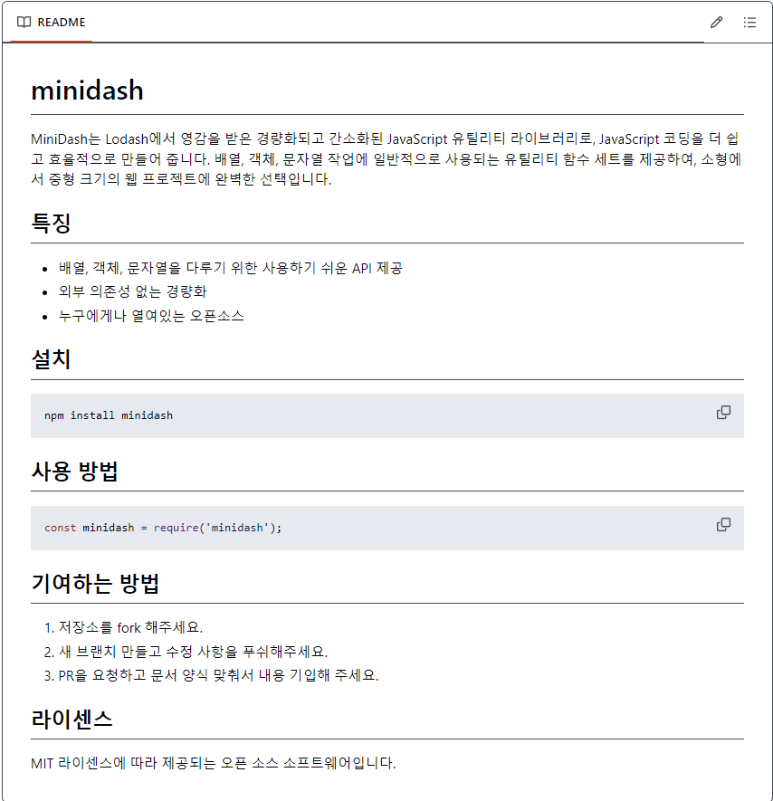


## 소스 코드 작성

- npm 초기화
    ```bash
    $ npm init -y

    Wrote to D:\development\minidash\package.json:

    {
        "name": "minidash",
        "version": "1.0.0",
        "description": "MiniDash는 Lodash에서 영감을 받은 경량화되고 간소화된 JavaScript 유틸리티 라이브러리로, JavaScript 코딩을 더 쉽고 효율적으로 만들어 줍니다. 배열, 객체, 문자열 작업에 일반적 으로 사용되는 유틸리티 함수 세트를 제공하여, 소형에서 중형 크기의 웹 프로젝트에 완벽한 선택입니다.",
        "main": "index.js",
        "scripts": {
            "test": "echo \"Error: no test specified\" && exit 1"
        },
        "keywords": [],
        "author": "",
        "license": "ISC"
    }
    ```


- 라이브러리 코드 작성

    - 짝수를 체크하는 기능

        ```js
        export const findEvenNums = (arr) => {
            return arr.filter((num) => num % 2 === 0);
        };

        ```

    - 홀수를 체크하는 기능

        ```js
        export const findOddNums = (arr) => {
            return arr.filter((num) => num % 2 !== 0);
        };
        ```

    - 첫 글자를 대문자로 치환하는 기능

        ```js
        export const capitalize = (str) => {
            if (typeof str !== 'string') return '';
            return str.charAt(0).toUpperCase() + str.slice(1).toLowerCase();
        };
        ```

    - 배열 여부를 체크하는 기능

        ```js
        export const checkedArr = (arr) => {
            return Array.isArray(arr);
        };
        ```

    - 외부에서 바로 사용할 수 있도록 설정

        ```js
        export { capitalize } from './src/capitalize';
        export { checkedArr } from './src/checkedArray';
        export { findEvenNums } from './src/findEvenNums';
        export { findOddNums } from './src/findOddNumber';
        ```

## Github Action Setting

### About `Github Actions`
- GitHub에서 제공하는 빌드, 테스트, 및 배포 파이프라인을 자동화할 수 있는 CI/CD 서비스
- Cl(Continuous Integration, 지속 통합)와 CD(Continuous Deployment, 지속 배포)


### Create Action file

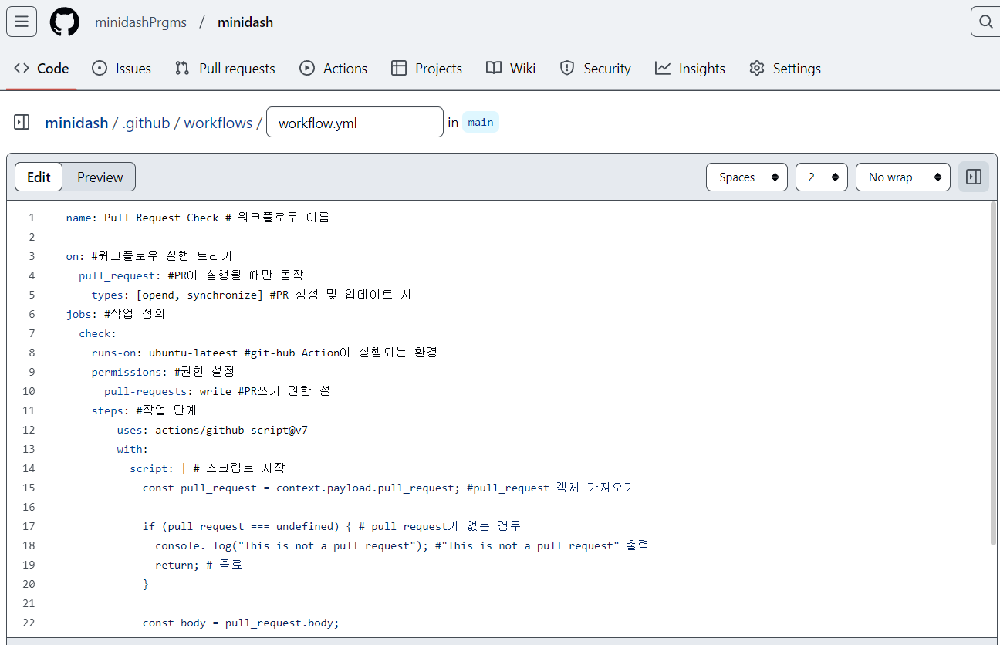

- yml파일로 생성 후 커밋밋
    ```markdown
    name: Pull Request Check # 워크플로우 이름

    on: #워크플로우 실행 트리거
    pull_request: #PR이 실행될 때만 동작
        types: [opend, synchronize] #PR 생성 및 업데이트 시
    jobs: #작업 정의
    check: 
        runs-on: ubuntu-lateest #git-hub Action이 실행되는 환경
        permissions: #권한 설정
        pull-requests: write #PR쓰기 권한 설
        steps: #작업 단계
        - uses: actions/github-script@v7
            with:
            script: | # 스크립트 시작
                const pull_request = context.payload.pull_request; #pull_request 객체 가져오기
                
                if (pull_request === undefined) { # pull_request가 없는 경우
                console. log("This is not a pull request"); #"This is not a pull request" 출력
                return; # 종료
                }

                const body = pull_request.body;

                if (!body) {
                // PR에 코멘트를 추가합니다.
                await github.rest.issues.createComment({ // PR에 코멘트 추가
                    owner: context.repo.owner, // 저장소 소유자
                    repo: context.repo.repo, // 저장소 이름
                    issue_number: pull_request.number, // PR 번호
                    body: "가이드 라인을 확인하여 다시 PR을 요청해주세요. 해당 PR을 닫겠습니다.", // 코멘트 내용
                });
                
                // close PR
                await github.rest.pulls.update({ // PR을 닫음
                    owner: context.repo.owner, / 저장소 소유자
                    repo: context.repo.repo, // 저장소 이름
                    pull_number: pull_request.number, // PR 번호
                    state: "closed", // 상태를 닫힘으로 변경
                });
                
                }
    ```

- test 브랜치에서 main 브랜치로 병합

    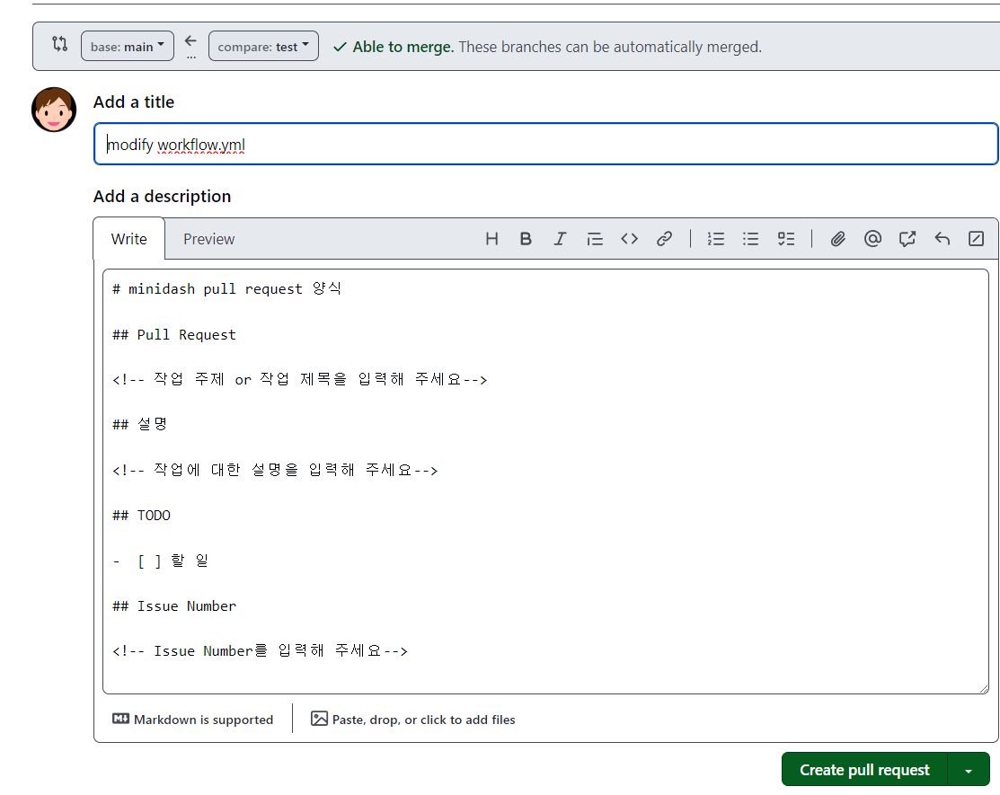

- 실행 중인 github action

    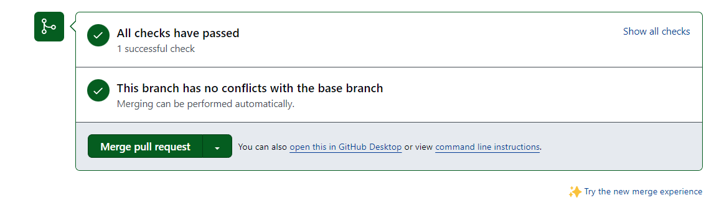

- 통과된 github action

    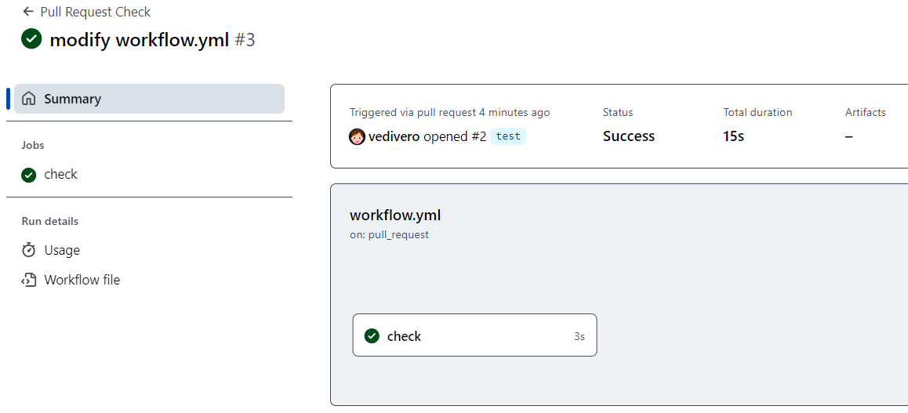