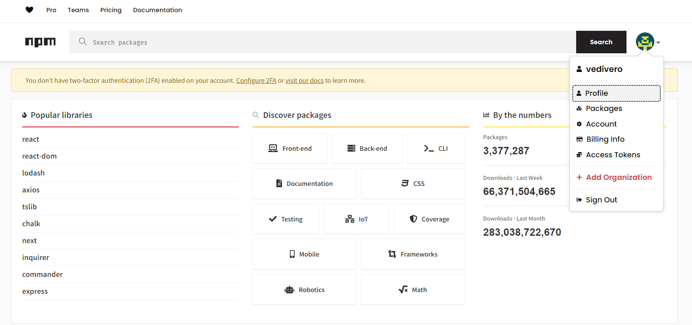
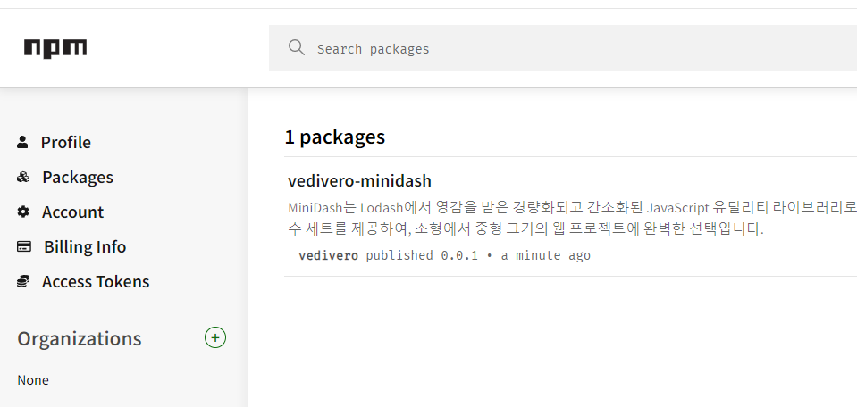
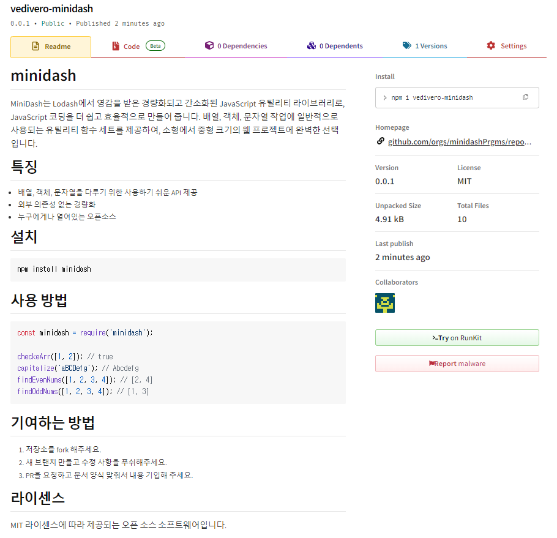
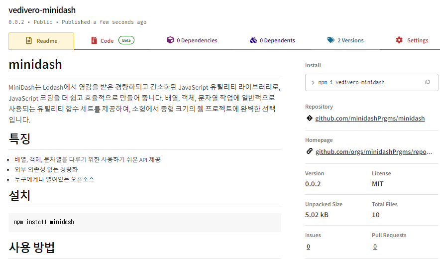
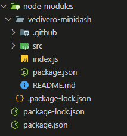

# Deploy Open Source

## npm 회원가입



## package.json

- keyword 항목, homepage 항목 추가 작성

    - 해시태그 같은 항목
        ```json
        {
            "name": "minidash",
            "version": "0.0.1",
            "description": "",
            "main": "index.js",
            "type": "module",
            "scripts": {
                "test": "echo \"Error: no test specified\" && exit 1"
            },
            "keywords": [
                "module",
                "util"
            ],
            "homepage": "https://github.com/orgs/minidashPrgms/repositories",
            "author": "",
            "license": "MIT"
        }
        ```

## ignore 설정

- npm ignore

    ```
    test/
    node_modules/
    webpack.*.js
    ```

- git ignore

    ```
    .idea
    node_modules
    package.json
    ```

## npm login

```bash
$ npm login
npm notice Log in on https://registry.npmjs.org/
Login at:
https://www.npmjs.com/login?next=/login/cli/873221d0-659b-4a46-9bd2-952c7791a618
Press ENTER to open in the browser...

Logged in on https://registry.npmjs.org/.
```

- 로그인 정보 확인

    ```bash
    $ npm whoami
    
    vedivero
    ```

- 배포 전 테스트

    ```bash
    $ npm init -y

    Wrote to D:\development\minidash\package.json:

    {
        "name": "minidash",
        "version": "0.0.1",
        "description": "",
        "main": "index.js",
        "type": "module",
        "scripts": {
            "test": "echo \"Error: no test specified\" && exit 1"
        },
        "keywords": [
            "module",
            "util"
        ],
        "homepage": "https://github.com/orgs/minidashPrgms/repositories",
        "author": "",
        "license": "MIT"
    }
    ```

## deploy

- 배포

    ```bash
    $ npm publish

    npm notice 
    npm notice 📦  vedivero-minidash@0.0.1
    npm notice === Tarball Contents ===
    npm notice 288B  .github/issue_template.md
    npm notice 282B  .github/pull_request_template.md
    npm notice 1.9kB .github/workflows/workflow.yml
    npm notice 1.1kB README.md
    npm notice 202B  index.js
    npm notice 734B  package.json
    npm notice 157B  src/capitalize.js
    npm notice 73B   src/checkedArray.js
    npm notice 91B   src/findEvenNums.js
    npm notice 90B   src/findOddNumber.js
    npm notice === Tarball Details ===
    npm notice name:          vedivero-minidash
    npm notice version:       0.0.1
    npm notice filename:      vedivero-minidash-0.0.1.tgz
    npm notice package size:  2.4 kB
    npm notice unpacked size: 4.9 kB
    npm notice shasum:        2c384c39efc711628206b5a94790c14c48baa840
    npm notice integrity:     sha512-gqujVzNc78uCu[...]l6SaWRCk1AgWg==
    npm notice total files:   10
    npm notice
    npm notice Publishing to https://registry.npmjs.org/ with tag latest and default access
    + vedivero-minidash@0.0.1
    ```

## npm package에 추가되어짐





## 리포지토리 저장소 정보 추가

```bash
"repository": {
    "type": "git",
    "url": "https://github.com/minidashPrgms/minidash.git"
},
```

## 수정 사항 재 배포

- 0.0.2버전으로 배포

    ```bash
    $ npm publish

    npm WARN publish npm auto-corrected some errors in your package.json when publishing.  Please run "npm pkg fix" to address these errors.
    npm WARN publish errors corrected:
    npm WARN publish "repository.url" was normalized to "git+https://github.com/minidashPrgms/minidash.git"
    npm notice 
    npm notice 📦  vedivero-minidash@0.0.2
    npm notice === Tarball Contents ===
    npm notice 288B  .github/issue_template.md
    npm notice 282B  .github/pull_request_template.md
    npm notice 1.9kB .github/workflows/workflow.yml
    npm notice 1.1kB README.md
    npm notice 202B  index.js
    npm notice 841B  package.json
    npm notice 157B  src/capitalize.js
    npm notice 73B   src/checkedArray.js
    npm notice 91B   src/findEvenNums.js
    npm notice 90B   src/findOddNumber.js
    npm notice === Tarball Details ===
    npm notice name:          vedivero-minidash
    npm notice version:       0.0.2
    npm notice filename:      vedivero-minidash-0.0.2.tgz
    npm notice package size:  2.5 kB
    npm notice unpacked size: 5.0 kB
    npm notice shasum:        8a6b347a9cf65b5569f1407bf399ac7912145cb6
    npm notice integrity:     sha512-JT9SJkoTP29vo[...]FHtnalachAYew==
    npm notice total files:   10
    npm notice
    npm notice Publishing to https://registry.npmjs.org/ with tag latest and default access
    + vedivero-minidash@0.0.2
    ```

- 반영된 배포

    


# UnDeploy

- 배포된 모듈을 회수하기

    `$ npm unpublish vedivero-minidash@0.2`

    - 조건

        - 72시간 내에 게시된 라이브러리
        - 다른 패키지에 대해 종속성이 없어야 함 
        - 24시간 내에 동일한 패키지 명으로 배포 불가


# 배포한 모듈 사용하기

- npm i vedivero-minidash

    ```bash
    npm i vedivero-minidash

    added 1 package, and audited 2 packages in 1s

    found 0 vulnerabilities
    PS D:\development\npm-test> npm i

    up to date, audited 2 packages in 1s

    found 0 vulnerabilities
    ```

- 파일 들이 다운로드 되었다

    