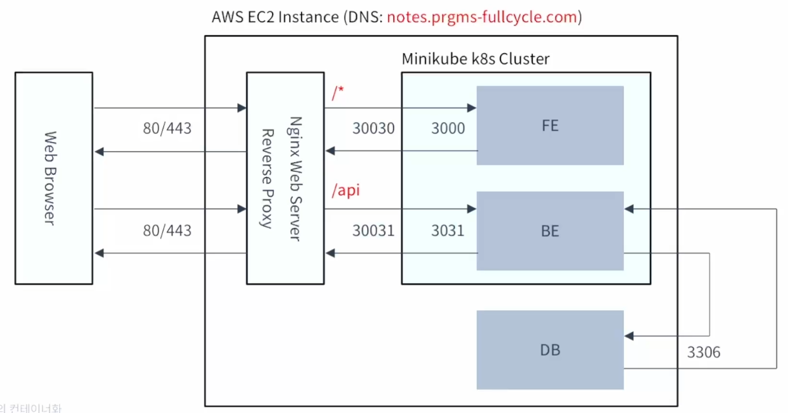
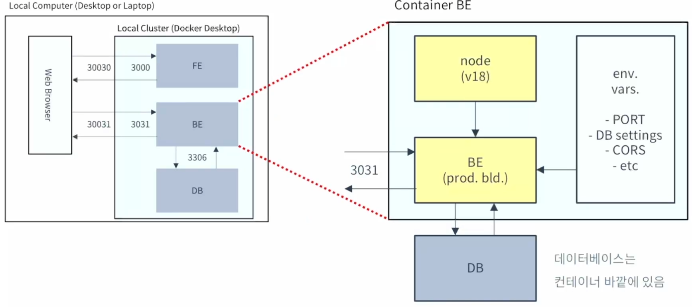
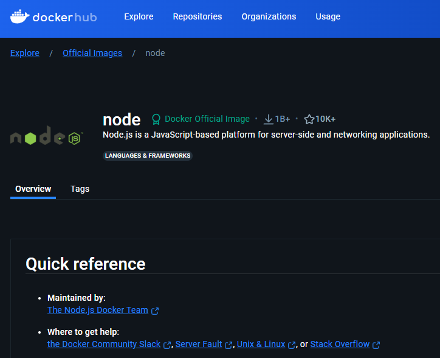

# 백엔드 컨테이너화

- 프로덕션 배포 환경

    

- 백엔드 컨테이너 실행 구조

    

- Node 베이스 이미지

    https://hub.docker.com/_/node
    


## 1. 컨테이너 구성 및 설정
기본 개요:
컨테이너를 사용해 백엔드 애플리케이션을 배포 및 테스트.
Dockerfile을 작성해 컨테이너 환경 설정.
구성 과정:
베이스 이미지 결정: node:18
Dockerfile에서 컨테이너가 실행될 작업 디렉토리 설정 (/var/app)
npm ci 명령어를 사용해 프로덕션 의존성만 설치.
Typescript로 빌드한 결과를 복사.

## 2. Dockerfile 구성
기본 구조:
dockerfile
코드 복사
FROM node:18
WORKDIR /var/app
COPY package.json package-lock.json ./
RUN npm ci --omit=dev
COPY ./build/ ./build/
ENV PORT=3031
ENV CORS_ALLOWED_ORIGIN=(...)
EXPOSE 3031
HEALTHCHECK CMD curl --fail http://localhost:3031/healthcheck || exit 1
ENTRYPOINT ["node", "."]
핵심 설정:
HEALTHCHECK: 애플리케이션의 상태를 주기적으로 확인해 비정상일 경우 컨테이너를 종료.
EXPOSE 3031: 컨테이너가 사용할 포트 노출.

## 3. Docker Compose 설정
목적: 데이터베이스와 백엔드를 같은 네트워크에서 실행.
구성 예시:
yaml
코드 복사
services:
  backend:
    image: (...)
    environment:
      DB_HOST: db
      DB_PORT: 3306
    ports:
      - 3031:3031
    networks:
      - notes
중요 사항:
DB_HOST와 DB_PORT 설정으로 DB와 연결.

## 4. 데이터베이스 초기화
- 절차:
    - docker compose up -d 명령어로 데이터베이스 컨테이너 실행.
    - mysql 클라이언트를 사용해 데이터베이스 초기화.
    - docker compose down으로 컨테이너 종료.

## 5. 컨테이너 이미지 빌드 및 테스트
- 명령어:
    ```bash
    - docker build -t lct-be .
    ```
- 테스트:
    - docker compose up -d로 컨테이너 실행 후 curl 또는 Postman을 통해 API 테스트.
    - Healthcheck로 애플리케이션 상태 확인.

## 6. Makefile 구성

- 자동화 설정:
    ```makefile
    ARCH=amd64
    IMG_TAG="..."

    all:
    cat ./Makefile

    test:
    npm test

    node:
    npm ci
    npm run build

    image:
    docker build --platform=linux/${ARCH} --tag ${IMG_TAG} .
    ```

- Apple Silicon 주의사항:
    - --platform=linux/amd64 옵션 사용.

## 7. 전체 실행 절차
- 컨테이너 빌드:
    ```bash
    docker build -t lct-be .
    ```
- 백엔드 및 데이터베이스 컨테이너 실행:
    ```bash
    - docker compose up -d
    ```
- Postman 또는 curl을 사용해 API 테스트:
    ```bash
    curl localhost:3031
    ```
- 컨테이너 종료:
    ```bash
    - docker compose down
    ```
- Healthcheck 상태 확인:
    - health: starting 또는 healthy 상태 확인.

## 8. 프론트엔드와 연결한 테스트
- 방법:
    - ${PROJECT_ROOT}/frontend에서 npm start 명령어 실행.
    - API 요청 시 API_BASE_URL과 CORS_ALLOWED_ORIGIN 설정 확인.
- 환경 변수 예시:
    ```env
    API_BASE_URL=http://localhost:3031
    CORS_ALLOWED_ORIGIN=http://localhost:3000
    ```