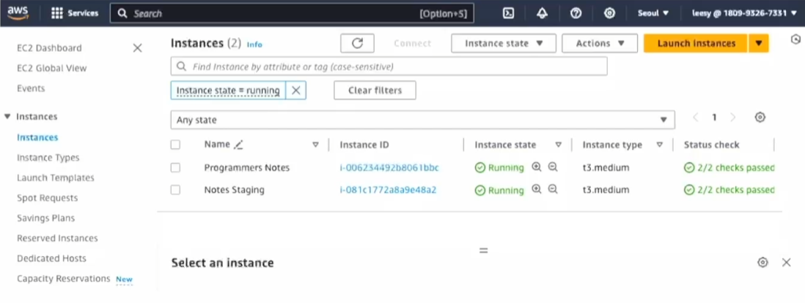

 
# AWS (Amazon Web Services)

## On-demand로 인프라를 제공하는 클라우드 서비스.

- 웹/모바일 서비스와 빅데이터, 인공지능 응용에 활용 가능.
- IaaS, PaaS, SaaS 중 IaaS에 가까운 모델.

## 실습에서의 AWS 사용

- Production 환경 구성
    - EC2: Minikube cluster, web server, DB, SSL 구성.
    - ECR: 컨테이너 이미지 저장.
    - S3: Terraform 상태 데이터 저장.

## AWS 주요 서비스

- Elastic Container Registry (ECR)
    - Docker 컨테이너 이미지를 저장, 배포.
    - Public/Private 접근 설정 가능.
- EC2 (Elastic Compute Cloud)

    
    - 가상 서버 제공.
    - 운영체제와 소프트웨어를 선택하여 설치 및 실행 가능.
- Route 53
    - DNS 관리 및 도메인 이름 등록.
- S3 (Simple Storage Service)
    - 객체 저장소.
    - 비정형 데이터 저장 및 공유.
    - Glacier 연동으로 저비용 데이터 아카이브 가능.

## 클라우드 인프라 사용의 장단점

- 장점
    - 유연한 사용, 안정성 제공, 손쉬운 확장성.
    - 사용한 만큼만 비용 지불 (Pay-as-you-go 모델).
    - 풍부한 문서와 다양한 도구 제공.
- 단점
    - 적절히 관리하지 않으면 불필요한 비용 발생 가능.
    - 초반 학습 비용 발생.
    - 익숙하지 않으면 복잡하게 느껴질 수 있음.

## 실습에서의 EC2 활용

- 프로젝트에서의 구성
    - Minikube single-node cluster 구성.
    - 데이터베이스 (MariaDB)와 웹 서버 (Nginx reverse proxy) 설치.
    - 단일 인스턴스에서 배포 환경 구성.
- 확장성 비교
    - 데이터베이스는 RDS 사용 가능.
    - Kubernetes cluster 운영을 위해 EKS 사용 가능.

## AMI (Amazon Machine Images)

- 정의
    - EC2에서 사용하는 컴퓨터 이미지.
    - 소프트웨어 설치와 구성을 포함.
- 프로젝트에서의 활용
    - 동일한 구성의 EC2 인스턴스 생성에 사용.
    - Minikube, MariaDB, Nginx 등의 설정 포함.
    - 데이터베이스 스키마와 Minikube 기본 설정 적용.

## 요약

- AWS를 활용한 클라우드 인프라
    - 비용 절감, 안정성, 유연성, 확장성 제공.
    - 기업 환경에서 Private/Public Cloud 비교하여 사용.
- 실습 적용
    - EC2와 S3를 사용하여 배포 환경 구성.
    - 응용의 배포 및 운영을 위해 필요한 자원을 클라우드로 배치.

